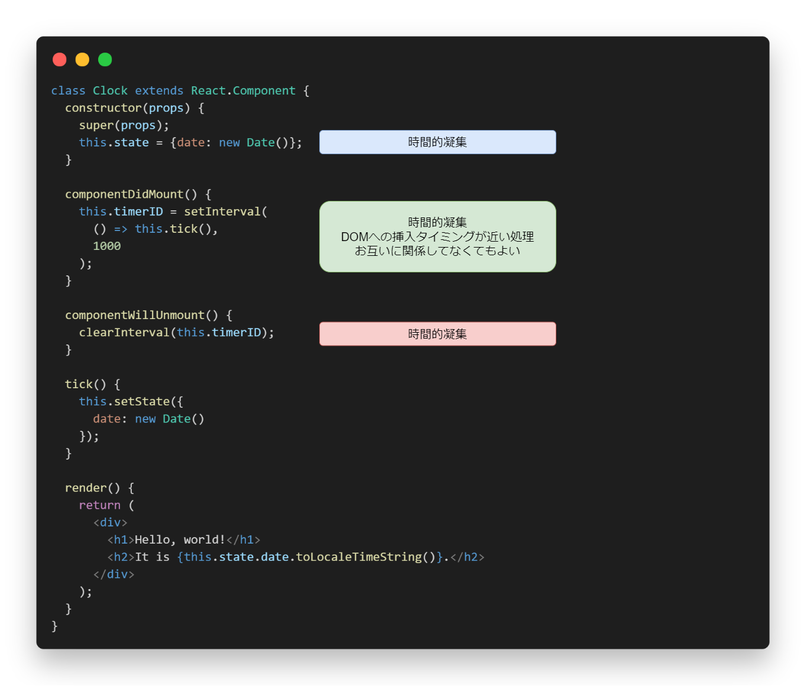

# 課題3

<!-- START doctoc generated TOC please keep comment here to allow auto update -->
<!-- DON'T EDIT THIS SECTION, INSTEAD RE-RUN doctoc TO UPDATE -->
<details>
<summary>Table of Contents</summary>

- [コンポーネントのライフサイクル](#%E3%82%B3%E3%83%B3%E3%83%9D%E3%83%BC%E3%83%8D%E3%83%B3%E3%83%88%E3%81%AE%E3%83%A9%E3%82%A4%E3%83%95%E3%82%B5%E3%82%A4%E3%82%AF%E3%83%AB)
  - [マウントとアンマウント](#%E3%83%9E%E3%82%A6%E3%83%B3%E3%83%88%E3%81%A8%E3%82%A2%E3%83%B3%E3%83%9E%E3%82%A6%E3%83%B3%E3%83%88)
  - [constructor(props)](#constructorprops)
  - [render](#render)
  - [componentDidMount](#componentdidmount)
  - [componentDidUpdate(prevProps, prevState, snapshot)](#componentdidupdateprevprops-prevstate-snapshot)
  - [componentWillUnmount](#componentwillunmount)
- [クラスコンポーネントの凝集度](#%E3%82%AF%E3%83%A9%E3%82%B9%E3%82%B3%E3%83%B3%E3%83%9D%E3%83%BC%E3%83%8D%E3%83%B3%E3%83%88%E3%81%AE%E5%87%9D%E9%9B%86%E5%BA%A6)
- [参考資料](#%E5%8F%82%E8%80%83%E8%B3%87%E6%96%99)

</details>
<!-- END doctoc generated TOC please keep comment here to allow auto update -->

## コンポーネントのライフサイクル

Reactが提供しているクラスコンポーネントのライフサイクルを例に、凝集度を考える。


> 引用元: https://projects.wojtekmaj.pl/react-lifecycle-methods-diagram/

### マウントとアンマウント

Reactにおけるマウントとアンマウントをまず理解する。

- マウント
  - コンポーネントが、最初にDOMとして描画されるときのこと
- アンマウント
  - コンポーネントに対して、生成されたDOMが削除されるときのこと

クラスコンポーネントでは、コンポーネントがマウントされたり、アンマウントされた際に、特別なメソッドを使用することでコードを実行することが可能である。

以下ではクラスコンポーネントにおける特別なメソッドの例を挙げる。

### constructor(props)

Reactのコンポーネントのコンストラクタは、 **マウントされる前** に呼び出されるライフサイクルメソッドであり、コンポーネントに状態を持たせることが可能となる。

具体的には以下のように、コンストラクタ内でコンポーネントに持たせたい状態を定義することで、ライフサイクルにまたがって状態を管理することが可能となる。

```js
class Clock extends React.Component {
  constructor(props) {
    // 継承元に props を渡さないと this.props が未定義となってしまう
    super(props);

    // コンポーネントで管理したい状態を定義する
    this.state = { counter: 0 };

    // イベントハンドラは、インスタンスにバインドさせておく
    this.handleClick = this.handleClick.bind(this);
  }
}
```

### render

クラスコンポーネントで **必ず定義** しなければならない唯一のライフサイクルメソッドである。

コンポーネントの state を変更せず、呼び出されるたびに同じ結果を返す、つまりブラウザと直接対話することはないメソッドである。

```js
class Clock extends React.Component {
  render() {
    return (
      <div>
        <h1>Hello, world!</h1>
        <!-- render内部では state は参照するのみ -->
        <h2>It is {this.state.date.toLocaleTimeString()}.</h2>
      </div>
    );
  }
}
```

上記のコードでは、JSX経由で `React.createElement()` に変換されて、DOMノードをレンダーする。

### componentDidMount

コンポーネントがDOMに挿入された直後に呼び出されるライフサイクルメソッドである。

DOMに関係する初期化処理を行う際に便利なメソッドであり、DOMの操作や、AjaxリクエストやsetIntervalの登録などの初期化処理で使用する。

```js
class Clock extends React.Component {
  // constructor

  componentDidMount() {
    // 状態を1秒間ごとに変更するコールバック関数を登録する
    this.timerID = setInterval(
      () => this.tick(),
      1000
    );
  }

  // コールバック関数内で呼び出されるメソッド
  // setState で状態を更新すると再度 render メソッドが呼び出される
  tick() {
    this.setState({
      date: new Date()
    });
  }

  // render
}
```

### componentDidUpdate(prevProps, prevState, snapshot)

更新が行われた直後に呼び出されるライフサイクルメソッドであり、最初のレンダーでは呼び出されない点に注意が必要である。

これは以下のように、更新前後で props の比較を行う場合などで使用する。

```js
componentDidUpdate(prevProps) {
  // 典型的な使い方
  // 更新前後での props を比較
  if (this.props.userID !== prevProps.userID) {
    this.fetchData(this.props.userID);
  }
}
```

内部で `setState` を呼び出すこともできるが、条件でラップしなければ無限ループを引き起こしてしまう点に注意が必要である。

### componentWillUnmount

コンポーネントがアンマウントされて、DOMから削除される直前に呼び出されるライフサイクルメソッドである。

以下のように登録したタイマーの無効化や、ネットワークリクエストのキャンセルなど、必要とされるクリーンアップ処理を実行する。

```js
class Clock extends React.Component {
  // constructor

  componentDidMount() {
    this.timerID = setInterval(
      () => this.tick(),
      1000
    );
  }

  componentWillUnmount() {
    clearInterval(this.timerID);
  }

  tick() {
    this.setState({
      date: new Date()
    });
  }

  // render
}
```

コンポーネントは再レンダーされないので、 `setState` を呼び出さない点に注意が必要である。

## クラスコンポーネントの凝集度

Reactが提供するクラスコンポーネントを凝集度の観点から考える。

以下の公式サイトで提供されている1秒間ごとに現在時刻を表示するコンポーネントを例に考えると、クラスコンポーネントが有するライフサイクルメソッドは **時間的凝集、つまり近い時間に実行する処理をまとめたモジュールである** と考えることができる。



つまりクラスコンポーネントは以下の2点に関して、凝集度が低いと判断することができる。

- ある目的を達成するための処理が、異なるライフサイクルメソッドに分散してしまう
- 1つのライフサイクルメソッドに、まったく関係のない処理がまとめられてしまう

こうした課題を解決するために提案されたものが **React Hooks** である。

## 参考資料

- [state とライフサイクル](https://ja.reactjs.org/docs/state-and-lifecycle.html)
- [React.jsのComponent Lifecycle](https://qiita.com/koba04/items/66e9c5be8f2e31f28461)
