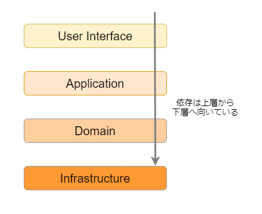
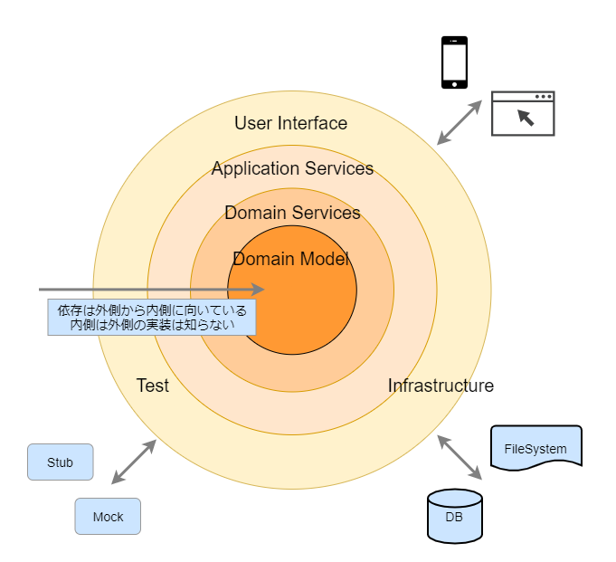

# 課題1

<!-- START doctoc generated TOC please keep comment here to allow auto update -->
<!-- DON'T EDIT THIS SECTION, INSTEAD RE-RUN doctoc TO UPDATE -->
<details>
<summary>Table of Contents</summary>

- [オニオンアーキテクチャとは何か](#%E3%82%AA%E3%83%8B%E3%82%AA%E3%83%B3%E3%82%A2%E3%83%BC%E3%82%AD%E3%83%86%E3%82%AF%E3%83%81%E3%83%A3%E3%81%A8%E3%81%AF%E4%BD%95%E3%81%8B)
- [ドメインモデル層がほかの層に依存しないようにするメリットは何か](#%E3%83%89%E3%83%A1%E3%82%A4%E3%83%B3%E3%83%A2%E3%83%87%E3%83%AB%E5%B1%A4%E3%81%8C%E3%81%BB%E3%81%8B%E3%81%AE%E5%B1%A4%E3%81%AB%E4%BE%9D%E5%AD%98%E3%81%97%E3%81%AA%E3%81%84%E3%82%88%E3%81%86%E3%81%AB%E3%81%99%E3%82%8B%E3%83%A1%E3%83%AA%E3%83%83%E3%83%88%E3%81%AF%E4%BD%95%E3%81%8B)
- [インターフェースへの依存のみ許可することのメリットは何か](#%E3%82%A4%E3%83%B3%E3%82%BF%E3%83%BC%E3%83%95%E3%82%A7%E3%83%BC%E3%82%B9%E3%81%B8%E3%81%AE%E4%BE%9D%E5%AD%98%E3%81%AE%E3%81%BF%E8%A8%B1%E5%8F%AF%E3%81%99%E3%82%8B%E3%81%93%E3%81%A8%E3%81%AE%E3%83%A1%E3%83%AA%E3%83%83%E3%83%88%E3%81%AF%E4%BD%95%E3%81%8B)
- [依存性の逆転とオニオンアーキテクチャとの関係は何か](#%E4%BE%9D%E5%AD%98%E6%80%A7%E3%81%AE%E9%80%86%E8%BB%A2%E3%81%A8%E3%82%AA%E3%83%8B%E3%82%AA%E3%83%B3%E3%82%A2%E3%83%BC%E3%82%AD%E3%83%86%E3%82%AF%E3%83%81%E3%83%A3%E3%81%A8%E3%81%AE%E9%96%A2%E4%BF%82%E3%81%AF%E4%BD%95%E3%81%8B)
- [RDBMSを変更する場合、どの層を変更すべきか](#rdbms%E3%82%92%E5%A4%89%E6%9B%B4%E3%81%99%E3%82%8B%E5%A0%B4%E5%90%88%E3%81%A9%E3%81%AE%E5%B1%A4%E3%82%92%E5%A4%89%E6%9B%B4%E3%81%99%E3%81%B9%E3%81%8D%E3%81%8B)
- [アクセス制限機能はどの層に実装するのが適切なのか](#%E3%82%A2%E3%82%AF%E3%82%BB%E3%82%B9%E5%88%B6%E9%99%90%E6%A9%9F%E8%83%BD%E3%81%AF%E3%81%A9%E3%81%AE%E5%B1%A4%E3%81%AB%E5%AE%9F%E8%A3%85%E3%81%99%E3%82%8B%E3%81%AE%E3%81%8C%E9%81%A9%E5%88%87%E3%81%AA%E3%81%AE%E3%81%8B)

</details>
<!-- END doctoc generated TOC please keep comment here to allow auto update -->

## オニオンアーキテクチャとは何か

「エリック・エヴァンスのドメイン駆動設計」において、ドメイン駆動設計で使用するアーキテクチャとして「レイヤードアーキテクチャ」が提案されている。

このアーキテクチャは、元々3層アーキテクチャで発生してしまう、ビジネスロジック層が責務過剰であるという問題に対処するため、ビジネスロジック自体を「ユースケースを実現する層」と「ドメイン知識を表現する層」の2つに分割したアーキテクチャである。



> 図1. レイヤードアーキテクチャ

しかしレイヤードアーキテクチャでは、ドメイン層がインフラ層に依存してしまっており、ドメインロジックが特定のRDBMSやORマッパーなどに依存してしまう。

そこで依存性の逆転 (Dependancy Injection) を活用して、インフラ層とドメイン層の依存関係を逆転させたものが、[Jeffrey Palermo](https://jeffreypalermo.com/) によって提案された「オニオンアーキテクチャ」である。



> 図2. オニオンアーキテクチャ

## ドメインモデル層がほかの層に依存しないようにするメリットは何か

ドメイン層は、ほかの層で使用されている特定の技術に依存させないことで、独立した層として実装を行うことができる。

これで使用しているDBやフレームワークの実装に影響を受けることがないため、ドメイン層はビジネスロジックやモデルが変更された際にのみ、修正を行うことができるようになる。

## インターフェースへの依存のみ許可することのメリットは何か

インターフェースへの依存のみを許可することで、具体的な実装を意識することなく、各層を独立させることができる。

例えば以下の例では、集約単位での永続下層へのアクセスを提供するリポジトリを使用することで、永続化手法をインメモリやRDBMS、そのほかの手法に変更したとしても、ドメイン層はまったく影響を受けなくなる。

```typescript
// ドメイン層のフォルダにそれぞれエンティティとリポジトリのインターフェースを配置
export interface User {
    name: string;
}

export interface IUserRepository {
    findByUsername(name: string): Promise<User[]>;
}
```

後は具体的な実装はインフラ層が提供するようにすれば、ほかの層は永続化の具体的な方法を一切意識することなく、依存性の逆転により疎結合を実現することができる。

```typescript
// インフラ層に具体的な実装を配置する
export class UserRepositoryMySQL implements IUserRepository {
    constructor() {
        console.log('new instance created');
    }
    
    public findByUsername(name: string) : Promise<User[]> {
        throw new Error('またMySQLの具体的実装はなし')
    }
}
```

## 依存性の逆転とオニオンアーキテクチャとの関係は何か

オニオンアーキテクチャでは、外側から内側への依存を持たせる場合に依存性の逆転 (Dependancy Injection) を利用している。

例えば、内側のアプリケーション層でユースケースを実装する際は、ユースケースがリポジトリの機能を使用している場合、アプリケーション層の外側から具体的なインスタンスをユースケースに注入している。

```typescript
// 一番外側のUIやインフラ層に該当するController
export class UserController {
  public patch(req: Request, res: Response) {
    // 
    const userRepository = new UserRepositoryMySQL();
    const userUseCase = new UserUseCase(userRepository);
    const userDTO = createUserDTO(req);
    const user = userUseCase.patchUser()
    res.status(201).send(user);
  }
}

export class UserUseCase {
  private userRepository: IUserRepository;

  constructor(userRepository: IUserRepository) {
    this.userRepository = userRepository;
  }

  public patchUser(userDTO: UserDTO) {
    const userName = userDTO.getUserName();
    const Users = this.userRepository.findByUsername(userName);
    Users.patchUser();
  }
}
```

## RDBMSを変更する場合、どの層を変更すべきか

インフラ層を変更する。

どのRDBMSを使用するのかは、具体的な実装に直結しており、リポジトリの具体的な実装はインフラ層に定義しているため、インフラ層を変更すればいい。

具体的には以下のように異なるRDBMSでの実装を追加して、UI層に配置されているコントローラーからユースケースに注入するインスタンスを変更すればいい。

```typescript
// インフラ層に具体的な実装を配置する
export class UserRepositoryMySQL implements IUserRepository {
    constructor() {
        console.log('new instance created');
    }
    
    public findByUsername(name: string) : Promise<User[]> {
        throw new Error('MySQLの具体的実装を配置')
    }
}

// PostgreSQL特有の実装をリポジトリに追加する
export class UserRepositoryPostgreSQL implements IUserRepository {
    constructor() {
        console.log('new instance created');
    }
    
    public findByUsername(name: string) : Promise<User[]> {
        throw new Error('PostgreSQLの具体的実装を配置')
    }
}
```

## アクセス制限機能はどの層に実装するのが適切なのか

特定のリソースに対する認可機能、例えば特定のユーザーしか投稿されたブログを編集できないようにする場合を考える。

この場合、リソースを表現するドメインモデルに認可機能を持たせることができる。

```typescript
// ドメインモデルに認可機能を持たせる
export interface Blog {
    canEditContentBy(userId: UserId): void;
    editContent(contents: BlogContent): void;
}

// ユースケースからはドメインモデルが有する認可機能を呼び出す
export class BlogUseCase {
  public patchBlog(blogDTO) {
    const blog = this.blogRepository.findByBlogId(blogDTO.getBlogID());
    // 認可を行った後で、ブログ内容を更新する
    blog.canEditContentBy(blogDTO.getEditorId());
    blog.editContent(blogDTO.getContents());
  }
}
```

参考質問集

- [質問1](https://github.com/little-hands/ddd-q-and-a/issues/121)
- [質問2](https://github.com/little-hands/ddd-q-and-a/issues/133)

## 参考資料

- [The Onion Architecture : part 1](https://jeffreypalermo.com/2008/07/the-onion-architecture-part-1/)
- [The Onion Architecture : part 2](https://jeffreypalermo.com/2008/07/the-onion-architecture-part-2/)
- [The Onion Architecture : part 3](https://jeffreypalermo.com/2008/08/the-onion-architecture-part-3/)
- [Onion Architecture: Part 4 – After Four Years](https://jeffreypalermo.com/2013/08/onion-architecture-part-4-after-four-years/)
- [ドメイン駆動設計で実装を始めるのに一番とっつきやすいアーキテクチャは何か](https://little-hands.hatenablog.com/entry/2017/10/04/231743)
- [ドメイン駆動 + オニオンアーキテクチャ概略[DDD]](https://little-hands.hatenablog.com/entry/2017/10/11/075634)
- [新卒にも伝わるドメイン駆動設計のアーキテクチャ説明(オニオンアーキテクチャ)[DDD]](https://little-hands.hatenablog.com/entry/2018/12/10/ddd-architecture)
- [ソースコードで理解するクリーンアーキテクチャ](https://buildersbox.corp-sansan.com/entry/2019/07/10/110000)
- [世界一わかりやすいClean Architecture](https://www.nuits.jp/entry/easiest-clean-architecture-2019-09)
- [実装クリーンアーキテクチャ](https://qiita.com/nrslib/items/a5f902c4defc83bd46b8)
- [実践クリーンアーキテクチャ](https://nrslib.com/clean-architecture/)
- [TypeScriptでDDD〜RepositoryとEntity編〜](https://speakerdeck.com/mrdshinse/typescriptdeddd-repositorytoentitybian)