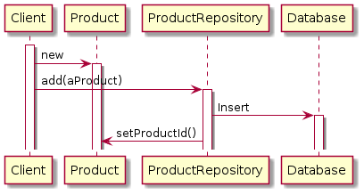
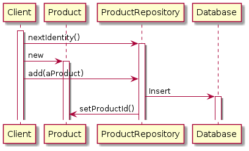

# 課題1

<!-- START doctoc generated TOC please keep comment here to allow auto update -->
<!-- DON'T EDIT THIS SECTION, INSTEAD RE-RUN doctoc TO UPDATE -->
<details>
<summary>Table of Contents</summary>

- [DDD用語](#ddd%E7%94%A8%E8%AA%9E)
- [エンティティ](#%E3%82%A8%E3%83%B3%E3%83%86%E3%82%A3%E3%83%86%E3%82%A3)
- [値オブジェクト (バリューオブジェクト)](#%E5%80%A4%E3%82%AA%E3%83%96%E3%82%B8%E3%82%A7%E3%82%AF%E3%83%88-%E3%83%90%E3%83%AA%E3%83%A5%E3%83%BC%E3%82%AA%E3%83%96%E3%82%B8%E3%82%A7%E3%82%AF%E3%83%88)
- [集約](#%E9%9B%86%E7%B4%84)
- [ユビキタス言語](#%E3%83%A6%E3%83%93%E3%82%AD%E3%82%BF%E3%82%B9%E8%A8%80%E8%AA%9E)
- [境界付けられたコンテキスト](#%E5%A2%83%E7%95%8C%E4%BB%98%E3%81%91%E3%82%89%E3%82%8C%E3%81%9F%E3%82%B3%E3%83%B3%E3%83%86%E3%82%AD%E3%82%B9%E3%83%88)
- [ドメイン](#%E3%83%89%E3%83%A1%E3%82%A4%E3%83%B3)
- [ドメインサービス](#%E3%83%89%E3%83%A1%E3%82%A4%E3%83%B3%E3%82%B5%E3%83%BC%E3%83%93%E3%82%B9)
- [リポジトリ](#%E3%83%AA%E3%83%9D%E3%82%B8%E3%83%88%E3%83%AA)
- [アプリケーション (ユースケース)](#%E3%82%A2%E3%83%97%E3%83%AA%E3%82%B1%E3%83%BC%E3%82%B7%E3%83%A7%E3%83%B3-%E3%83%A6%E3%83%BC%E3%82%B9%E3%82%B1%E3%83%BC%E3%82%B9)
- [CQRS](#cqrs)
- [DTO](#dto)

</details>
<!-- END doctoc generated TOC please keep comment here to allow auto update -->

## DDD用語

ドメイン駆動開発では、固有の概念や用語を理解する必要がある。

そこで以下の用語に関して簡単にまとめる。

- エンティティ
- 値オブジェクト（バリューオブジェクト）
- 集約
- ユビキタス言語
- 境界づけられたコンテキスト
- ドメイン
- ドメインサービス
- リポジトリ
- アプリケーション（ユースケース層と呼ばれることも）
- CQRS
- DTO
## エンティティ

エンティティとは、一意性を有するオブジェクト、つまりシステム内で他のオブジェクトとの区別が必須の制約となっているオブジェクトを表している。

後続の値オブジェクトと異なる点は、エンティティは一意な識別子が存在し、エンティティの属性自体は変化するという特性を有している点である。

識別子に関しては以下の点を考慮する必要がある。

- 生成方法
  - ユーザー指定
  - アプリケーション生成
  - データベース生成
  - 他の境界付けられたコンテキストが生成
- 生成タイミング
  - 早期生成
  - 遅延生成

以下に疑問点をまとめる

> アプリケーション側で識別子を生成する際にはどこで生成させるのか？
> 実践ドメイン駆動には、リポジトリで生成させることが多いとあった
> 以下を参照

```java
public class HibernateProductRepository implements ProductRepository {
    public ProductId nextIdentity() {
        return new ProductId(java.util.UUID.randomUUID().toString().toUpperCase());
    }
}
```

> 識別子の生成タイミングによる違いは何か
> 詳細は以下を参照

|          earlyId           |          delayId           |
| :------------------------: | :------------------------: |
|  |  |

## 値オブジェクト (バリューオブジェクト)

システムで発生する値には、数字や文字列、日付や時刻などが存在しているが、これをドメインの概念でモデリングするための道具が、値オブジェクトである。

値オブジェクトが有する特徴の1つは、不変性であり、例えば以下のオブジェクトは一旦インスタンス化されると、外部から属性を変更することはできない。

```java
// 実践ドメイン駆動設計 p.212 より
public class BusinessPriority implements Serializable {
    // 下記の型も値オブジェクトである
    private BusinessPriorityRatings ratings;

    // 属性を変更できるのはコンストラクタのみ
    public BusinessPriority(BusinessPriorityRatings aRatings) {
        super();
        this.setRatings(aRatings);
        this.initialize()l
    }

    private setratings(BusinessPriorityRatings aRatings) {
        // implements
    }

    private initialize() {
        // implements
    }
}
```

また値オブジェクトで使用する属性やクラスの名称などは、境界付けられたコンテキストとユビキタス言語が定まってからでないと定義することが難しい点に注意が必要である。

値オブジェクトの特徴は、その等価性は2つのオブジェクトの型とそれぞれの属性値との比較で判定することである。

```java
// 実践ドメイン駆動開発 p.217
public boolean equals(Object anObject) {
    boolean equalObject = false;

    // 最初に型の比較を行う
    if (anObject != null && this.getClass() == anObbject.getClass() ) {
        FullName typedObject = (FullName) anObject;

        // それぞれの属性値の等価性を比較する
        equalObject = 
            this.firstName().equals(typedObject.firstName()) &&
            this.lastName().equals(typedObject.getlastName());
    }
    return equalObject;
}
```

## 集約


## ユビキタス言語

ユビキタス言語とは、ドメインエキスパートや開発者など、プロジェクトにかかわるチーム全体で共有する言語のことである。

重要なのは、普段の会話やドキュメント、コードでもユビキタス言語を使用して、ドメインを表現する言葉の意味が受け取り側に依存して変化してしまわないようにすることである。

## 境界付けられたコンテキスト


## ドメイン


## ドメインサービス


## リポジトリ


## アプリケーション (ユースケース)


## CQRS

参照系の処理で、複数の集約に関する情報を一覧表示したい場合、リポジトリを使用すると問題が発生する。

集約に対してリポジトリは紐づいているため、例えば4つの集約にまたがる情報を画面に一覧表示する場合、1つのユースケースから4つのリポジトリから値を取得して、戻り値のクラスに詰め替える実装にする必要がある。

この問題を解決するために導入することが可能のものが「CQRS」であり、参照に使用するモデルと更新に使用するモデルを分離するアーキテクチャである。

参照系のモデルには、表示内容ごとにテーブルを作成する必要があるが、実際にはビューやSQLのJOINで表現する。

```sql
SELECT * FROM vw_usr_product WHERE id = ?
```

ただし参照系のオブジェクトと更新系のオブジェクトが別れるため、ドメインオブジェクトのゲッターから参照元を追うことができなくなる点に注意が必要である。


