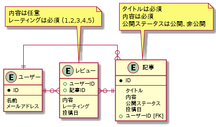

# Prisma Aggregation

<!-- START doctoc generated TOC please keep comment here to allow auto update -->
<!-- DON'T EDIT THIS SECTION, INSTEAD RE-RUN doctoc TO UPDATE -->
<details>
<summary>Table of Contents</summary>

- [目的](#%E7%9B%AE%E7%9A%84)
- [再現したい SQL](#%E5%86%8D%E7%8F%BE%E3%81%97%E3%81%9F%E3%81%84-sql)

</details>
<!-- END doctoc generated TOC please keep comment here to allow auto update -->

## 目的

交差テーブルを使用した多対多の関係をモデリングした際の、データの初期化方法や取得方法を試す。

今回対象とするデータ構造は以下になる。



上記のデータモデリングを反映させた Prisma のスキーマを以下のように定義する。

```prisma
model User {
  id      Int      @id @default(autoincrement())
  name    String
  email   String
  posts   Post[]
  reviews Review[]

  @@map("user")
}

model Post {
  id        Int       @id @default(autoincrement())
  title     String
  contents  String
  published Boolean   @default(false)
  Author    User      @relation(fields: [authorId], references: [id])
  authorId  Int
  reviews   Review[]
  postedAt  DateTime? @default(now())

  @@map("post")
}

model Review {
  user       User      @relation(fields: [userId], references: [id])
  userId     Int
  post       Post      @relation(fields: [postId], references: [id])
  postId     Int
  contents   String?
  rating     Int
  reviewedAt DateTime? @default(now())

  @@unique([userId, postId])
  @@map("review")
}
```

## 再現したい SQL

```sql
-- 登録されているユーザーの一覧を取得する
SELECT * FROM User;

-- 2つのテーブルを結合する
SELECT * FROM User
INNER JOIN Post ON Post.authorId = User.id;

-- ユーザーが所有している記事の総数を計算する
SELECT id, COUNT(*) FROM User
INNER JOIN Post ON Post.authorId = User.id;

-- 特定のユーザーのレビューを投稿日の降順で取得する
SELECT * FROM Review
WHERE userId = '1'
ORDER BY reviewedAt DESC;

-- 公開されている記事のみを取得する
SELECT * FROM Post
WHERE published IS TRUE;
```
