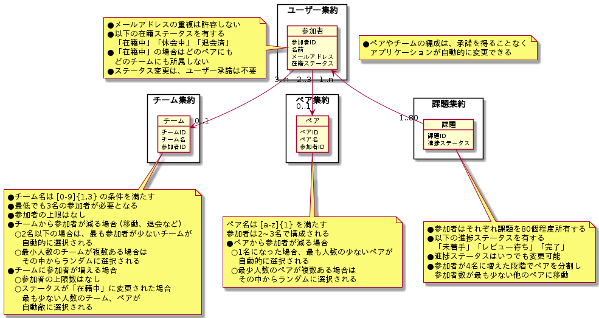
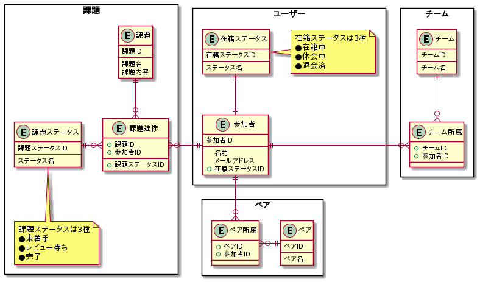
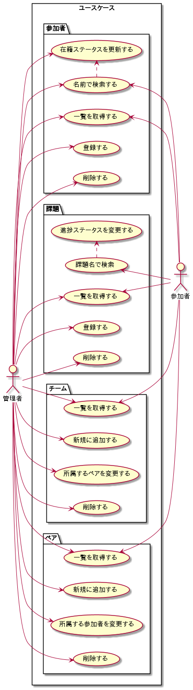

# 課題1

<!-- START doctoc generated TOC please keep comment here to allow auto update -->
<!-- DON'T EDIT THIS SECTION, INSTEAD RE-RUN doctoc TO UPDATE -->

Table of Contents

- [モデル図](#%E3%83%A2%E3%83%87%E3%83%AB%E5%9B%B3)
- [参考資料](#%E5%8F%82%E8%80%83%E8%B3%87%E6%96%99)

<!-- END doctoc generated TOC please keep comment here to allow auto update -->

## ドメインモデル図

まずはドメインモデル図を下記の観点で考える。

- [x] 各オブジェクト自体に状態を持たせる
  - 永続化させる場合は、イベント型テーブルを導入する
  - 例えば、ユーザーと課題の関係は交差テーブルで表現するなど
- [ ] 参加者の移動をどうするのか
  - ユーザーの在籍ステータスが変更されると、合わせてチームやペアの参加者も変更する
  - この責務をどこに持たせるのか

## ER図

次にドメインモデルを永続化するためのテーブル設計を考える。

- ペアの所属やチームの所属は、イベント型と捉えて、別のテーブルとして永続化する
- 課題ステータスや在籍ステータスは、別のテーブルとして永続化する

## ユースケース図

## メモ

> ドメインモデル図を元に、永続化するための設計としてER図を作成する。
> 別の形になることもある。
> ドメインモデルは特定の状態をもつオブジェクトになっていたとしても、データソースはイベント型として記録するなど。
>
> 順番はドメインモデル図→ER図であることがポイントです。

- [ドメインモデルとER図が似ているように感じています。違いを教えてもらえませんか？](https://github.com/little-hands/ddd-q-and-a/issues/578)

> ユースケース図は使い捨てになることが多い。
> ドメインモデル図は常に更新する。

- [ユースケース図やドメインモデル図は常に更新し続けているのでしょうか？DDDで開発をするにあたり、重要と感じているドキュメントはありますか？](https://github.com/little-hands/ddd-q-and-a/issues/397)

## 参考資料

- [PlantUMLでドメイン駆動設計のモデリングを実装する（Nizi Project編）](https://tech.holmescloud.com/entry/2020/10/16/150605#%E3%83%89%E3%83%A1%E3%82%A4%E3%83%B3%E3%83%A2%E3%83%87%E3%83%AB%E5%9B%B3)

