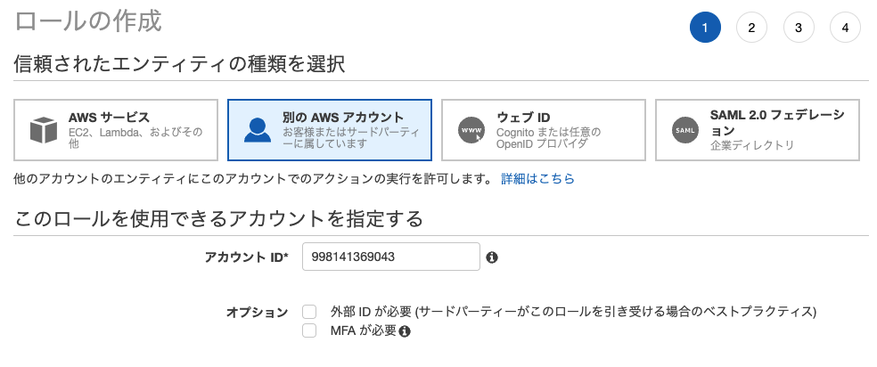

# ペアクイズ

<!-- START doctoc generated TOC please keep comment here to allow auto update -->
<!-- DON'T EDIT THIS SECTION, INSTEAD RE-RUN doctoc TO UPDATE -->

Table of Contents

- [クイズ 1](#%E3%82%AF%E3%82%A4%E3%82%BA-1)
- [クイズ 2](#%E3%82%AF%E3%82%A4%E3%82%BA-2)

<!-- END doctoc generated TOC please keep comment here to allow auto update -->

## クイズ 1

IAM の Switch Role と IAM ユーザーの違いはなんでしょうか。

また、Switch Role を使用するメリット・デメリットはなんでしょうか。

## クイズ 2

実際に Switch Role を行ってみましょう。

回答

- 開発者用の IAM ロールを作成する
  
- Developer 用の権限を指定する
  
- Developer ロール名を指定する
  
- Admin 用の権限を指定する
  
- Admin ロール名を指定する
  
- Developer ロールに切り替える
  
- 権限が足りていないことがわかる
  
- Admin ロールに切り替える
  
- 権限が足りていることがわかる
  

