# 課題 1

<!-- START doctoc generated TOC please keep comment here to allow auto update -->
<!-- DON'T EDIT THIS SECTION, INSTEAD RE-RUN doctoc TO UPDATE -->

Table of Contents

- [IAM ユーザー、グループ、ロール、ポリシーの違い](#iam-%E3%83%A6%E3%83%BC%E3%82%B6%E3%83%BC%E3%82%B0%E3%83%AB%E3%83%BC%E3%83%97%E3%83%AD%E3%83%BC%E3%83%AB%E3%83%9D%E3%83%AA%E3%82%B7%E3%83%BC%E3%81%AE%E9%81%95%E3%81%84)
  - [認証と認可](#%E8%AA%8D%E8%A8%BC%E3%81%A8%E8%AA%8D%E5%8F%AF)

<!-- END doctoc generated TOC please keep comment here to allow auto update -->

## IAM ユーザー、グループ、ロール、ポリシーの違い

### 認証と認可

IAM の仕組みを説明する前に一般的な認証・認可の仕組みを振り返る。

下記の図のように、ID やパスワードなどの組み合わせでユーザーを一意に識別して本人であることを確認することが認証であり、そのユーザーに対してリソースの参照や書き込みなどの権限を設定してアクセス制御を行うことが認可である。

AWS のリソースにアクセスする際にも認証・認可の仕組みが存在しており、大まかには以下の流れになっている。

リソースを要求するユーザーには、IAM ユーザーや IAM ロール、アプリケーションなど複数存在しているが、どれもまずは認証を行い本人であることが保証された後で、そのユーザーに紐づいている権限を IAM ポリシーで検証を行い、最終的にリソースにアクセスしている。

> https://www.slideshare.net/AmazonWebServicesJapan/20190129-aws-black-belt-online-seminar-aws-identity-and-access-management-iam-part1

