# 課題 1

<!-- START doctoc generated TOC please keep comment here to allow auto update -->
<!-- DON'T EDIT THIS SECTION, INSTEAD RE-RUN doctoc TO UPDATE -->
<details>
<summary>Table of Contents</summary>

- [IAM ユーザー、グループ、ロール、ポリシーの違い](#iam-%E3%83%A6%E3%83%BC%E3%82%B6%E3%83%BC%E3%82%B0%E3%83%AB%E3%83%BC%E3%83%97%E3%83%AD%E3%83%BC%E3%83%AB%E3%83%9D%E3%83%AA%E3%82%B7%E3%83%BC%E3%81%AE%E9%81%95%E3%81%84)
  - [認証と認可](#%E8%AA%8D%E8%A8%BC%E3%81%A8%E8%AA%8D%E5%8F%AF)
  - [AWS のアカウント](#aws-%E3%81%AE%E3%82%A2%E3%82%AB%E3%82%A6%E3%83%B3%E3%83%88)
  - [AWS IAM](#aws-iam)
  - [IAM ユーザー](#iam-%E3%83%A6%E3%83%BC%E3%82%B6%E3%83%BC)
  - [IAM グループ](#iam-%E3%82%B0%E3%83%AB%E3%83%BC%E3%83%97)
  - [IAM ポリシー](#iam-%E3%83%9D%E3%83%AA%E3%82%B7%E3%83%BC)
  - [IAM ポリシーの種類](#iam-%E3%83%9D%E3%83%AA%E3%82%B7%E3%83%BC%E3%81%AE%E7%A8%AE%E9%A1%9E)
  - [IAM ロール](#iam-%E3%83%AD%E3%83%BC%E3%83%AB)

</details>
<!-- END doctoc generated TOC please keep comment here to allow auto update -->

## IAM ユーザー、グループ、ロール、ポリシーの違い

### 認証と認可

IAM の仕組みを説明する前に一般的な認証・認可の仕組みを振り返る。

下記の図のように、ID やパスワードなどの組み合わせでユーザーを一意に識別して本人であることを確認することが認証であり、そのユーザーに対してリソースの参照や書き込みなどの権限を設定してアクセス制御を行うことが認可である。


AWS のリソースにアクセスする際にも認証・認可の仕組みが存在しており、大まかには以下の流れになっている。

リソースを要求するユーザーには、IAM ユーザーや IAM ロール、アプリケーションなど複数存在しているが、どれもまずは認証を行い本人であることが保証された後で、そのユーザーに紐づいている権限を IAM ポリシーで検証を行い、最終的にリソースにアクセスしている。


> https://www.slideshare.net/AmazonWebServicesJapan/20190129-aws-black-belt-online-seminar-aws-identity-and-access-management-iam-part1

### AWS のアカウント

AWS で作成するアカウントには 2 種類存在しており、用途も異なっているため、どのような違いがあるのか認識しておくことが重要である。

大きな違いは以下の図にあるように、付与されている権限である。AWS アカウントはアカウント内の全てのリソースへのフルアクセスが可能という大きな権限を持っているため、日常的な作業な管理者権限を有する IAM ユーザーを作成することが推奨されている。


ただし、AWS アカウントの認証情報が必要なタスク（AWS アカウントの解約など）もあるため、適宜使い分ける必要がある。

- [ルートユーザー認証情報が必要なタスク](https://docs.aws.amazon.com/ja_jp/general/latest/gr/root-vs-iam.html#aws_tasks-that-require-root)

### AWS IAM

AWS IAM の機能の中でも、以下の 4 つの違いがわかるように解説を行なっていく。

- IAM ユーザー
- IAM グループ
- IAM ポリシー
- IAM ロール

### IAM ユーザー

IAM ユーザーはリソースにアクセスする前の認証に関わっている。

その際の認証は 2 種類存在しており、以下のように AWS マネジメントコンソールに対して ID とパスワードを使用してアクセスする認証方式と、CLI などのプログラムベースでアクセスキーとシークレットアクセスキーの組み合わせを使用してアクセスする認証方式である。


また IAM ユーザーに対してはリソースに対するアクセス権限を IAM ポリシーの形で付与することが可能だが、その場合ユーザーの数だけアクセス権限の管理が必要になる。そのため、 IAM グループを作成し、グループ全体に一律の IAM ポリシーを付与することが一般的である。

### IAM グループ

IAM グループを使用すると、複数の IAM ユーザーに対するアクセス権限を役割別に付与することが可能となる。

例えば以下の図のように、管理者権限を必要とするようなアクセス権限を付与したグループと、普段の開発時に使用するリソースへのアクセス権限を付与したグループに分けるような操作が可能となる。


> https://docs.aws.amazon.com/ja_jp/IAM/latest/UserGuide/id_groups.html

### IAM ポリシー

IAM ポリシーを使用すると、ユーザーによる AWS リソースへのアクセスを制限することができる。

IAM ポリシーは、AWS が最初から用意している AWS 管理ポリシーだけではなく、ユーザーが独自にポリシーを作成（カスタム管理ポリシー）することもできる。

その場合には基本的には以下のフォーマットに従う。

- 「Action（どの AWS サービスの）」
- 「Resource（どの AWS リソースに対して）」
- 「Effect（許可/拒否するのか）」

例えば以下の IAM ポリシーでは、「特定の S3 バケットに対して」「バケット内のオブジェクトを取得するサービスを」「許可する」アクセス権限を表している。

```js
{
    "Version": "2012-10-17",
    "Statement": {
        "Effect": "Allow",
        "Action": "s3:ListBucket",
        "Resource": "arn:aws:s3::example_bucket"
    }
}
```

- [IAM でのポリシーとアクセス許可](https://docs.aws.amazon.com/ja_jp/IAM/latest/UserGuide/access_policies.html)

### IAM ポリシーの種類

IAM ポリシーの種類は複数存在しているが、よく使用されているのは以下の 2 種類である。

- アイデンティティベースのポリシー
- リソースベースのポリシー

ポリシーの種類に応じて、以下のように設定する項目が異なっているので注意が必要である。



### IAM ロール

ユーザーが AWS サービスを利用する以外に、例えば EC2 インスタンス上のサーバーから DB にアクセスする場合を考えると、AWS サービスから AWS サービスを利用する場合が存在する。

この場合に IAM ユーザーを使用してしまうと ID とパスワード、あるいはアクセスキーとシークレットアクセスキーが必要となってしまい、コード内や環境変数内に認証情報を埋め込んでしまう可能性がある。

こうしたアンチパターンを回避するための方法としてよく使用されているのは以下の方法である。

- 一時的に認証情報を使用すること
- 認証情報を AWS サービスに権限委譲すること
  - EC2 インスタンス
  - AWS サービス
  - ユーザー

IAM ロールを使用すると、上記のように AWS サービスなどに AWS のアクセス権限を与えることができる。

例えば以下のように特定のリソースへのアクセス権限を有した IAM ロールを作成し、対象のリソースへロールをアタッチすることで、目的のリソースへアクセスすることが可能となる。


