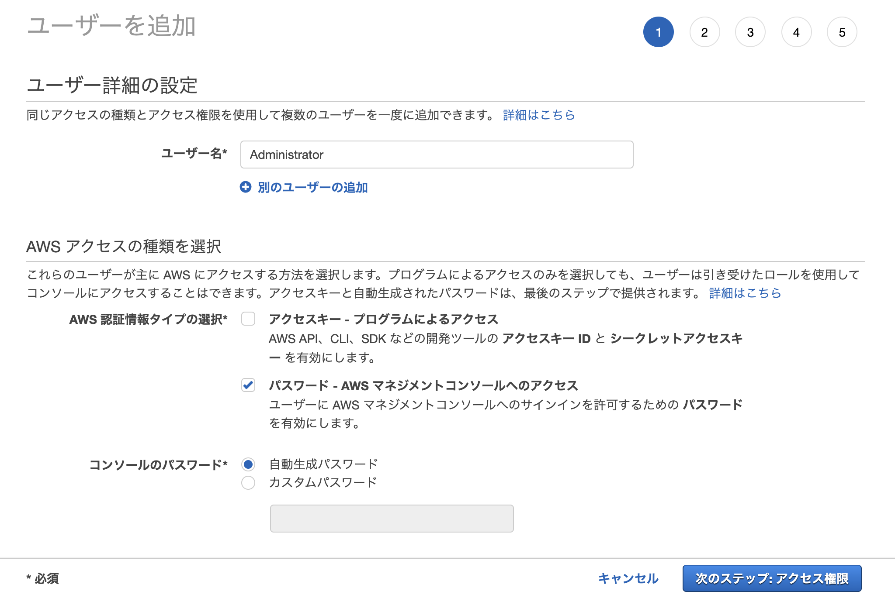
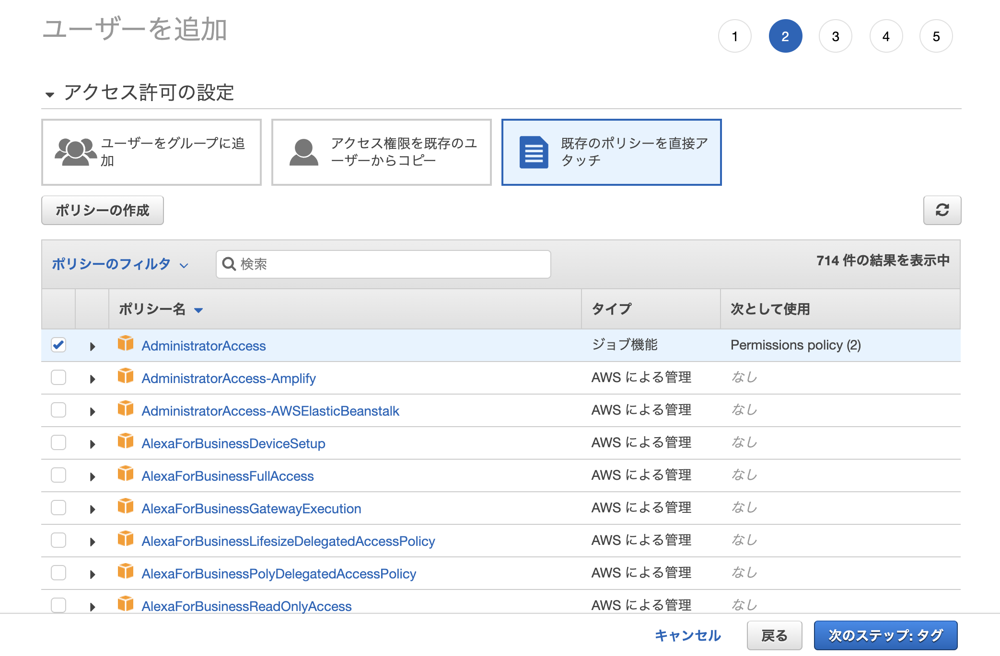
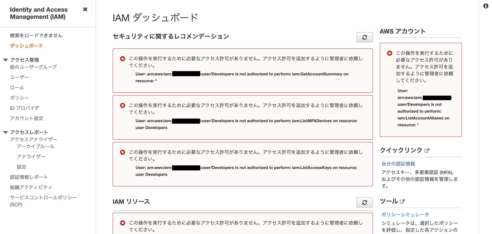
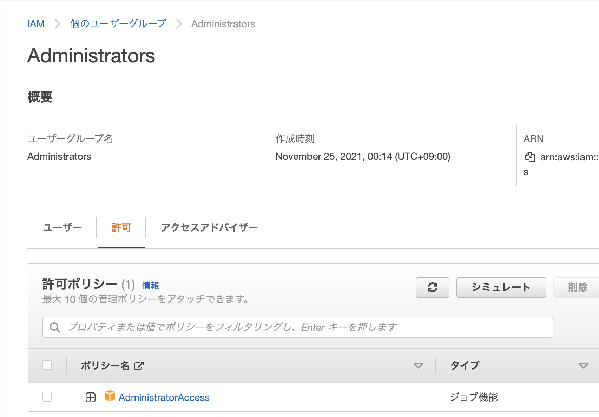
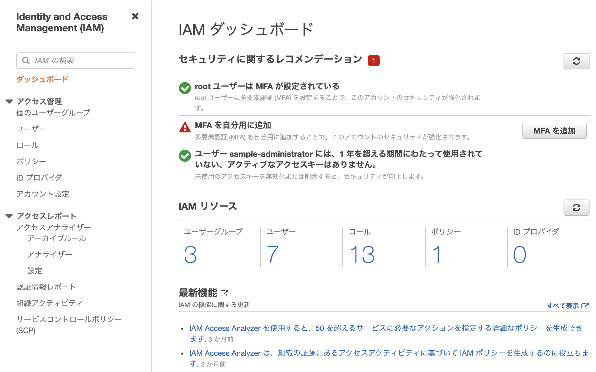

# 課題 2

<!-- START doctoc generated TOC please keep comment here to allow auto update -->
<!-- DON'T EDIT THIS SECTION, INSTEAD RE-RUN doctoc TO UPDATE -->
<details>
<summary>Table of Contents</summary>

- [IAM ユーザーを作成する](#iam-%E3%83%A6%E3%83%BC%E3%82%B6%E3%83%BC%E3%82%92%E4%BD%9C%E6%88%90%E3%81%99%E3%82%8B)
  - [管理者権限を有する IAM ユーザーを作成する](#%E7%AE%A1%E7%90%86%E8%80%85%E6%A8%A9%E9%99%90%E3%82%92%E6%9C%89%E3%81%99%E3%82%8B-iam-%E3%83%A6%E3%83%BC%E3%82%B6%E3%83%BC%E3%82%92%E4%BD%9C%E6%88%90%E3%81%99%E3%82%8B)
  - [一般権限を有する IAM ユーザーを作成する](#%E4%B8%80%E8%88%AC%E6%A8%A9%E9%99%90%E3%82%92%E6%9C%89%E3%81%99%E3%82%8B-iam-%E3%83%A6%E3%83%BC%E3%82%B6%E3%83%BC%E3%82%92%E4%BD%9C%E6%88%90%E3%81%99%E3%82%8B)
  - [ルートユーザーと IAM ユーザー](#%E3%83%AB%E3%83%BC%E3%83%88%E3%83%A6%E3%83%BC%E3%82%B6%E3%83%BC%E3%81%A8-iam-%E3%83%A6%E3%83%BC%E3%82%B6%E3%83%BC)
- [IAM グループを作成する](#iam-%E3%82%B0%E3%83%AB%E3%83%BC%E3%83%97%E3%82%92%E4%BD%9C%E6%88%90%E3%81%99%E3%82%8B)

</details>
<!-- END doctoc generated TOC please keep comment here to allow auto update -->

## IAM ユーザーを作成する

### 管理者権限を有する IAM ユーザーを作成する

ルートユーザーとしてログインした後は以下の手順に従えばいい。

1. ID とパスワードでアクセス可能な `Administrator` ユーザーを作成する

   

2. 作成するユーザーに対して `AdministratorAccess` 権限を付与する

   

この `AdministratorAccess` 権限の中身を見てみると以下のようになっており、全てのリソースに対する全ての操作が実行可能となっていることがわかる。

```json
{
  "Version": "2012-10-17",
  "Statement": [
    {
      "Effect": "Allow",
      "Action": "*",
      "Resource": "*"
    }
  ]
}
```

### 一般権限を有する IAM ユーザーを作成する

今度は同じ手順で `PowerUserAccess` 権限を付与したユーザーを作成すると、以下のように IAM コンソール画面でエラーが発生していることがわかる。



これは `PowerUserAccess` 権限ではコンソール画面に出力するためのリソース操作に対する権限が足りていないからである。

実際に `PowerUserAccess` 権限の中身を見てみると、`NotAction` にあるように IAM に関係するほとんどの操作が制限されており、ロールを作成したり取得したりすることしかできないことがわかる。

```json
{
  "Version": "2012-10-17",
  "Statement": [
    {
      "Effect": "Allow",
      "NotAction": ["iam:*", "organizations:*", "account:*"],
      "Resource": "*"
    },
    {
      "Effect": "Allow",
      "Action": [
        "iam:CreateServiceLinkedRole",
        "iam:DeleteServiceLinkedRole",
        "iam:ListRoles",
        "organizations:DescribeOrganization",
        "account:ListRegions"
      ],
      "Resource": "*"
    }
  ]
}
```

### ルートユーザーと IAM ユーザー

ルートユーザーは AWS リソースに対するフルアクセス権限を有しており、アクセス制御をすることもできないため、普段の開発ではアクセス権限を付与した IAM ユーザーを使用することが推奨されている。

- [AWS アカウント ルートユーザーのアクセスキーをロックする](https://docs.aws.amazon.com/ja_jp/IAM/latest/UserGuide/best-practices.html#lock-away-credentials)

## IAM グループを作成する

では `AdministratorAccess` 権限を有する IAM グループを作成する。

実際に作成されたグループを確認してみると、ポリシーに `AdministratorAccess` 権限が付与されているグループが作成されていることがわかる。



ここで IAM グループ内に、なんの権限も持たせていない IAM ユーザーを所属させて、対象のユーザーで IAM コンソールを見てみると、以下のようにグループに付与されている権限を通してエラーが発生していないことがわかる。



### アクセス権限の付与方法

アクセス権限を付与する場合に、 IAM ユーザーに直接付与する方法と IAM グループに付与する方法が存在している。

以下の理由から IAM グループに対してアクセス権限を付与する方がいい。

- 権限の付与漏れや過剰付与などのミスが発生する確率が上昇する
- グループで管理することで複数のユーザーに対して同じ権限を割り当てることができる

