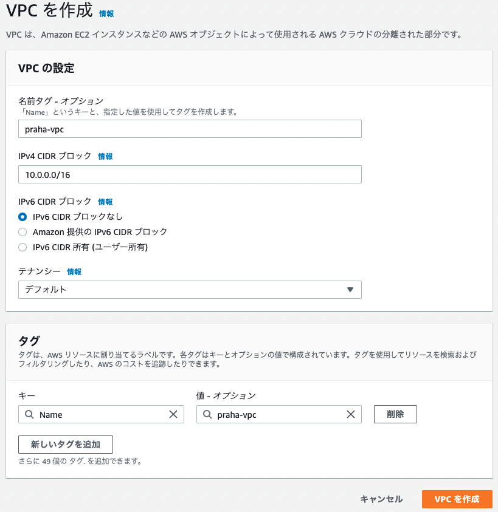

# 課題 1

<!-- START doctoc generated TOC please keep comment here to allow auto update -->
<!-- DON'T EDIT THIS SECTION, INSTEAD RE-RUN doctoc TO UPDATE -->
<details>
<summary>Table of Contents</summary>

- [AWS VPC](#aws-vpc)
- [VPC の構築](#vpc-%E3%81%AE%E6%A7%8B%E7%AF%89)

</details>
<!-- END doctoc generated TOC please keep comment here to allow auto update -->

## AWS VPC

AWS VPC (Virtual Private Cloud) を使用すると AWS 上に仮想ネットワークを構築することができ、仮想ネットワーク内で EC2 インスタンスや RDS を配置したり、トラフィックを制御して各サービスと通信したりできる。

VPC では以下のような様々なコンポーネントを組み合わせることで仮想ネットワークを構築して
いく。



参考資料

- [Amazon VPC とは？](https://docs.aws.amazon.com/ja_jp/vpc/latest/userguide/what-is-amazon-vpc.html)

## VPC の構築

AWS VPC を構築する際には、使用する IP アドレスを CIDR ブロック形式で指定する必要がある。

今回は 16 ビットマスクの IP アドレスの範囲を指定している。

- CIDR ブロック：`10.0.0.0/16`
  - 割り当てられる IP アドレスの範囲：`10.0.0.0 ~ 10.0.255.255`
  - 割り当てられる IP アドレスの数：`65536`

構成図としては以下のようになっている。



これで以下の画面のように設定項目を追加することで VPC を作成した。



AWS CLI 上では下記のコマンドで作成することができる。

```bash
# https://docs.aws.amazon.com/cli/latest/reference/ec2/create-vpc.html

# praha-vpc
aws ec2 create-vpc \
    --cidr-block 10.0.0.0/16 \
    --tag-specifications 'ResourceType=vpc,Tags=[{Key=Name,Value=praha-vpc}]' \
    --profile <yout profile>
```

これ以降のリソース作成は全て AWS CLI を使用する。

参考資料

- [VPC とサブネットの利用](https://docs.aws.amazon.com/ja_jp/vpc/latest/userguide/working-with-vpcs.html)

