# 課題 1

<!-- START doctoc generated TOC please keep comment here to allow auto update -->
<!-- DON'T EDIT THIS SECTION, INSTEAD RE-RUN doctoc TO UPDATE -->
<details>
<summary>Table of Contents</summary>

- [AWS VPC](#aws-vpc)
- [VPC の構築](#vpc-%E3%81%AE%E6%A7%8B%E7%AF%89)
- [リージョンとアベイラビリティゾーン](#%E3%83%AA%E3%83%BC%E3%82%B8%E3%83%A7%E3%83%B3%E3%81%A8%E3%82%A2%E3%83%99%E3%82%A4%E3%83%A9%E3%83%93%E3%83%AA%E3%83%86%E3%82%A3%E3%82%BE%E3%83%BC%E3%83%B3)
- [サブネット](#%E3%82%B5%E3%83%96%E3%83%8D%E3%83%83%E3%83%88)
  - [サブネットとは](#%E3%82%B5%E3%83%96%E3%83%8D%E3%83%83%E3%83%88%E3%81%A8%E3%81%AF)
  - [サブネットの構築](#%E3%82%B5%E3%83%96%E3%83%8D%E3%83%83%E3%83%88%E3%81%AE%E6%A7%8B%E7%AF%89)
- [インターネットゲートウェイ](#%E3%82%A4%E3%83%B3%E3%82%BF%E3%83%BC%E3%83%8D%E3%83%83%E3%83%88%E3%82%B2%E3%83%BC%E3%83%88%E3%82%A6%E3%82%A7%E3%82%A4)
- [ルートテーブル](#%E3%83%AB%E3%83%BC%E3%83%88%E3%83%86%E3%83%BC%E3%83%96%E3%83%AB)
  - [VPC 内通信専用のルートテーブル](#vpc-%E5%86%85%E9%80%9A%E4%BF%A1%E5%B0%82%E7%94%A8%E3%81%AE%E3%83%AB%E3%83%BC%E3%83%88%E3%83%86%E3%83%BC%E3%83%96%E3%83%AB)
- [SSH アクセス可能な EC2 インスタンス](#ssh-%E3%82%A2%E3%82%AF%E3%82%BB%E3%82%B9%E5%8F%AF%E8%83%BD%E3%81%AA-ec2-%E3%82%A4%E3%83%B3%E3%82%B9%E3%82%BF%E3%83%B3%E3%82%B9)
  - [キーペアの作成](#%E3%82%AD%E3%83%BC%E3%83%9A%E3%82%A2%E3%81%AE%E4%BD%9C%E6%88%90)
  - [セキュリティグループの作成](#%E3%82%BB%E3%82%AD%E3%83%A5%E3%83%AA%E3%83%86%E3%82%A3%E3%82%B0%E3%83%AB%E3%83%BC%E3%83%97%E3%81%AE%E4%BD%9C%E6%88%90)
  - [EC2 インスタンスの作成](#ec2-%E3%82%A4%E3%83%B3%E3%82%B9%E3%82%BF%E3%83%B3%E3%82%B9%E3%81%AE%E4%BD%9C%E6%88%90)
  - [SSH によるアクセス](#ssh-%E3%81%AB%E3%82%88%E3%82%8B%E3%82%A2%E3%82%AF%E3%82%BB%E3%82%B9)
- [プライベートサブネット内での EC2 インスタンスの作成](#%E3%83%97%E3%83%A9%E3%82%A4%E3%83%99%E3%83%BC%E3%83%88%E3%82%B5%E3%83%96%E3%83%8D%E3%83%83%E3%83%88%E5%86%85%E3%81%A7%E3%81%AE-ec2-%E3%82%A4%E3%83%B3%E3%82%B9%E3%82%BF%E3%83%B3%E3%82%B9%E3%81%AE%E4%BD%9C%E6%88%90)
  - [キーペアの作成](#%E3%82%AD%E3%83%BC%E3%83%9A%E3%82%A2%E3%81%AE%E4%BD%9C%E6%88%90-1)
  - [セキュリティグループの作成](#%E3%82%BB%E3%82%AD%E3%83%A5%E3%83%AA%E3%83%86%E3%82%A3%E3%82%B0%E3%83%AB%E3%83%BC%E3%83%97%E3%81%AE%E4%BD%9C%E6%88%90-1)
  - [EC2 インスタンスの作成](#ec2-%E3%82%A4%E3%83%B3%E3%82%B9%E3%82%BF%E3%83%B3%E3%82%B9%E3%81%AE%E4%BD%9C%E6%88%90-1)

</details>
<!-- END doctoc generated TOC please keep comment here to allow auto update -->

## AWS VPC

AWS VPC (Virtual Private Cloud) を使用すると AWS 上に仮想ネットワークを構築することができ、仮想ネットワーク内で EC2 インスタンスや RDS を配置したり、トラフィックを制御して各サービスと通信したりできる。

VPC では以下のような様々なコンポーネントを組み合わせることで仮想ネットワークを構築して
いく。


参考資料

- [Amazon VPC とは？](https://docs.aws.amazon.com/ja_jp/vpc/latest/userguide/what-is-amazon-vpc.html)

## VPC の構築

AWS VPC を構築する際には、使用する IP アドレスを CIDR ブロック形式で指定する必要がある。

今回は 16 ビットマスクの IP アドレスの範囲を指定している。

- CIDR ブロック：`10.0.0.0/16`
  - 割り当てられる IP アドレスの範囲：`10.0.0.0 ~ 10.0.255.255`
  - 割り当てられる IP アドレスの数：`65536`

構成図としては以下のようになっている。


これで以下の画面のように設定項目を追加することで VPC を作成した。


AWS CLI 上では下記のコマンドで作成することができる。

```bash
# https://docs.aws.amazon.com/cli/latest/reference/ec2/create-vpc.html

# praha-vpc
aws ec2 create-vpc \
    --cidr-block 10.0.0.0/16 \
    --tag-specifications 'ResourceType=vpc,Tags=[{Key=Name,Value=praha-vpc}]' \
    --profile <yout profile>
```

これ以降のリソース作成は全て AWS CLI を使用する。

参考資料

- [VPC とサブネットの利用](https://docs.aws.amazon.com/ja_jp/vpc/latest/userguide/working-with-vpcs.html)

## リージョンとアベイラビリティゾーン

AWS でネットワークを構築する際には、**リージョン** と **アベイラビリティゾーン** の違いを理解しておく必要がある。

AWS におけるリージョンとは、データセンターが集積されている世界中の物理的ロケーションを意味している。また、1 つの物理的ロケーションは複数の論理的データセンターで構築されており、これをアベイラビリティゾーンと呼んでいる。

それぞれのアベイラビリティゾーン自体は、1 つのリージョン内で切り離されており、冗長的な電力源やネットワークなどで構成されているため、アベイラビリティゾーンごとに VPC 内のサブネットを構築しておくことで、システムの耐障害性を向上させることができる。

例えば東京リージョンは以下のように 3 つのアベイラビリティゾーンで構成されている。

| Region         | Availibility Zone |
| -------------- | ----------------- |
| ap-northeast-1 | ap-northeast-1a   |
|                | ap-northeast-1c   |
|                | ap-northeast-1d   |

## サブネット

### サブネットとは

VPC 内で構築するサブネットは、インターネットに対して公開するパブリックサブネットと、インターネットと通信することのないプライベートサブネットに分けられる。

サブネットを構築するには、まずはどのように VPC に割り当てられている IP アドレスをグルーピングするのかを考慮する必要がある。

ただし、サブネットで利用できない IP アドレス（以下は `/24` の例）が存在することに注意する必要がある。

| host address | how to                                                                         |
| ------------ | ------------------------------------------------------------------------------ |
| .0           | ネットワークアドレス                                                           |
| .1           | VPC ルータ                                                                     |
| .2           | Amazon が提供する DNS サービス                                                 |
| .3           | AWS で予約されている                                                           |
| .255         | ブロードキャストアドレス<br>（VPC ではブロードキャストはサポートされていない） |

上記を考慮して、CIDR ブロックに対応するサブネット数とサブネットあたりの IP アドレスの数は以下のようになる。

| CIDR block                                 | Subnet Mask | Subnets | IP Addresses |
| ------------------------------------------ | ----------- | ------- | ------------ |
| `00001010.00000000`.`YY` `XXXXXX.XXXXXXXX` | /18         | 4       | 16379        |
| `00001010.00000000`.`YYYY` `XXXX.XXXXXXXX` | /20         | 16      | 4091         |
| `00001010.00000000`.`YYYYYY` `XX.XXXXXXXX` | /22         | 64      | 1019         |
| `00001010.00000000`.`YYYYYYYY`.`XXXXXXXX`  | /24         | 256     | 251          |

> ただし VPC あたりのサブネット作成上限数はデフォルトで 200 個までなので注意が必要である。

### サブネットの構築

今回は以下の構成図のように、冗長性を持たせるためのマルチ AZ 構成であり、インターネットに公開するサブネットと公開しないサブネットを構築していく。

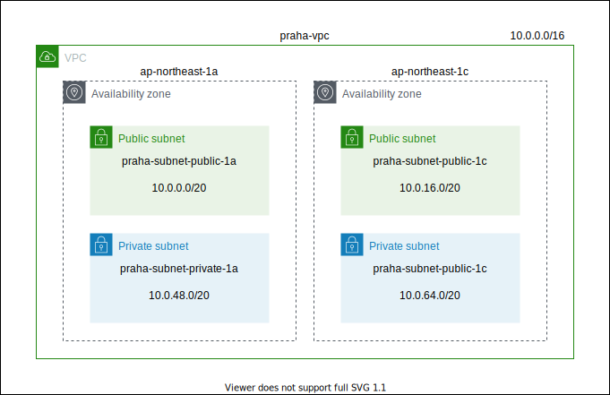

AWS CLI では以下のコマンドで作成する。

```bash
# https://awscli.amazonaws.com/v2/documentation/api/latest/reference/ec2/create-subnet.html

# 使用できるアベイラビリティゾーンを全て確認する
aws ec2 describe-availability-zones \
    --region ap-northeast-1 \
    --profile <your profile>

# praha-subnet-public-1a
aws ec2 create-subnet \
    --vpc-id vpc-07694e790ce13cfbc \
    --cidr-block 10.0.0.0/20 \
    --availability-zone ap-northeast-1a \
    --tag-specifications 'ResourceType=subnet,Tags=[{Key=Name,Value=praha-subnet-public-1a}]' \
    --profile <your profile>

# praha-subnet-public-1c
aws ec2 create-subnet \
    --vpc-id vpc-07694e790ce13cfbc \
    --cidr-block 10.0.16.0/20 \
    --availability-zone ap-northeast-1c \
    --tag-specifications 'ResourceType=subnet,Tags=[{Key=Name,Value=praha-subnet-public-1c}]' \
    --profile <your profile>

# praha-subnet-private-1a
aws ec2 create-subnet \
    --vpc-id vpc-07694e790ce13cfbc \
    --cidr-block 10.0.48.0/20 \
    --availability-zone ap-northeast-1a \
    --tag-specifications 'ResourceType=subnet,Tags=[{Key=Name,Value=praha-subnet-private-1a}]' \
    --profile <your profile>

# praha-subnet-private-1c
aws ec2 create-subnet \
    --vpc-id vpc-07694e790ce13cfbc \
    --cidr-block 10.0.64.0/20 \
    --availability-zone ap-northeast-1c \
    --tag-specifications 'ResourceType=subnet,Tags=[{Key=Name,Value=praha-subnet-private-1c}]' \
    --profile <your profile>
```

これで以下のようなリソースを作成することができた。

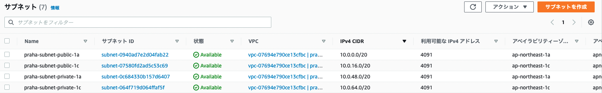

## インターネットゲートウェイ

今のままではサブネットを構築しただけであり、インターネットと VPC は通信していない状態である。

そこでインターネットとの接続点となるインタネットゲートウェイを作成し、対象の VPC に紐づける必要がある。

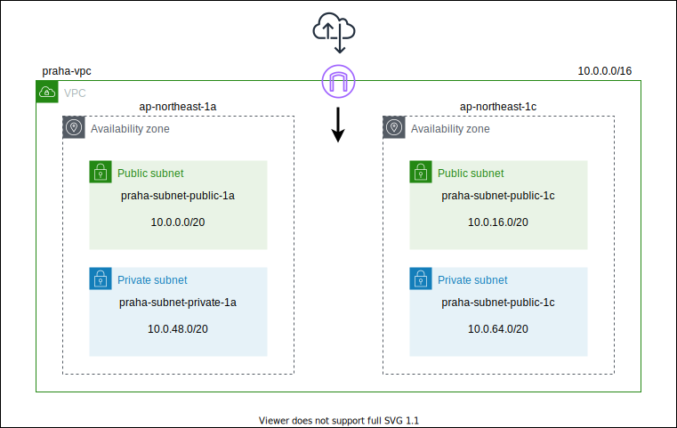

これで VPC 内のパブリック ID アドレスを有している (インターネットに公開されている) リソースと通信することが可能となる。

AWS CLI では以下のコマンドで作成する。

```bash
# https://awscli.amazonaws.com/v2/documentation/api/latest/reference/ec2/create-internet-gateway.html

# praha-igw
aws ec2 create-internet-gateway \
    --tag-specifications 'ResourceType=internet-gateway,Tags=[{Key=Name,Value=praha-igw}]' \
    --profile <your profile>
```

インターネットゲートウェイの作成ができれば、あとは VPC に紐づける。

```bash
# https://awscli.amazonaws.com/v2/documentation/api/latest/reference/ec2/attach-internet-gateway.html

# 作成したインターネットゲートウェイをVPCにアタッチする
aws ec2 attach-internet-gateway \
    --internet-gateway-id igw-0d6546efe63fe9988 \
    --vpc-id vpc-07694e790ce13cfbc \
    --profile <your profile>
```

これで以下のようなリソースを作成することができた。

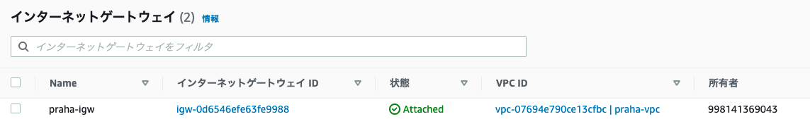

参考資料

- [インターネットゲートウェイ](https://docs.aws.amazon.com/ja_jp/vpc/latest/userguide/VPC_Internet_Gateway.html)

## ルートテーブル

インターネットゲートウェイを VPC に紐づけることで、インターネットと通信することができるようになるが、その後でインターネットからの通信を対象のサブネットなどに振り分けるためのルートテーブルを追加する必要がある。


なお VPC を作成した段階でデフォルトのルートテーブルが作成される。これは以下のように VPC 内の通信をルーティングできるようにするためのルートが追加されている。

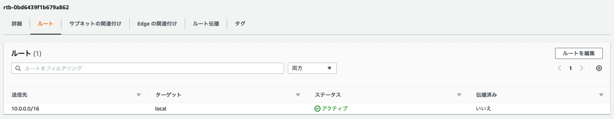

これでは VPC 内からインターネットへ通信することができないため、VPC 内からのインターネットへの通信はインターネットゲートウェイを経由して外部へ通信する設定を追加する。

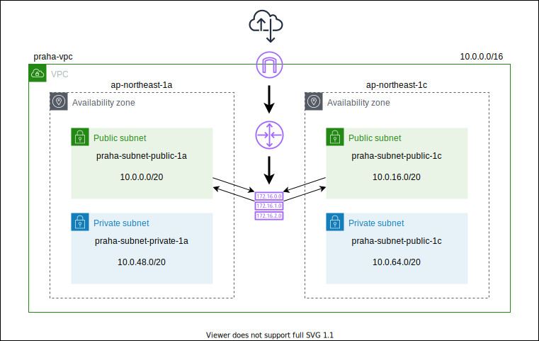

```bash
# https://awscli.amazonaws.com/v2/documentation/api/latest/reference/ec2/create-route.html

aws ec2 create-route \
    --route-table-id rtb-0bd6439f1b679a862 \
    --destination-cidr-block 0.0.0.0/0 \
    --gateway-id igw-0d6546efe63fe9988 \
    --profile <your profile>
```

これでルートテーブルに新しくルートを登録することができた。

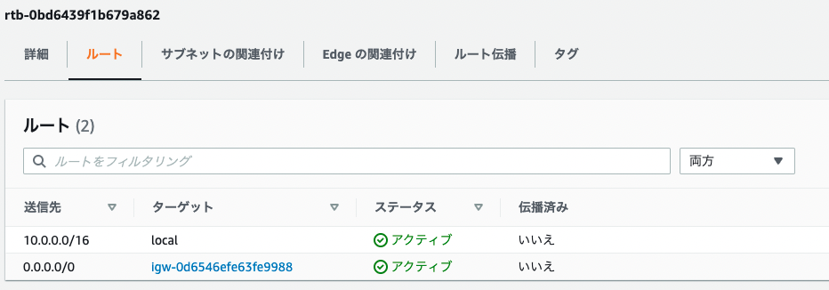

あとはこのルートテーブルをパブリックサブネットに対して明示的に関連づけるようにしておく。

まずは紐づける対象となるサブネットを確認する。

```bash
# https://awscli.amazonaws.com/v2/documentation/api/latest/reference/ec2/describe-subnets.html

aws ec2 describe-subnets \
    --filters "Name=vpc-id,Values=vpc-07694e790ce13cfbc" \
    --query "Subnets[*].{ID:SubnetId,CIDR:CidrBlock}" \
    --profile <your profile>
```

あとは、サブネットとルートテーブルを紐づければいい。

```bash
# https://awscli.amazonaws.com/v2/documentation/api/latest/reference/ec2/associate-route-table.html

aws ec2 associate-route-table \
    --route-table-id rtb-0bd6439f1b679a862 \
    --subnet-id subnet-0940ad7e2d04fab22 \
    --profile <your profile>

aws ec2 associate-route-table \
    --route-table-id rtb-0bd6439f1b679a862 \
    --subnet-id subnet-07580fd2ad5c53c69 \
    --profile <your profile>
```

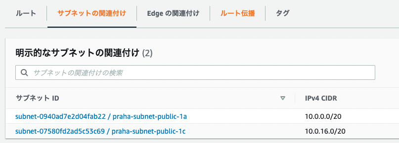

参考資料

- [例: AWS CLI を使用して IPv4 VPC とサブネットを作成](https://docs.aws.amazon.com/ja_jp/vpc/latest/userguide/vpc-subnets-commands-example.html)

### VPC 内通信専用のルートテーブル

プライベートサブネットでは、インターネットに接続せずに VPC 内で通信ができればいい。

そのため新規でルートテーブルを作成した際にデフォルトで登録されているルート (VPC 内のサービス間通信のトラフィック) を使用する。

```bash
# https://awscli.amazonaws.com/v2/documentation/api/latest/reference/ec2/create-route-table.html

# praha-rt-private-1a
aws ec2 create-route-table \
    --vpc-id vpc-07694e790ce13cfbc \
    --tag-specifications 'ResourceType=route-table,Tags=[{Key=Name,Value=praha-rt-private-1a}]' \
    --profile <your profile>

# praha-rt-private-1c
aws ec2 create-route-table \
    --vpc-id vpc-07694e790ce13cfbc \
    --tag-specifications 'ResourceType=route-table,Tags=[{Key=Name,Value=praha-rt-private-1c}]' \
    --profile <your profile>
```

あとは上記のプライベートサブネットごとに作成したルートテーブルに対して、明示的にサブネットを紐づければいい。

```bash
# praha-rt-private-1a
aws ec2 associate-route-table \
    --route-table-id rtb-068899b0c03d1b887 \
    --subnet-id subnet-0c684330b157d6407 \
    --profile <your profile>

# praha-rt-private-1c
aws ec2 associate-route-table \
    --route-table-id rtb-047a6ba6f2c84cf7e \
    --subnet-id subnet-064f719d064ffaf5f \
    --profile <your profile>
```

これで下記のようにルートテーブルとプライベートサブネットが紐づいていることがわかる。

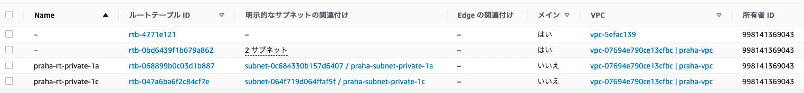

## SSH アクセス可能な EC2 インスタンス

### キーペアの作成

EC2 インスタンスを構築するために、SSH アクセスする際に使用するキーペアを作成する。

```bash
# https://awscli.amazonaws.com/v2/documentation/api/latest/reference/ec2/create-key-pair.html

# praha-task-47
aws ec2 create-key-pair \
    --key-name praha-task-47 \
    --key-type rsa \
    --query 'KeyMaterial' \
    --output text \
    --profile <your profile> > ~/.ssh/praha-task-47.pem

# 権限を絞る
chmod 400 ~/.ssh/praha-task-47.pem
```

キーペアを削除したい場合は以下のコマンドを実行すればいい。

```bash
# 削除する場合
aws ec2 delete-key-pair \
    --key-name praha-task-47 \
    --profile <your profile>
```

参考資料

- [Amazon EC2 キーペアの作成、表示、削除](https://docs.aws.amazon.com/ja_jp/cli/latest/userguide/cli-services-ec2-keypairs.html)

### セキュリティグループの作成

まずはパブリックサブネット内に EC2 インスタンスを作成するが、SSH アクセスのみを許可するような設定を追加する。

このように対象のリソースに対してトラフィックのインバウンドとアウトバウンドの制限を設けたい場合は、**セキュリティグループ** を作成することで対応することが可能となる。

そこで以下のコマンドでセキュリティグループを作成する。

```bash
# https://docs.aws.amazon.com/v2/documentation/api/latest/reference/ec2/create-security-group.html

# praha-sg-bastion
aws ec2 create-security-group \
    --group-name praha-sg-bastion \
    --description 'Security Group for SSH in Public Subnet' \
    --vpc-id vpc-07694e790ce13cfbc \
    --profile <your profile>
```

あとは作成されたセキュリティグループに対して、インバウンドルールを追加する。

```bash
# https://docs.aws.amazon.com/cli/latest/reference/ec2/authorize-security-group-ingress.html
#
aws ec2 authorize-security-group-ingress \
    --group-id sg-05926a9dfc5b8ada7 \
    --protocol tcp \
    --port 22 \
    --cidr 0.0.0.0/0 \
    --profile <your profile>
```

これで以下のように外部からの SSH アクセスのみを許可するようなトラフィック制限を設けることができた。

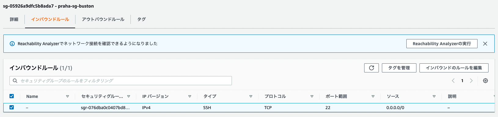

参考資料

- [Amazon EC2 のセキュリティグループの作成、設定、および削除](https://docs.aws.amazon.com/ja_jp/cli/latest/userguide/cli-services-ec2-sg.html)
- [ステップ 4: AWS CLI を使用してセキュリティグループのインバウンドルールを設定する](https://docs.aws.amazon.com/ja_jp/amazondynamodb/latest/developerguide/DAX.create-cluster.cli.configure-inbound-rules.html)

### EC2 インスタンスの作成

パブリックサブネットに SSH でアクセス可能な EC2 インスタンスを作成する。

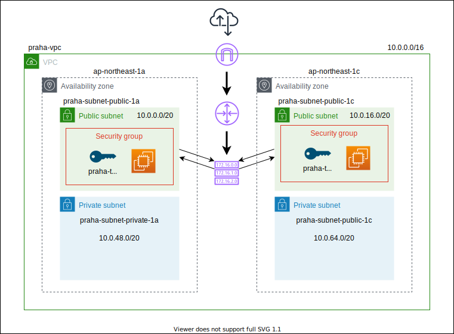

EC2 インスタンスの作成時の注意点としては、パブリックアクセスを可能にするために、パブリック IP アドレスを割り当てる様にしておく点である。

これは `--associate-public-ip-address` フラグで制御する。

```bash
# https://awscli.amazonaws.com/v2/documentation/api/latest/reference/ec2/run-instances.html

# for praha-subnet-public-1a
aws ec2 run-instances \
    --image-id ami-0404778e217f54308 \
    --count 1 \
    --instance-type t2.micro \
    --key-name praha-task-47 \
    --security-group-ids sg-05926a9dfc5b8ada7 \
    --subnet-id subnet-0940ad7e2d04fab22 \
    --associate-public-ip-address \
    --tag-specifications 'ResourceType=instance,Tags=[{Key=Name,Value=praha-ec2-buston-public-1a}]' \
    --profile <your profile>

# for praha-subnet-public-1c
aws ec2 run-instances \
    --image-id ami-0404778e217f54308 \
    --count 1 \
    --instance-type t2.micro \
    --key-name praha-task-47 \
    --security-group-ids sg-05926a9dfc5b8ada7 \
    --subnet-id subnet-07580fd2ad5c53c69 \
    --associate-public-ip-address \
    --tag-specifications 'ResourceType=instance,Tags=[{Key=Name,Value=praha-ec2-buston-public-1c}]' \
    --profile <your profile>
```

これで以下のようなリソースを作成することができた。

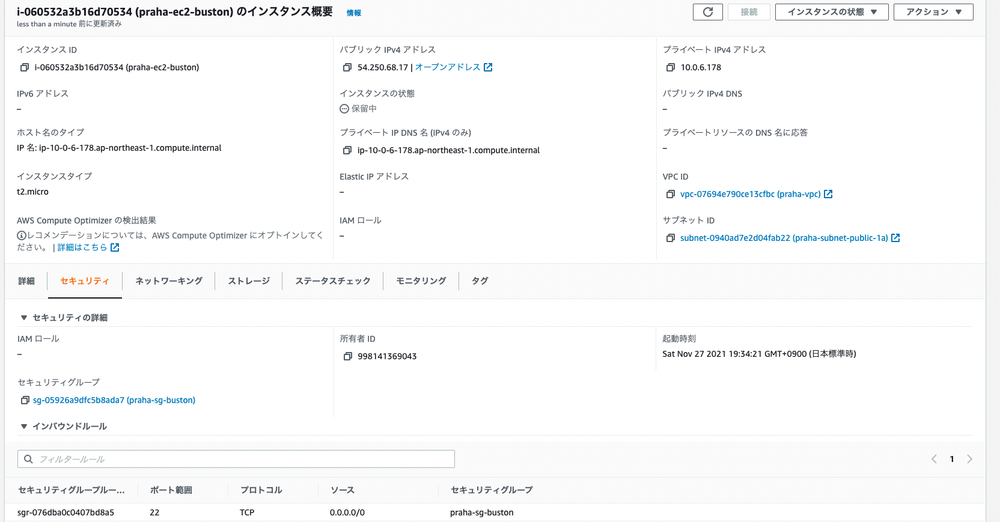

参考資料

- [Amazon EC2 インスタンスの起動、一覧表示、および終了](https://docs.aws.amazon.com/ja_jp/cli/latest/userguide/cli-services-ec2-instances.html)

### SSH によるアクセス

あとは EC2 インスタンスのパブリック IP アドレスと、作成した秘密鍵を指定すれば以下のようにインスタンスにアクセスすることができる。

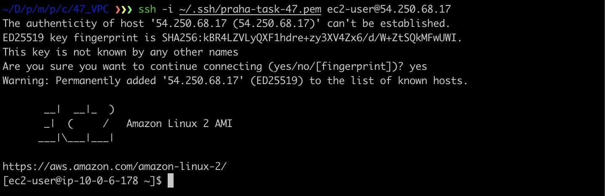

## プライベートサブネット内での EC2 インスタンスの作成

### キーペアの作成

パブリックサブネットに配置している EC2 インスタンスに適用している SSH キーとは、別のキーペアを作成して新しく作成する EC2 インスタンスに適用する。

```bash
# https://awscli.amazonaws.com/v2/documentation/api/latest/reference/ec2/create-key-pair.html

# praha-task-47-private
aws ec2 create-key-pair \
    --key-name praha-task-47-private \
    --key-type rsa \
    --query 'KeyMaterial' \
    --output text \
    --profile <your profile> > ~/.ssh/praha-task-47-private.pem

# 権限を絞る
chmod 400 ~/.ssh/praha-task-47-private.pem

# 削除する場合
aws ec2 delete-key-pair \
    --key-name praha-task-47-private \
    --profile <your profile>
```

### セキュリティグループの作成

プライベートサブネットに構築する EC2 インスタンスでは、パブリックサブネットに配置している EC2 インスタンスからの SSH アクセスを実施する。

そのためパブリック用の EC2 インスタンスに適用しているセキュリティグループから、SSH アクセスを許可するためのルールを作成していく。

```bash
# https://docs.aws.amazon.com/v2/documentation/api/latest/reference/ec2/create-security-group.html

# praha-sg-web
aws ec2 create-security-group \
    --group-name praha-sg-web \
    --description 'Security Group for SSH in Public Subnet' \
    --vpc-id vpc-07694e790ce13cfbc \
    --profile <your profile>
```

あとはインバウンドルールの送信元に対象のセキュリティグループを指定すればいい。

```bash
# https://awscli.amazonaws.com/v2/documentation/api/latest/reference/ec2/authorize-security-group-ingress.html

aws ec2 authorize-security-group-ingress \
    --group-id sg-09a29fc2218a293f9 \
    --protocol tcp \
    --port 22 \
    --source-group sg-05926a9dfc5b8ada7 \
    --profile <your profile>
```

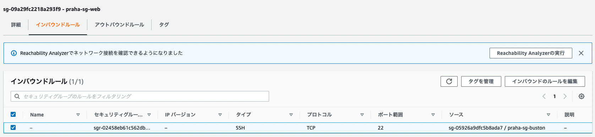

### EC2 インスタンスの作成

ではプライベートサブネットに新しく EC2 インスタンスを作成する。このインスタンスの特徴は以下になる。

- インターネットから直接 SSH アクセスすることはできない
- パブリックサブネットの EC2 インスタンス経由の SSH アクセスのみ可能

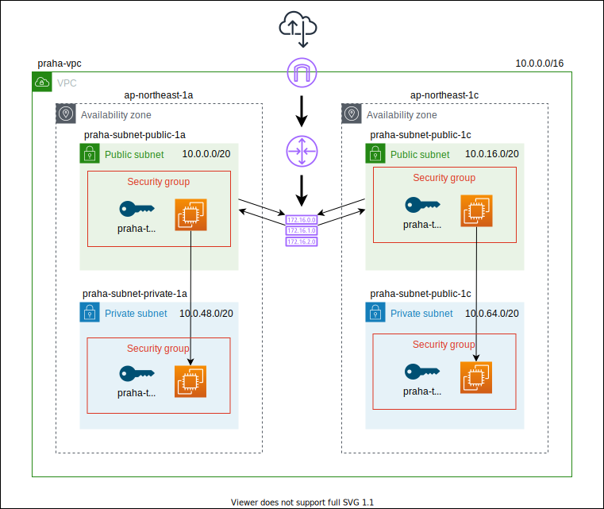

ただし以下の点に注意する必要がある。

- パブリック IP アドレスは割り当てない (`--no-associate-public-ip-address`)
- 新たに作成したセキュリティグループと紐づける
- プライベートサブネットと紐づける

```bash
# https://awscli.amazonaws.com/v2/documentation/api/latest/reference/ec2/run-instances.html

# for praha-ec2-private-1a
aws ec2 run-instances \
    --image-id ami-0404778e217f54308 \
    --count 1 \
    --instance-type t2.micro \
    --key-name praha-task-47-private \
    --security-group-ids sg-09a29fc2218a293f9 \
    --subnet-id subnet-0c684330b157d6407 \
    --no-associate-public-ip-address \
    --tag-specifications 'ResourceType=instance,Tags=[{Key=Name,Value=praha-ec2-private-1a}]' \
    --profile <your profile>

# for praha-ec2-private-1c
aws ec2 run-instances \
    --image-id ami-0404778e217f54308 \
    --count 1 \
    --instance-type t2.micro \
    --key-name praha-task-47-private \
    --security-group-ids sg-09a29fc2218a293f9 \
    --subnet-id subnet-064f719d064ffaf5f \
    --no-associate-public-ip-address \
    --tag-specifications 'ResourceType=instance,Tags=[{Key=Name,Value=praha-ec2-private-1c}]' \
    --profile <your profile>
```

これで以下のように新しく EC2 インスタンスが作成され、パブリック IP アドレスも割り当てられていないことがわかる。

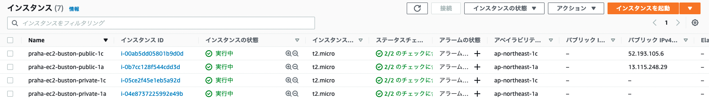

そのため VPC 内でのプライベート IP アドレスしか割り当てられていないためで SSH アクセスすることが不可能であることがわかる。

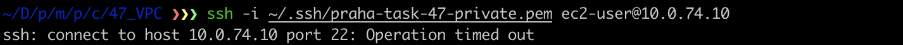

### 多段接続による EC2 インスタンスへのアクセス

ではパブリックサブネット内の EC2 インスタンスを経由して、プライベートサブネット内の EC2 インスタンスに SSH アクセスできるような多段接続設定を追加していく。

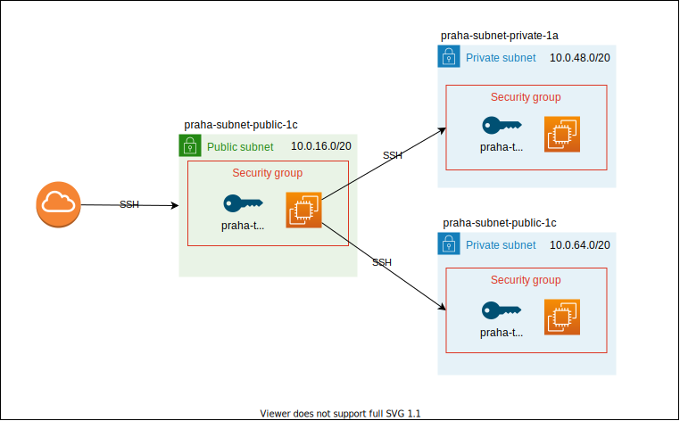

そのためローカルの `~/.ssh/config` を以下のように編集する。

```bash
Host bastion-1a
    Hostname 13.115.248.29
    User ec2-user
    Port 22
    IdentityFile ~/.ssh/praha-task-47.pem

Host web-1a
    Hostname 10.0.49.39
    User ec2-user
    Port 22
    IdentityFile ~/.ssh/praha-task-47-private.pem
    ProxyCommand ssh bastion-1a -W %h:%p

Host web-1c
    Hostname 10.0.74.10
    User ec2-user
    Port 22
    IdentityFile ~/.ssh/praha-task-47-private.pem
    ProxyCommand ssh bastion-1a -W %h:%p
```

これで以下の様にパブリックサブネットの EC2 インスタンスを踏み台として、プライベートサブネット内の EC2 インスタンスに SSH アクセスできる様になったことがわかる。


