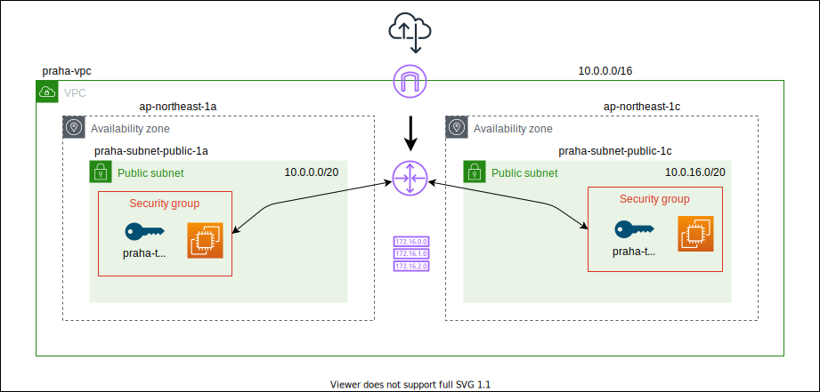
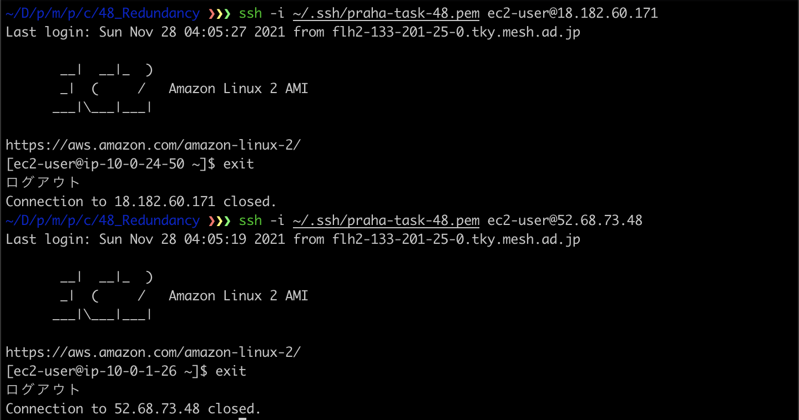
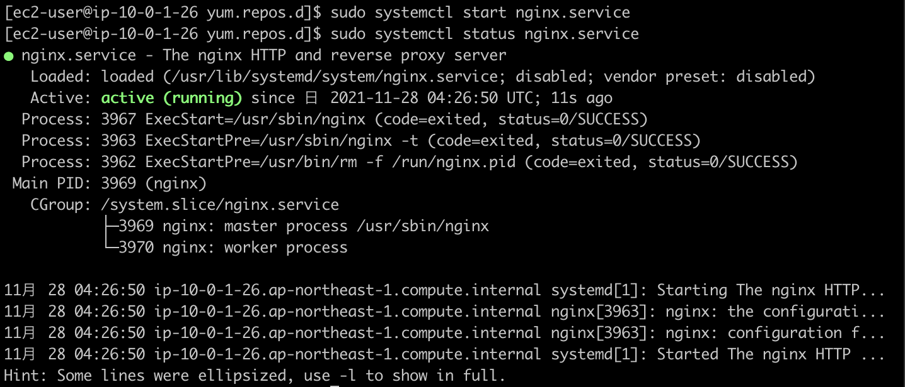
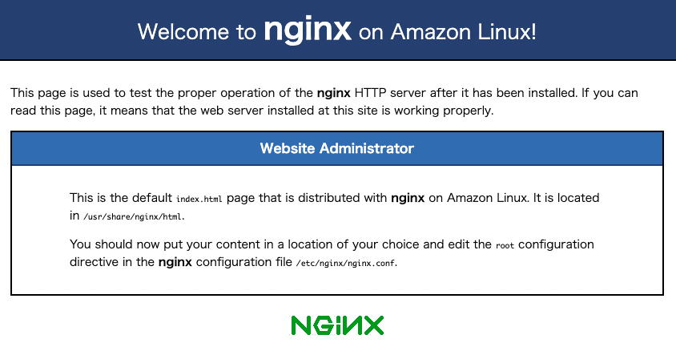
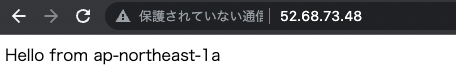
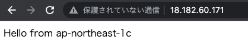

# 準備

<!-- START doctoc generated TOC please keep comment here to allow auto update -->
<!-- DON'T EDIT THIS SECTION, INSTEAD RE-RUN doctoc TO UPDATE -->
<details>
<summary>Table of Contents</summary>

- [検証環境の準備](#%E6%A4%9C%E8%A8%BC%E7%92%B0%E5%A2%83%E3%81%AE%E6%BA%96%E5%82%99)
- [Nginx での動作検証](#nginx-%E3%81%A7%E3%81%AE%E5%8B%95%E4%BD%9C%E6%A4%9C%E8%A8%BC)
- [Web ページの編集](#web-%E3%83%9A%E3%83%BC%E3%82%B8%E3%81%AE%E7%B7%A8%E9%9B%86)
- [メモ](#%E3%83%A1%E3%83%A2)

</details>
<!-- END doctoc generated TOC please keep comment here to allow auto update -->

## 検証環境の準備

パブリックサブネットにパブリック IP アドレスを割り当てた EC2 インスタンスを配置して、Nginx で Web ページを提供することを目指す。



まずは以下のコマンドで環境を準備する。

<details>
<summary>コマンド</summary>
<div>

```bash
# praha-sample-vpc
aws ec2 create-vpc \
    --cidr-block 10.0.0.0/16 \
    --tag-specifications 'ResourceType=vpc,Tags=[{Key=Name,Value=praha-sample-vpc}]' \
    --profile <yout profile>

# praha-sample-subnet-public-1a
aws ec2 create-subnet \
    --vpc-id vpc-0ece6b84405193340 \
    --cidr-block 10.0.0.0/20 \
    --availability-zone ap-northeast-1a \
    --tag-specifications 'ResourceType=subnet,Tags=[{Key=Name,Value=praha-sample-subnet-public-1a}]' \
    --profile <your profile>

# praha-subnet-public-1c
aws ec2 create-subnet \
    --vpc-id vpc-0ece6b84405193340 \
    --cidr-block 10.0.16.0/20 \
    --availability-zone ap-northeast-1c \
    --tag-specifications 'ResourceType=subnet,Tags=[{Key=Name,Value=praha-sample-subnet-public-1c}]' \
    --profile <your profile>

# praha-sample-igw
aws ec2 create-internet-gateway \
    --tag-specifications 'ResourceType=internet-gateway,Tags=[{Key=Name,Value=praha-sample-igw}]' \
    --profile <your profile>

# VPCにIGWを紐づける
aws ec2 attach-internet-gateway \
    --internet-gateway-id igw-0e6c7ce41b810265a \
    --vpc-id vpc-0ece6b84405193340 \
    --profile <your profile>

# デフォルトルートテーブル (rtb-0b0dfc5ef092c1829) に紐づける
aws ec2 create-route \
    --route-table-id rtb-0b0dfc5ef092c1829 \
    --destination-cidr-block 0.0.0.0/0 \
    --gateway-id igw-0e6c7ce41b810265a \
    --profile <your profile>

# public-1a
aws ec2 associate-route-table \
    --route-table-id rtb-0b0dfc5ef092c1829 \
    --subnet-id subnet-02a962009458a80ff \
    --profile <your profile>

# publc-1c
aws ec2 associate-route-table \
    --route-table-id rtb-0b0dfc5ef092c1829 \
    --subnet-id subnet-075060f6ff70e98bc \
    --profile <your profile>

# praha-task-48
aws ec2 create-key-pair \
    --key-name praha-task-48 \
    --key-type rsa \
    --query 'KeyMaterial' \
    --output text \
    --profile <your profile> > ~/.ssh/praha-task-48.pem

# 権限を絞る
chmod 400 ~/.ssh/praha-task-48.pem

# praha-sample-sg-web
aws ec2 create-security-group \
    --group-name praha-sample-sg-web \
    --description 'Security Group for SSH in Public Subnet' \
    --vpc-id vpc-0ece6b84405193340 \
    --profile <your profile>

# SSH
aws ec2 authorize-security-group-ingress \
    --group-id sg-086c45943fe2ac195 \
    --protocol tcp \
    --port 22 \
    --cidr 0.0.0.0/0 \
    --profile <your profile>

# HTTP
aws ec2 authorize-security-group-ingress \
    --group-id sg-086c45943fe2ac195 \
    --protocol tcp \
    --port 80 \
    --cidr 0.0.0.0/0 \
    --profile <your profile>

# HTTPS
aws ec2 authorize-security-group-ingress \
    --group-id sg-086c45943fe2ac195 \
    --protocol tcp \
    --port 443 \
    --cidr 0.0.0.0/0 \
    --profile <your profile>

# praha-sample-ec2-web-public-1a
aws ec2 run-instances \
    --image-id ami-0404778e217f54308 \
    --count 1 \
    --instance-type t2.micro \
    --key-name praha-task-48 \
    --security-group-ids sg-086c45943fe2ac195 \
    --subnet-id subnet-02a962009458a80ff \
    --associate-public-ip-address \
    --tag-specifications 'ResourceType=instance,Tags=[{Key=Name,Value=praha-sample-ec2-web-public-1a}]' \
    --profile <your profile>

# praha-sample-ec2-web-public-1c
aws ec2 run-instances \
    --image-id ami-0404778e217f54308 \
    --count 1 \
    --instance-type t2.micro \
    --key-name praha-task-47 \
    --security-group-ids sg-086c45943fe2ac195 \
    --subnet-id subnet-075060f6ff70e98bc \
    --associate-public-ip-address \
    --tag-specifications 'ResourceType=instance,Tags=[{Key=Name,Value=praha-sample-ec2-web-public-1c}]' \
    --profile <your profile>
```

</div>
</details>

これでひとまずパブリック IP アドレスを使用して SSH アクセスできることが確認できた。



## Nginx での動作検証

[公式サイト](https://www.nginx.com/blog/setting-up-nginx/) を参考に Web サイトを構築する。

ただし Amazon Linux を使用しているため、Nginx のインストール方法は下記を使用する。

- まずは必要なライブラリをインストールする

  ```bash
  $ sudo rm -rf /var/cache/yum/*
  $ sudo yum clean all
  $ sudo yum update
  ```

- Amazon Linux のパッケージマネージャを使用する

  ```bash
  $ which amazon-linux-extras
  $ amazon-linux-extras | grep nginx
  ```

- インストール

  ```bash
  $ sudo amazon-linux-extras install nginx1
  ```

- バージョン確認

  ```bash
  $ nginx -v
  > nginx version: nginx/1.20.0
  ```

Nginx では、以下のコマンドを使用してサーバーを立ち上げたり、終了したり、状態を確認できたりする。

```bash
$ sudo systemctl start nginx.service
$ sudo systemctl status nginx.service
$ sudo systemctl stop nginx.service
$ sudo systemctl restart nginx.service
```

実際に上記のコマンドを使用して Nginx を起動させることができる。



これで EC2 インスタンスのパブリック IP アドレスにブラウザからアクセスすると以下のページが確認できる。



## Web ページの編集

次にホームディレクトリに `public_html/index.html` を配置して、Nginx から参照する設定を追加していく。

- まずは HTML ファイルを用意する

  ```bash
  $ mkdir public_html
  $ cd public_html
  $ vim index.html
  >
    Hello from ap-northeast-1a
  ```

- 次に Nginx の設定ファイルを変更する

  ```bash
  $ cd /etc/nginx
  $ sudo vim nginx.conf
  >
    - root /usr/share/nginx/html;
    + root /home/ec2-user/public_html;
  ```

- ディレクトリの権限を編集する

  ```bash
  $ cd ~
  $ ls -ld
  > drwx------ 6 ec2-user ec2-user 166 11月 28 05:57 .

  # nginxプロセスは読み取れないので権限を付与する
  $ chmod 701 ./
  ```

- Nginx を再起動する

  ```bash
  $ sudo systemctl restart nginx.service
  ```

同じ手順をもう一方のサブネットに配置した EC2 インスタンスでも実行する。





参考資料

- [Nginx で 403 Forbidden が表示された時のチェックポイント 5 選](https://engineers.weddingpark.co.jp/nginx-403-forbidden/)

## メモ

Vim コマンド

- `:%d`: ファイル全行削除
- `:42`: 42 行目に移動
