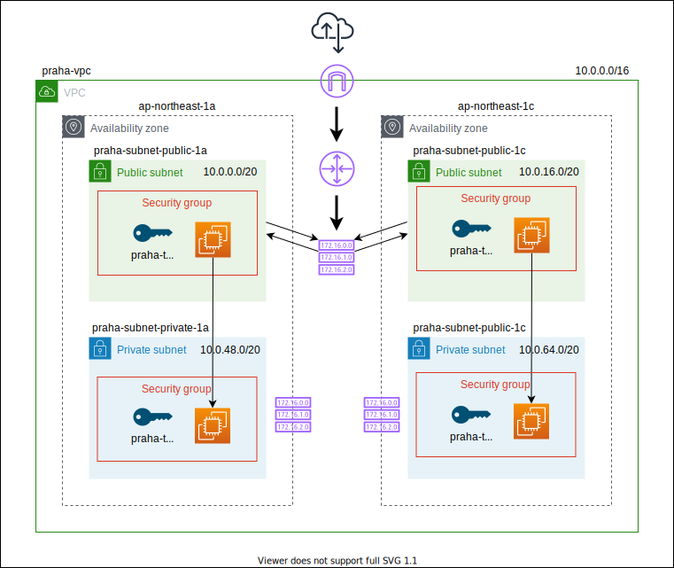

# 課題 1

<!-- START doctoc generated TOC please keep comment here to allow auto update -->
<!-- DON'T EDIT THIS SECTION, INSTEAD RE-RUN doctoc TO UPDATE -->
<details>
<summary>Table of Contents</summary>

- [前回の課題の振り返り](#%E5%89%8D%E5%9B%9E%E3%81%AE%E8%AA%B2%E9%A1%8C%E3%81%AE%E6%8C%AF%E3%82%8A%E8%BF%94%E3%82%8A)
- [NAT ゲートウェイ](#nat-%E3%82%B2%E3%83%BC%E3%83%88%E3%82%A6%E3%82%A7%E3%82%A4)
  - [プライベートな EC2 の公開](#%E3%83%97%E3%83%A9%E3%82%A4%E3%83%99%E3%83%BC%E3%83%88%E3%81%AA-ec2-%E3%81%AE%E5%85%AC%E9%96%8B)
  - [NAT ゲートウェイとは](#nat-%E3%82%B2%E3%83%BC%E3%83%88%E3%82%A6%E3%82%A7%E3%82%A4%E3%81%A8%E3%81%AF)
  - [NAT ゲートウェイの構築](#nat-%E3%82%B2%E3%83%BC%E3%83%88%E3%82%A6%E3%82%A7%E3%82%A4%E3%81%AE%E6%A7%8B%E7%AF%89)
  - [ルートテーブルの更新](#%E3%83%AB%E3%83%BC%E3%83%88%E3%83%86%E3%83%BC%E3%83%96%E3%83%AB%E3%81%AE%E6%9B%B4%E6%96%B0)
- [Nginx サーバーの配置](#nginx-%E3%82%B5%E3%83%BC%E3%83%90%E3%83%BC%E3%81%AE%E9%85%8D%E7%BD%AE)
- [Application Load Balancer](#application-load-balancer)
  - [Elastic Load Balancer とは](#elastic-load-balancer-%E3%81%A8%E3%81%AF)
  - [Application Load Balancer の構築](#application-load-balancer-%E3%81%AE%E6%A7%8B%E7%AF%89)
  - [Security Gourp を作成する](#security-gourp-%E3%82%92%E4%BD%9C%E6%88%90%E3%81%99%E3%82%8B)

</details>
<!-- END doctoc generated TOC please keep comment here to allow auto update -->

## 前回の課題の振り返り

前回の課題では、下記の構成のインフラを構築した。



## NAT ゲートウェイ

### プライベートな EC2 の公開

現在の構成では、プライベートサブネット内に配置されている EC2 インスタンスをインターネットに公開しようとすると以下の課題が存在している。

- EC2 インスタンスにパブリック IP アドレスを割り当てていないためインターネットと通信できない
- トラフィックがパブリックサブネット内の EC2 インスタンスからの SSH アクセスのみを許可している

それぞれの課題を解決するために、NAT ゲートウェイとセキュリティグループを設定する必要がある。

### NAT ゲートウェイとは

プライベートサブネットに配置した EC2 インスタンスは、インタネットにトラフィックを送信する必要はあるが、インターネットからのトラフィックを直接受け取ることはしない。

そのため **NAT ゲートウェイ** を使用することで、以下の様にプライベート IP アドレスをパブリック IP アドレスに変換することで、インターネットにトラフィックを送信することが可能となる。


### NAT ゲートウェイの構築

今回作成する NAT ゲートウェイでは、パブリックサブネットに配置するため、以下のような構成図になる。


パブリックサブネットに NAT ゲートウェイを配置するにあたって、NAT ゲートウェイにパブリック IP アドレスを割り当てる必要がある。

そこでまずはパブリック IP アドレス (Elastic IP) を作成する。

```bash
# https://docs.aws.amazon.com/cli/latest/reference/ec2/allocate-address.html

aws ec2 allocate-address --profile <your profile>
aws ec2 allocate-address --profile <your profile>
```

これで以下の IP アドレスが生成された。


次に以下のコマンドで NAT ゲートウェイを作成する。

```bash
# https://awscli.amazonaws.com/v2/documentation/api/latest/reference/ec2/create-nat-gateway.html

# praha-ngw-public-1a
aws ec2 create-nat-gateway \
    --subnet-id subnet-0940ad7e2d04fab22 \
    --allocation-id eipalloc-0d37e5f0ce8bd1750 \
    --tag-specifications 'ResourceType=natgateway,Tags=[{Key=Name,Value=praha-ngw-public-1a}]' \
    --profile <your profile>

# praha-ngw-public-1c
aws ec2 create-nat-gateway \
    --subnet-id subnet-07580fd2ad5c53c69 \
    --allocation-id eipalloc-0885b112b724c564b \
    --tag-specifications 'ResourceType=natgateway,Tags=[{Key=Name,Value=praha-ngw-public-1c}]' \
    --profile <your profile>
```

これで以下の様に NAT ゲートウェイが作成されたことがわかる。


### ルートテーブルの更新

現在のプライベートサブネットに割り当てられているルートテーブルには、VPC 内のリソース同士の通信を行うだけであり、外部へのトラフィックはどこにも通信されない設定となっている。

そこで以下の様にルートテーブルを更新して、プライベートサブネットの EC2 インスタンスから NAT ゲートウェイに対してトラフィックを制御する。


```bash
# https://awscli.amazonaws.com/v2/documentation/api/latest/reference/ec2/create-route.html

# ap-notheast-1a
aws ec2 create-route \
    --route-table-id rtb-068899b0c03d1b887 \
    --nat-gateway-id nat-0d4678c1fb1b2c34d \
    --destination-cidr-block 0.0.0.0/0 \
    --profile <your profile>

# ap-notheast-1c
aws ec2 create-route \
    --route-table-id rtb-047a6ba6f2c84cf7e \
    --nat-gateway-id nat-0e891587384c62e36 \
    --destination-cidr-block 0.0.0.0/0 \
    --profile <your profile>
```

これで以下の様にルートテーブルに対して、NAT ゲートウェイにトラフィックを送信するようなルーティング設定を追加することができた。


## Nginx サーバーの配置

EC2 インスタンスに Nginx を導入する手順は下記のページにまとめている。

[準備](../prepare)

上記の手順で導入したとしても、対象の EC2 インスタンスはプライベート IP アドレスしか割り当てられておらず、外部からのトラフィックも NAT ゲートウェイを設けているためアクセスすることができない。

そのため、ロードバランサーを導入してインターネットからのアクセスをプライベートサブネット内の EC2 インスタンスに振り分けていく。

参考資料

https://www.nginx.com/blog/setting-up-nginx/#aws-setup

## Application Load Balancer

### Elastic Load Balancer とは

ロードバランサーを使用すると、Web サーバーを複数用意して性能を向上させるようなスケールアウトを実行できる様になる。

このロードバランサーは以下の様な役割を持っている。

- 不正なリクエストを検知して、リクエストを拒否する
- SSL による暗号化処理を担当して、Web サーバーの負荷を下げる
- リクエストを複数の Web サーバーに対して分散できる
- Web サーバーをリクエストの負荷に応じて自動的にスケールアウトする


この Elastic Load Balancer はいくつかの種類が存在している。

| Type                      | Feature              | Way                        |
| ------------------------- | -------------------- | -------------------------- |
| Application Load Balancer | HTTP や HTTPS に特化 | Web サイトや REST API など |
| Network Load Balancer     | いろいろな通信に対応 | ゲーム、チャットなど       |

今回は **Application Load Balancer** を使用する。

### Application Load Balancer の構築

今回は Application Load Balancer を以下の様に配置する。

別個にセキュリティグループを配置して、ロードバランサーからはプライベートサブネット内の EC2 インスタンスにトラフィックを振り分けるような設定を追加する。


### Security Gourp を作成する

ロードバランサーが HTTP や HTTPS のリクエストを受け付けることができるようにセキュリティグループを作成する。

```bash
# praha-sg-alb
aws ec2 create-security-group \
    --group-name praha-sg-alb \
    --description 'Security Group for Public Access in Public Subnet' \
    --vpc-id vpc-07694e790ce13cfbc \
    --profile <your profile>

# HTTP
aws ec2 authorize-security-group-ingress \
    --group-id sg-0516adee76de6fd3b \
    --protocol tcp \
    --port 80 \
    --cidr 0.0.0.0/0 \
    --profile <your profile>

# HTTPS
aws ec2 authorize-security-group-ingress \
    --group-id sg-0516adee76de6fd3b \
    --protocol tcp \
    --port 443 \
    --cidr 0.0.0.0/0 \
    --profile <your profile>
```

なお Web サーバーがロードバランサーからのリクエストを受け付けることができる様に、以下の様にセキュリティグループを編集する。

```bash
# HTTP
aws ec2 authorize-security-group-ingress \
    --group-id sg-09a29fc2218a293f9 \
    --protocol tcp \
    --port 80 \
    --source-group sg-0516adee76de6fd3b \
    --profile <your profile>
```

これであとはロードバランサーを作成すればいいだけである。

### Application Load Balancer を作成する

次にロードバランサーを作成する。

- まずはロードバランサーを作成する

  ```bash
  aws elbv2 create-load-balancer \
    --name praha-alb \
    --subnets subnet-07580fd2ad5c53c69 subnet-0940ad7e2d04fab22 \
    --security-groups sg-0516adee76de6fd3b \
    --profile <your profile>
  ```

- 次にどのインスタンスに振り分けるのかターゲットグループを作成する

  ```bash
  aws elbv2 create-target-group \
    --name praha-web-target \
    --protocol HTTP \
    --port 3000 \
    --vpc-id vpc-07694e790ce13cfbc \
    --profile <your profile>
  ```

- 次はインスタンスをターゲットグループに登録する

  ```bash
  aws elbv2 register-targets \
    --target-group-arn arn:aws:elasticloadbalancing:ap-northeast-1:998141369043:targetgroup/praha-web-target/eff52b787f23b9fc \
    --targets Id=i-04e8737225992e49b Id=i-05ce2f45e1eb5a92d \
    --profile <your profile>
  ```

- ターゲットグループにリクエストを転送するルールを持つリスナーを作成する

  ```bash
  aws elbv2 create-listener \
    --load-balancer-arn arn:aws:elasticloadbalancing:ap-northeast-1:998141369043:loadbalancer/app/praha-alb/873e4ca063bb6cc0 \
    --protocol HTTP --port 80 \
    --default-actions Type=forward,TargetGroupArn=arn:aws:elasticloadbalancing:ap-northeast-1:998141369043:targetgroup/praha-web-target/eff52b787f23b9fc \
    --profile <your profile>
  ```

ここまでできればロードバランサーに登録されている A レコードにアクセスすれば、Web サーバーに配置した `index.html` を確認することができる。


参考資料

- [チュートリアル: AWS CLI を使用した Application Load Balancer の作成](https://docs.aws.amazon.com/ja_jp/elasticloadbalancing/latest/application/tutorial-application-load-balancer-cli.html)

