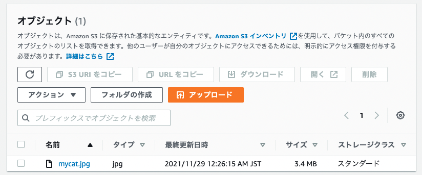

# 課題 1

<!-- START doctoc generated TOC please keep comment here to allow auto update -->
<!-- DON'T EDIT THIS SECTION, INSTEAD RE-RUN doctoc TO UPDATE -->
<details>
<summary>Table of Contents</summary>

- [ストレージクラス](#%E3%82%B9%E3%83%88%E3%83%AC%E3%83%BC%E3%82%B8%E3%82%AF%E3%83%A9%E3%82%B9)
  - [ストレージクラスの種類](#%E3%82%B9%E3%83%88%E3%83%AC%E3%83%BC%E3%82%B8%E3%82%AF%E3%83%A9%E3%82%B9%E3%81%AE%E7%A8%AE%E9%A1%9E)
  - [ストレージクラスのユースケース](#%E3%82%B9%E3%83%88%E3%83%AC%E3%83%BC%E3%82%B8%E3%82%AF%E3%83%A9%E3%82%B9%E3%81%AE%E3%83%A6%E3%83%BC%E3%82%B9%E3%82%B1%E3%83%BC%E3%82%B9)
- [ライフサイクル](#%E3%83%A9%E3%82%A4%E3%83%95%E3%82%B5%E3%82%A4%E3%82%AF%E3%83%AB)
  - [ライフサイクルとは](#%E3%83%A9%E3%82%A4%E3%83%95%E3%82%B5%E3%82%A4%E3%82%AF%E3%83%AB%E3%81%A8%E3%81%AF)
  - [ストレージクラスを変更するライフサイクルの設定](#%E3%82%B9%E3%83%88%E3%83%AC%E3%83%BC%E3%82%B8%E3%82%AF%E3%83%A9%E3%82%B9%E3%82%92%E5%A4%89%E6%9B%B4%E3%81%99%E3%82%8B%E3%83%A9%E3%82%A4%E3%83%95%E3%82%B5%E3%82%A4%E3%82%AF%E3%83%AB%E3%81%AE%E8%A8%AD%E5%AE%9A)
  - [オブジェクトを削除するライフライクルの設定](#%E3%82%AA%E3%83%96%E3%82%B8%E3%82%A7%E3%82%AF%E3%83%88%E3%82%92%E5%89%8A%E9%99%A4%E3%81%99%E3%82%8B%E3%83%A9%E3%82%A4%E3%83%95%E3%83%A9%E3%82%A4%E3%82%AF%E3%83%AB%E3%81%AE%E8%A8%AD%E5%AE%9A)

</details>
<!-- END doctoc generated TOC please keep comment here to allow auto update -->

## ストレージクラス

ストレージクラスを確認する前に、以下の用語は把握しておく必要がある

- オブジェクトあたりの最小キャパシティー料金
- 最小ストレージ期間
- 取り出し料金
- 取り出し時間
- IA (Infrequent Access)

これはそれぞれ以下の意味を表している。

| 用語                                       | 解説                                   | 具体例                                                                                           |
| ------------------------------------------ | -------------------------------------- | ------------------------------------------------------------------------------------------------ |
| オブジェクトあたりの最小キャパシティー料金 | 課金対象となる最小のオブジェクトサイズ | 128KB の場合、128KB を下回るオブジェクトを保存した場合でも 128KB オブジェクトとして課金される。  |
| 最小ストレージ期間                         | ストレージ料金が課金される最小の期間   | 30 日間の場合、30 日以内にオブジェクトを削除、上書き、移行した場合でも 30 日間の料金が発生する。 |
| 取り出し料金                               | 課金対象となるオブジェクトの最小単位   | 一部のストレージクラスはオブジェクトの取り出し GB あたりに課金される                             |
| 取り出し時間                               | オブジェクトの取り出しに必要な時間     | ストレージクラスによって取り出し時間は大きく異なる                                               |
| IA                                         | 低頻度アクセスの略称                   | アクセス頻度が低いとより低い課金額となる                                                         |

ではこれらの項目を含む、ストレージクラスの種類を見ていく。

### ストレージクラスの種類

まずはいくつか存在するストレージクラスの用途の違いを確認する。

| ストレージクラス        | 用途                                                                                                                           |
| ----------------------- | ------------------------------------------------------------------------------------------------------------------------------ |
| S3 Standard             | ミリ秒単位のアクセス時間を要し、アクセス頻度も高いデータ                                                                       |
| S3 Standard IA          | アクセス頻度も低く、存続期間も長いデータ<br><br>地理的に分離された複数の AZ 間でオブジェクトデータを重複して保存する           |
| S3 One Zone IA          | アクセス頻度も低く、存続期間も長いデータ<br><br>1 つの AZ のみでオブジェクトデータを保存するため、Standard-IA よりも安価になる |
| S3 Intelligent Tiering  | アクセスパターンが変化、あるいは不明なデータを自動的に最適化させる                                                             |
| S3 Glacier              | データアーカイブを目的としており、データの一部を数分で取得する必要がある                                                       |
| S3 Glacier Deep Archive | データアーカイブを目的としており、ほとんどアクセスする必要がないデータ                                                         |

さらにストレージクラスごとの細かい違いはいかに記載している。

| ストレージクラス        | 可用性 | 取り出し時間                                           | 取り出し料金       | 最小ストレージ時間 | 最小キャパシティー料金 | ストレージ保管料金 |
| ----------------------- | ------ | ------------------------------------------------------ | ------------------ | ------------------ | ---------------------- | ------------------ |
| S3 Standard             | 99.9%  | ミリ秒                                                 | なし               | なし               | なし                   | 0.023USD/GB        |
| S3 Standard IA          | 99%    | ミリ秒                                                 | なし               | 30 日間            | なし                   | 0.0125USD/GB       |
| S3 One Zone IA          | 99%    | ミリ秒                                                 | 取り出し GB あたり | 30 日間            | 128KB                  | 0.01USD/GB         |
| S3 Intelligent Tiering  | 99%    | ミリ秒                                                 | 取り出し GB あたり | 30 日間            | 128KB                  | -                  |
| S3 Glacier              | 99,9%  | 迅速：1〜5 分<br>標準：3〜5 時間<br>大容量：5〜12 時間 | 取り出し GB あたり | 90 日間            | 40KB                   | 0.004USD/GB        |
| S3 Glacier Deep Archive | 99,9%  | 標準：12 時間以上<br>大容量：48 時間以上               | 取り出し GB あたり | 180 日間           | 40KB                   | 0.00099USD/GB      |

参考資料

- [Amazon S3 ストレージクラスを使用する](https://docs.aws.amazon.com/ja_jp/AmazonS3/latest/userguide/storage-class-intro.html)
- [Amazon S3 ストレージクラス](https://aws.amazon.com/jp/s3/storage-classes/)
- [Amazon S3 の料金](https://aws.amazon.com/jp/s3/pricing/)

### ストレージクラスのユースケース

例えばほとんどデータにアクセスすることがない場合には `S3 Glacier Deep Archive` が推奨される。このストレージクラスは、最小ストレージ時間や取り出し時間が長いが、ストレージ保管料金はそのほかのストレージクラスと比較して非常に安価である。

上記の様に最小ストレージ時間の考慮は重要である。

たとえば 1 週間で削除されるログに対して、アクセスはすぐにできる様にしておきたい場合、料金が柔軟に決定される `S3 Intelligent Tiering` を使用すればいいと考えられるが、最小ストレージ時間は 30 日間であるため、1 週間の保存期間に対して 30 日間の課金が発生してしまう。こうした場合には `S3 Standard` が最適である。

## ライフサイクル

### ライフサイクルとは

S3 ではライフサイクルと呼ばれる、一定のルールに基づいてオブジェクトに対して自動的にアクションを実行できる機能が存在している。

このアクションは以下の 2 種類が存在している。

- 移行アクション
  - 別のストレージクラスにオブジェクトを移行するタイミングを定義する
  - 例えば作成から 30 日後に `S3 Standard IA` のストレージクラスにオブジェクトを移すことができる
- 失効アクション
  - オブジェクトを削除するまでの有効期限を定義する

AWS CLI を使用してライフサイクルを設定することが可能である。その場合には、ライフサイクルを JSON 形式で指定する必要がある。

例えば、「`documents/` 配下にあるオブジェクトは、1 年後に `S3 Glacier` に移行し、10 年後に削除する」設定の場合は以下の様に指定できる。

```json
{
  "Rules": [
    {
      "Filter": {
        "Prefix": "documents/"
      },
      "Status": "Enabled",
      "Transitions": [
        {
          "Days": 365,
          "StorageClass": "GLACIER"
        }
      ],
      "Expirations": {
        "Days": 3650
      },
      "ID": "ExampleRule"
    }
  ]
}
```

参考資料

- [ストレージのライフサイクルの管理](https://docs.aws.amazon.com/ja_jp/AmazonS3/latest/userguide/object-lifecycle-mgmt.html)

### ストレージクラスを変更するライフサイクルの設定

Amazon S3 では、ストレージクラス間のオブジェクトの移行に関して、以下の移行元と移行先の組み合わせをサポートしている。


では試しに移行アクションを定義するため、以下のコマンドを使用して S3 バケットを作成する。

```bash
# https://awscli.amazonaws.com/v2/documentation/api/latest/reference/s3api/create-bucket.html

aws s3api create-bucket \
  --bucket trasition-bucket \
  --create-bucket-configuration LocationConstraint=ap-northeast-1 \
  --profile <your profile>
```

では上記の S3 バケットに画像を配置する。

```bash
# https://awscli.amazonaws.com/v2/documentation/api/latest/reference/s3api/put-object.html

aws s3api put-object \
  --bucket transition-bucket \
  --key images/mycat.jpg \
  --body assets/mycat.jpg \
  --profile <your profile>
```



S3 コンソールを使用して、`images` 配下のオブジェクトが新規作成から 30 日後に自動的に `S3 Standard IA` に移行させるアクションを追加した。


参考資料

- [Amazon S3 ライフサイクルを使用したオブジェクトの移行](https://docs.aws.amazon.com/ja_jp/AmazonS3/latest/userguide/lifecycle-transition-general-considerations.html)

### オブジェクトを削除するライフライクルの設定

オブジェクトの有効期限のライフサイクルを定義すると、オブジェクトは自動的に S3 削除キューに追加され、非同期的に削除される。

```bash
aws s3api create-bucket \
  --bucket expires-bucket \
  --create-bucket-configuration LocationConstraint=ap-northeast-1 \
  --profile <your profile>
```

ログ用のファイルを追加する。

```bash
aws s3api put-object \
  --bucket expires-bucket \
  --key logs/log.txt \
  --body assets/log.txt \
  --profile <your profile>
```

S3 コンソールを使用して、全てのオブジェクトに対して新規作成から 90 日後に自動的にオブジェクトを削除するアクションを追加した。


参考資料

- [オブジェクトの有効期限](https://docs.aws.amazon.com/ja_jp/AmazonS3/latest/userguide/lifecycle-expire-general-considerations.html)
