# 課題 2

<!-- START doctoc generated TOC please keep comment here to allow auto update -->
<!-- DON'T EDIT THIS SECTION, INSTEAD RE-RUN doctoc TO UPDATE -->

Table of Contents

- [レプリケーション](#%E3%83%AC%E3%83%97%E3%83%AA%E3%82%B1%E3%83%BC%E3%82%B7%E3%83%A7%E3%83%B3)
  - [クロスリージョンレプリケーション](#%E3%82%AF%E3%83%AD%E3%82%B9%E3%83%AA%E3%83%BC%E3%82%B8%E3%83%A7%E3%83%B3%E3%83%AC%E3%83%97%E3%83%AA%E3%82%B1%E3%83%BC%E3%82%B7%E3%83%A7%E3%83%B3)
- [バージョニング](#%E3%83%90%E3%83%BC%E3%82%B8%E3%83%A7%E3%83%8B%E3%83%B3%E3%82%B0)
  - [バージョニングの挙動確認](#%E3%83%90%E3%83%BC%E3%82%B8%E3%83%A7%E3%83%8B%E3%83%B3%E3%82%B0%E3%81%AE%E6%8C%99%E5%8B%95%E7%A2%BA%E8%AA%8D)

<!-- END doctoc generated TOC please keep comment here to allow auto update -->

## レプリケーション

AWS S3 が提供しているレプリケーションを使用すると、S3 バケット間でオブジェクトを自動かつ非同期的にコピーすることが可能である。

オブジェクトは、単一または複数のレプリケーション先のバケットにコピーすることが可能であり、リージョンを跨いだレプリケーションもサポートしている。

注意点としては、デフォルトではレプリケーション設定を行った後で追加されたオブジェクトがレプリケーション対象となるため、既存のオブジェクトを他のバケットにコピーする場合はサポートセンターに問い合わせる必要がある点である。

参考資料

- [オブジェクトのレプリケーション](https://docs.aws.amazon.com/ja_jp/AmazonS3/latest/userguide/replication.html)

### クロスリージョンレプリケーション

では実際に異なるリージョン間のオブジェクトのレプリケーションの挙動を確認するために、バケットを作成していく。

- オリジナルのバケットは、`ap-northeast-1 (東京)` に配置する

  - バージョニングは有効に設定している

    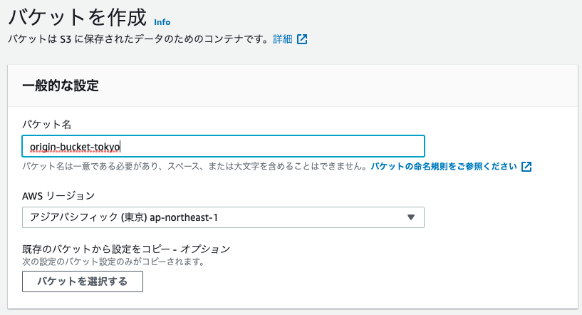

- レプリケーションのバケットは `ap-northeast-3 (大阪)` に配置する

  - バージョンには有効に設定している

    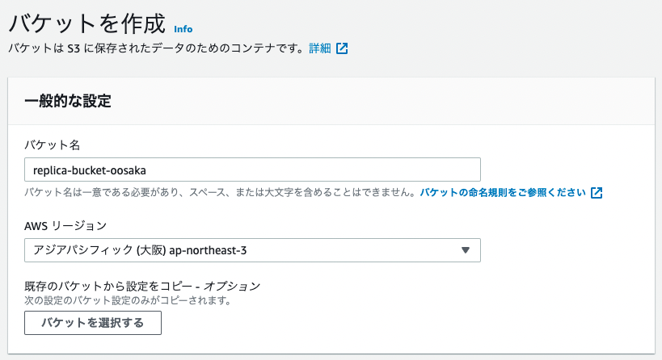

ではオリジンバケットにオブジェクトを追加する。

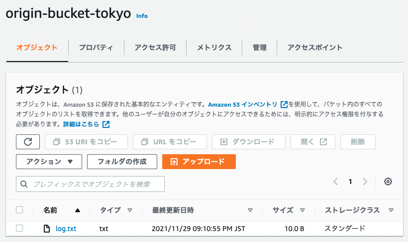

レプリケーション設定を実施していない状態では、レプリケーションバケットにオブジェクトがコピーされることはない。

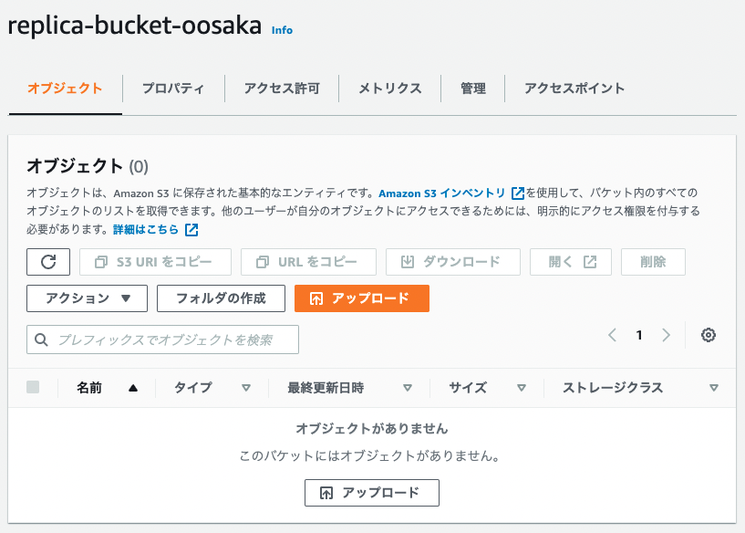

では以下の様にオリジンバケットに対して、レプリケーションルールを作成していく。

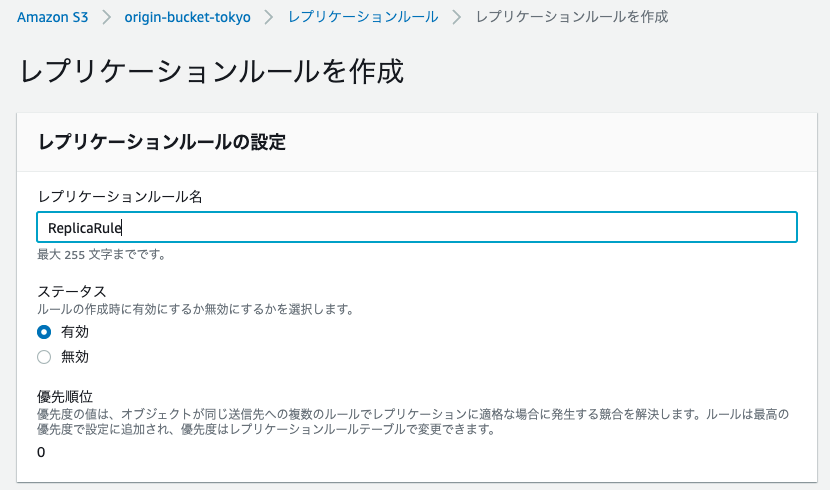

この時下記の設定を採用している。

| 項目                     | 値                                 |
| :----------------------- | :--------------------------------- |
| レプリケーションルール名 | ReplicaRule                        |
| ルールスコープ           | バケット内の全てのオブジェクト     |
| 送信先                   | このアカウントのバケットを選択する |
|                          | replica-bucket-oosaka              |
| IAM ロール               | 新しいロールの作成                 |

これで以下のレプリケーションルールが作成された。

この状態でオリジンバケットに対して `mycat.jpg` ファイルをアップロードする。

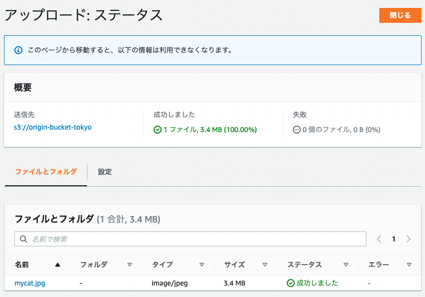

この後でレプリケーションバケットを確認すると、レプリケーション前のオブジェクトはコピーされておらず、新たにオリジンバケットに追加したオブジェクトがコピーされていることがわかる。

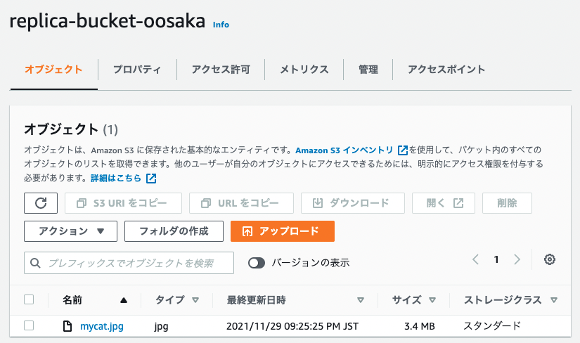

今の状態でオリジンバケットからオブジェクトを全て削除してみる。

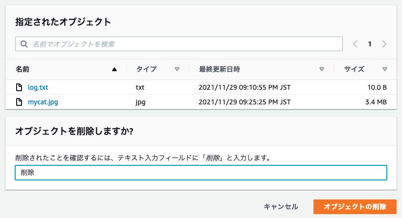

この場合、レプリケーションバケットまで反映されていないことがわかる。

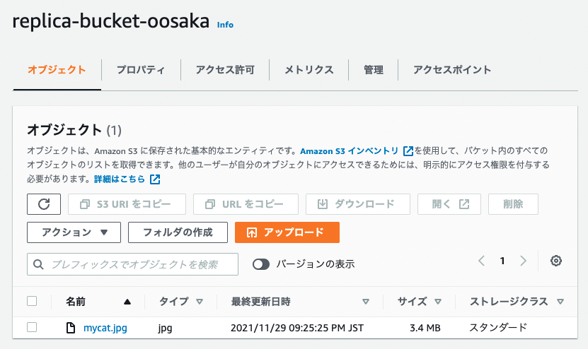

削除も同期したい場合には、以下の様に削除マーカーのレプリケーションも実施する必要がある。

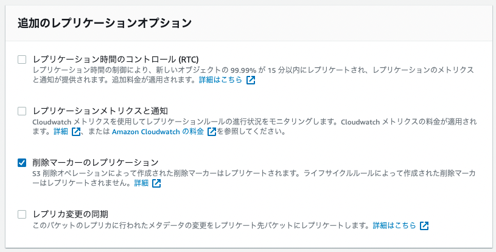

これで削除も同期可能となる。

参考資料

- [Amazon S3 のレプリケーション機能を使用してみました。](https://dev.classmethod.jp/articles/lim-s3-replication/)

## バージョニング

Amazon S3 が提供しているバージョニング機能を使用すると、バケットに保存された全てのオブジェクトのバージョンを、保存・取得・復元できる様になる。

仕組みとしては、以下の様に同じオブジェクトに対して一意なバージョン ID を割り当て、すべてのバージョンのオブジェクトを保存する様にしている。

バージョニングを無効にしていた場合でもバージョン ID は付与されており、常に `null` が設定される様になっている。

例えば同じ名称のオブジェクトを `PUT` した場合には、以下の様に新しいバージョン ID (`121212`) が生成され、オブジェクトとバージョン ID のセットが新しいバージョンとして登録される。

オブジェクトが削除される場合には、バケット内の全てのバージョンを保持したまま、新しいバージョン ID を付与した状態で削除マーカーが挿入される。

Amazon S3 での `GET` リクエストは最後に保存されたバージョンを取得するが、最新バージョンが削除マーカーである場合には、`404 Not Found` を返す様になっている。

`Get Object` では以下の様に特定のバージョンのオブジェクトを取得することも可能である。

削除マーカーを残すことなく完全にオブジェクトを削除したい場合は、`DELETE VersionId` で特定のバージョンを削除することができる。

参考資料

- [S3 バージョニングの仕組み](https://docs.aws.amazon.com/ja_jp/ja_jp/AmazonS3/latest/userguide/versioning-workflows.html)
- [絵で見て 3 分でおさらいする Amazon S3 のバージョニングとライフサイクル](https://dev.classmethod.jp/articles/3minutes-s3-versioning-lifecycle/#toc-9)

### バージョニングの挙動確認

まずは実験用のバケットを作成する。

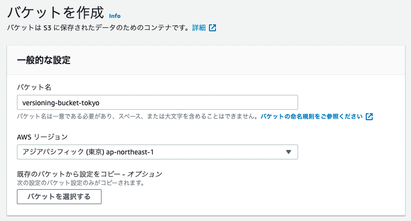

その際にオブジェクトのバージョニング機能を有効にしておく必要がある。

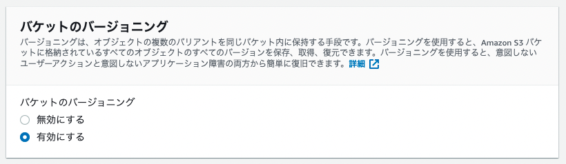

ではサンプルとなるオブジェクトをバケットにアップロードする。

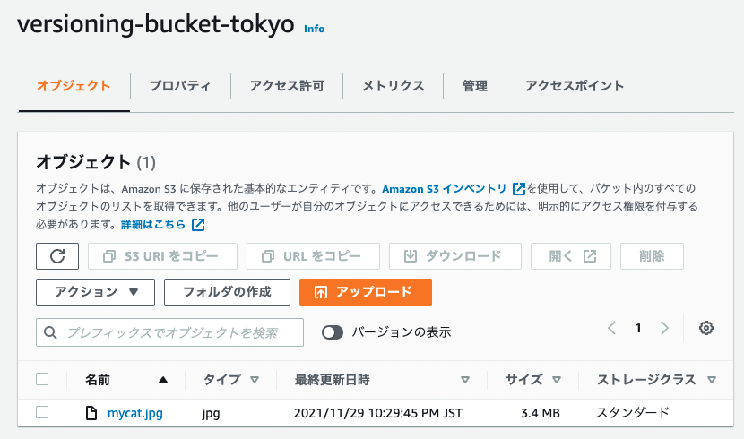

これで同じファイルを削除した後で、`バージョンの表示` を有効にすると以下の様に削除したオブジェクトが、削除マーカーとして追加されていることがわかる。

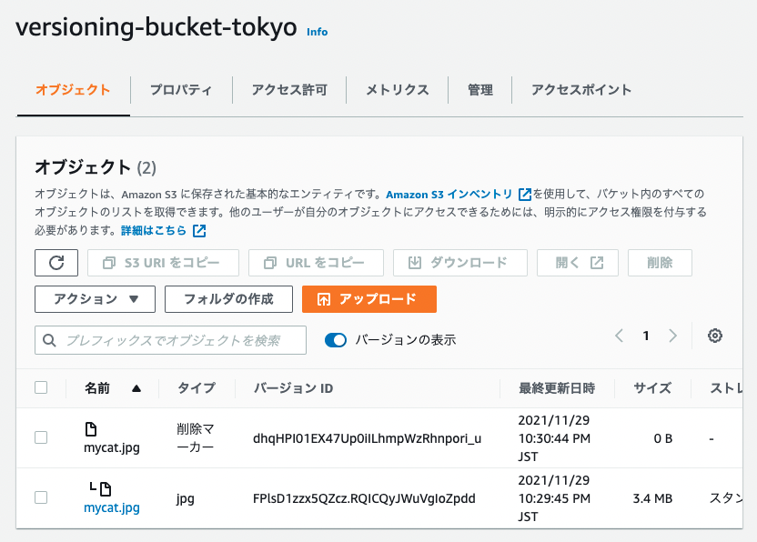

この状態で削除マーカーを削除すると、以下の様にバケットにオブジェクトが復元されていることがわかる。

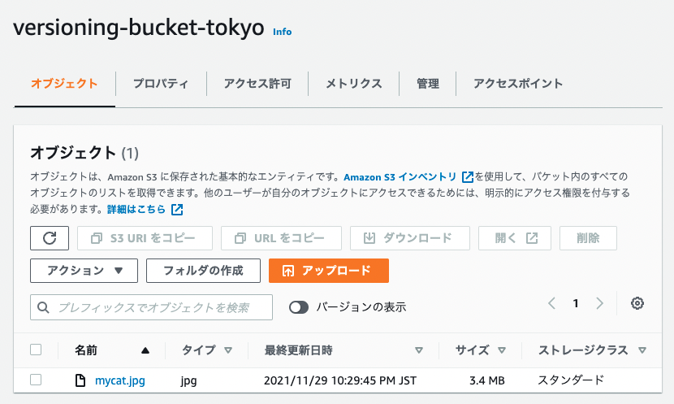

