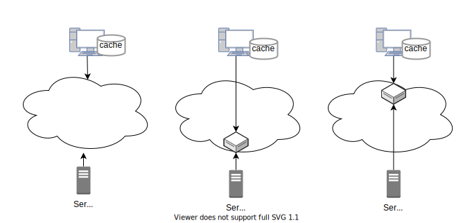

# 課題 1

<!-- START doctoc generated TOC please keep comment here to allow auto update -->
<!-- DON'T EDIT THIS SECTION, INSTEAD RE-RUN doctoc TO UPDATE -->
<details>
<summary>Table of Contents</summary>

- [課題 1](#課題-1)
  - [CDN とは](#cdn-とは)
  - [ブラウザキャッシュと CDN](#ブラウザキャッシュと-cdn)
  - [メモ](#メモ)
  - [参考資料](#参考資料)

</details>
<!-- END doctoc generated TOC please keep comment here to allow auto update -->

## CDN とは

ブラウザからウェブコンテンツにアクセスする際には、対象のコンテンツを配信している「オリジンサーバー」が存在する。

CDN では、ブラウザからコンテンツにアクセスした際に、オリジンサーバーからコンテンツを取得するのではなく、地理的に近い場所に配置されている「エッジサーバー」から、コンテンツのコピーを取得することになります。



CDN を使用する場合、オリジンサーバーから配信しているコンテンツの複製をエッジサーバーから配信することになるため、オリジンサーバーへのネットワーク負荷を軽減することが可能となる。

また、トラフィック分散による遅延の軽減も可能となる。CDN を使用しない場合、オリジンサーバーに対してロードバランサーなどを配置することで負荷分散することが可能だが、ロードバランサーから回線容量がボトルネックになることがある。CDN を使用すれば、地理的に分散するサーバーへのトラフィックになるため、単一のネットワーク帯域不足による遅延を軽減することが可能となる。

## ブラウザキャッシュと CDN

キャッシュの機構として CDN は良く使用されているが、ブラウザキャッシュと比較してよく使用されている理由には以下の様なものがある。

- 制御が難しい
  - CDN はキャッシュを削除するオプションが存在している
  - ブラウザキャッシュの場合にはない
- 初回アクセスに対応できない
  - ブラウザキャッシュはユーザーの初回アクセスには対応できない
  - CDN はコールドブラウザキャッシュやウォームブラウザキャッシュで高速化できる
- 地理分散のメリット
  - TLS 接続では少なくとも 1 回のラウンドトリップが発生する
  - CDN で RTT を短くすることは、この余分な往復の影響を小さくできる
- 他のユーザーへの影響
  - CDN では全てのユーザーに対して共有される
  - ブラウザキャッシュはあくまでも 1 人のユーザーに対して有効

理想的には、ブラウザキャッシュはユーザーがサイトへの 1 回のアクセスをカバーできればよく、例えばサイトの訪問時間を 5 分程度と想定した場合には、ブラウザキャッシュも 5 分程度の期間で有効になるように設定する。

CDN がパージ（キャッシュを削除する）コマンドをサポートしている場合には、1 ヶ月や 1 年などの長い時間を設定するといい。

例えば以下のような HTTP レスポンスを設定すれば、ブラウザキャッシュと CDN を有効化することができる。

```bash
Cache-Control: max-age=600
Surrogate-Control: max-age=31536000
```

## メモ

> コールドブラウザキャッシュやウォームブラウザキャッシュとは何か

## 参考資料

- [第１回 ＣＤＮ の 仕組み （CDN はどんな技術で何が出来るのか）](https://blog.redbox.ne.jp/what-is-cdn.html)
- [CDNs vs Caching: What Are They And How Are They Different?](https://www.ezoic.com/cdn-and-caching-difference/)
- [Is it better to use Cache or CDN?](https://stackoverflow.com/questions/12916430/is-it-better-to-use-cache-or-cdn)
- [What is caching?](https://www.cloudflare.com/ja-jp/learning/cdn/what-is-caching/)
- [入門](https://docs.fastly.com/ja/guides/getting-started)
- [キャッシュ設定のベストプラクティス](https://docs.fastly.com/ja/guides/caching-best-practices)
- [コンテンツ配信のベスト プラクティス](https://cloud.google.com/cdn/docs/best-practices)
- [How caching and CDNs work](https://docs.fastly.com/en/guides/how-caching-and-cdns-work)
- [Leveraging the browser cache with Fastly’s CDN](https://www.fastly.com/blog/leveraging-browser-cache-fastlys-cdn)
- [Keeping things fresh with stale-while-revalidate](https://web.dev/stale-while-revalidate/)

CDN 関連の障害

- [2021 年 6 月に発生した Fastly と Akamai の大規模 CDN 障害の根本的原因と課題とは](https://www.cscdbs.com/jp/cdn-outages-blog/)
