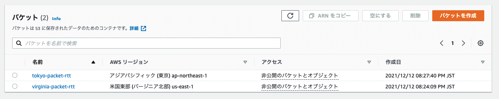
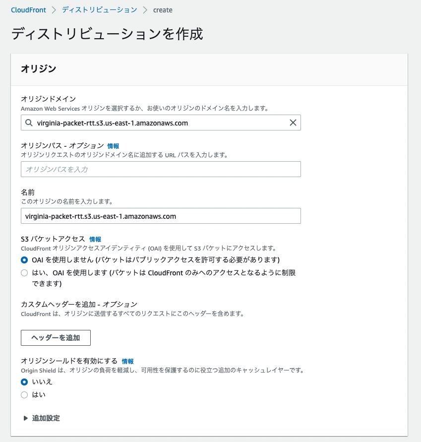
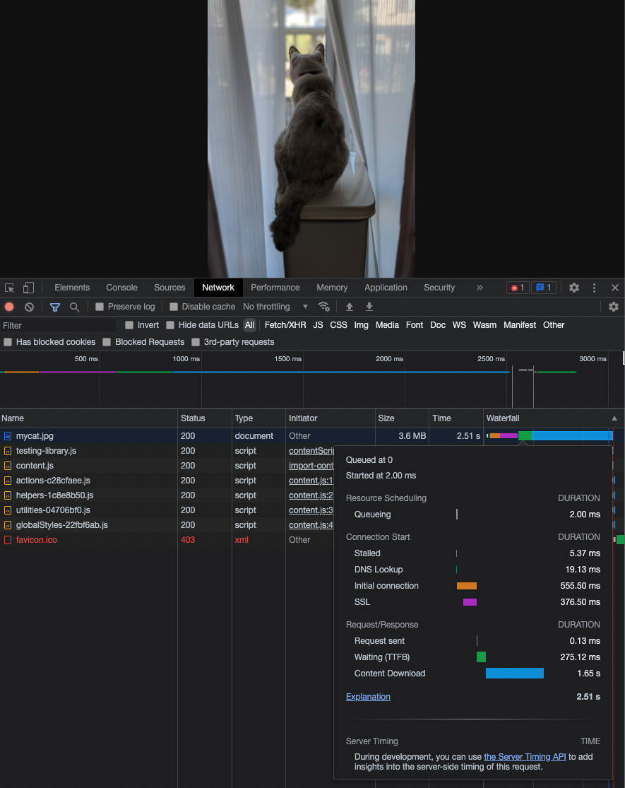
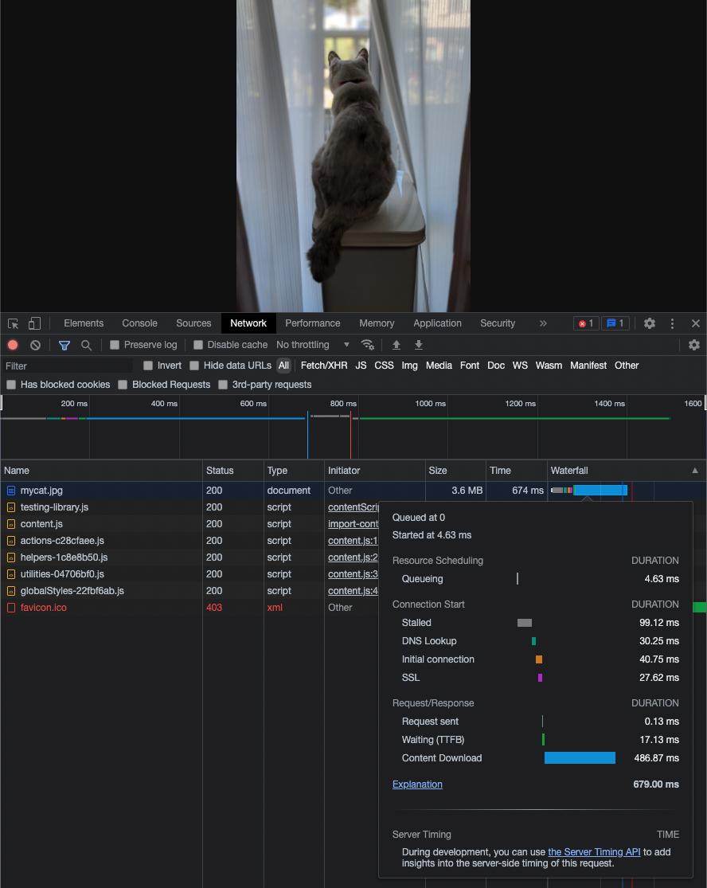

# 課題 2

<!-- START doctoc generated TOC please keep comment here to allow auto update -->
<!-- DON'T EDIT THIS SECTION, INSTEAD RE-RUN doctoc TO UPDATE -->

<!-- END doctoc generated TOC please keep comment here to allow auto update -->

## リージョンごとの S3 バケットの作成

まずは以下のように `us-east-1` と `ap-northeast-1` のリージョンに S3 バケットを作成した。



このときにブラウザからアクセスできる様にバケットポリシーに以下を設定している。

```json
{
  "Version": "2012-10-17",
  "Statement": [
    {
      "Sid": "PublicRead",
      "Principal": "*",
      "Effect": "Allow",
      "Action": ["s3:GetObject"],
      "Resource": ["arn:aws:s3:::virginia-packet-rtt/*"]
    }
  ]
}
```

この場合、以下のように RTT を確認すると地理的に遠い場所にある `us-east-1` へのラウンドトリップにはより長い時間がかかっていることがわかる。

- 東京リージョンへのアクセス

  ```bash
  ❯❯❯ ping -c 5 https://tokyo-packet-rtt.s3.ap-northeast-1.amazonaws.com

  PING s3-r-w.ap-northeast-1.amazonaws.com (52.219.0.91): 56 data bytes
  64 bytes from 52.219.0.91: icmp_seq=0 ttl=236 time=14.675 ms
  64 bytes from 52.219.0.91: icmp_seq=1 ttl=236 time=14.897 ms
  64 bytes from 52.219.0.91: icmp_seq=2 ttl=236 time=15.305 ms
  64 bytes from 52.219.0.91: icmp_seq=3 ttl=236 time=16.321 ms
  64 bytes from 52.219.0.91: icmp_seq=4 ttl=236 time=16.401 ms

  --- s3-r-w.ap-northeast-1.amazonaws.com ping statistics ---
  5 packets transmitted, 5 packets received, 0.0% packet loss
  round-trip min/avg/max/stddev = 14.675/15.520/16.401/0.716 ms
  ```

- 米国北部へのアクセス

  ```bash
  ❯❯❯ ping -c 5 https://virginia-packet-rtt.s3.us-east-1.amazonaws.com

  PING s3-r-w.us-east-1.amazonaws.com (52.216.104.22): 56 data bytes
  64 bytes from 52.216.104.22: icmp_seq=0 ttl=236 time=179.209 ms
  64 bytes from 52.216.104.22: icmp_seq=1 ttl=236 time=181.449 ms
  64 bytes from 52.216.104.22: icmp_seq=2 ttl=236 time=180.392 ms
  64 bytes from 52.216.104.22: icmp_seq=3 ttl=236 time=182.065 ms
  64 bytes from 52.216.104.22: icmp_seq=4 ttl=236 time=181.763 ms

  --- s3-r-w.us-east-1.amazonaws.com ping statistics ---
  5 packets transmitted, 5 packets received, 0.0% packet loss
  round-trip min/avg/max/stddev = 179.209/180.976/182.065/1.048 ms
  ```

## CloudFront と S3 を接続する

CloudFront のディストリビューションを作成する場合には、オリジンに作成した S3 バケットを指定する。



これでディストリビューションのドメイン名とファイル名で URL にアクセスすれば、CloudFront 経由で画像を参照できていることがわかる。

## S3 バケットへの直接アクセス



## CloudFront へのアクセス



## 比較結果

以下のように [TTFB](#TTFB) でも画像のダウンロード時間でも CloudFront 経由の方が所要時間が短くなっていることがわかる。

| metrics          | S3        | CloufFront |
| :--------------- | :-------- | :--------- |
| TTFB             | 275.12 ms | 1.65 s     |
| Content Download | 17.13 ms  | 486.87 ms  |

## TTFB

TTFB とは、リソースに対してリクエストを送った後に、レスポンスの最初のバイトが到着するまでの時間である。

具体的には以下の画像の中の `startTime` から `responseStart` までの所要時間である。


- [[web.dev] TTFB](https://web.dev/ttfb/)
