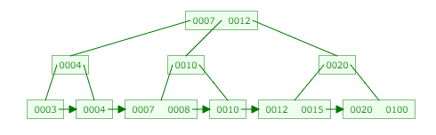
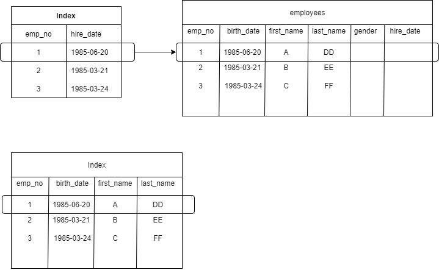

# 課題17「インデックスを理解する」

<!-- START doctoc generated TOC please keep comment here to allow auto update -->
<!-- DON'T EDIT THIS SECTION, INSTEAD RE-RUN doctoc TO UPDATE -->
<details>
<summary>Table of Contents</summary>

- [課題1](#%E8%AA%B2%E9%A1%8C1)
  - [インデックスとは何か](#%E3%82%A4%E3%83%B3%E3%83%87%E3%83%83%E3%82%AF%E3%82%B9%E3%81%A8%E3%81%AF%E4%BD%95%E3%81%8B)
  - [「Slow Query Log」とは何か](#slow-query-log%E3%81%A8%E3%81%AF%E4%BD%95%E3%81%8B)
  - [カーディナリティとは何か](#%E3%82%AB%E3%83%BC%E3%83%87%E3%82%A3%E3%83%8A%E3%83%AA%E3%83%86%E3%82%A3%E3%81%A8%E3%81%AF%E4%BD%95%E3%81%8B)
  - [カバリングインデックスとは何か](#%E3%82%AB%E3%83%90%E3%83%AA%E3%83%B3%E3%82%B0%E3%82%A4%E3%83%B3%E3%83%87%E3%83%83%E3%82%AF%E3%82%B9%E3%81%A8%E3%81%AF%E4%BD%95%E3%81%8B)
- [課題2](#%E8%AA%B2%E9%A1%8C2)
  - [MySQL Docker Imageの使い方](#mysql-docker-image%E3%81%AE%E4%BD%BF%E3%81%84%E6%96%B9)
  - [performance_schema の使い方](#performance_schema-%E3%81%AE%E4%BD%BF%E3%81%84%E6%96%B9)
    - [Step1](#step1)
    - [Step2](#step2)
    - [Step3](#step3)
    - [Step4](#step4)
    - [Step5](#step5)
    - [Step6](#step6)
  - [EXPLAIN の使い方](#explain-%E3%81%AE%E4%BD%BF%E3%81%84%E6%96%B9)
  - [SELECTクエリ その1](#select%E3%82%AF%E3%82%A8%E3%83%AA-%E3%81%9D%E3%81%AE1)
    - [インデックスなし](#%E3%82%A4%E3%83%B3%E3%83%87%E3%83%83%E3%82%AF%E3%82%B9%E3%81%AA%E3%81%97)
    - [インデックス作成](#%E3%82%A4%E3%83%B3%E3%83%87%E3%83%83%E3%82%AF%E3%82%B9%E4%BD%9C%E6%88%90)
    - [インデックスあり](#%E3%82%A4%E3%83%B3%E3%83%87%E3%83%83%E3%82%AF%E3%82%B9%E3%81%82%E3%82%8A)
  - [SELECTクエリ その2](#select%E3%82%AF%E3%82%A8%E3%83%AA-%E3%81%9D%E3%81%AE2)
    - [インデックスなし](#%E3%82%A4%E3%83%B3%E3%83%87%E3%83%83%E3%82%AF%E3%82%B9%E3%81%AA%E3%81%97-1)
    - [インデックスあり](#%E3%82%A4%E3%83%B3%E3%83%87%E3%83%83%E3%82%AF%E3%82%B9%E3%81%82%E3%82%8A-1)
    - [インデックスを強制した場合](#%E3%82%A4%E3%83%B3%E3%83%87%E3%83%83%E3%82%AF%E3%82%B9%E3%82%92%E5%BC%B7%E5%88%B6%E3%81%97%E3%81%9F%E5%A0%B4%E5%90%88)
  - [SELECTクエリ その3](#select%E3%82%AF%E3%82%A8%E3%83%AA-%E3%81%9D%E3%81%AE3)
    - [インデックスなし](#%E3%82%A4%E3%83%B3%E3%83%87%E3%83%83%E3%82%AF%E3%82%B9%E3%81%AA%E3%81%97-2)
    - [インデックスあり](#%E3%82%A4%E3%83%B3%E3%83%87%E3%83%83%E3%82%AF%E3%82%B9%E3%81%82%E3%82%8A-2)
  - [SELECTクエリ その4](#select%E3%82%AF%E3%82%A8%E3%83%AA-%E3%81%9D%E3%81%AE4)
    - [インデックスなし](#%E3%82%A4%E3%83%B3%E3%83%87%E3%83%83%E3%82%AF%E3%82%B9%E3%81%AA%E3%81%97-3)
    - [インデックスあり](#%E3%82%A4%E3%83%B3%E3%83%87%E3%83%83%E3%82%AF%E3%82%B9%E3%81%82%E3%82%8A-3)
  - [SELECTクエリ その5](#select%E3%82%AF%E3%82%A8%E3%83%AA-%E3%81%9D%E3%81%AE5)
    - [インデックスなし](#%E3%82%A4%E3%83%B3%E3%83%87%E3%83%83%E3%82%AF%E3%82%B9%E3%81%AA%E3%81%97-4)
    - [インデックスあり](#%E3%82%A4%E3%83%B3%E3%83%87%E3%83%83%E3%82%AF%E3%82%B9%E3%81%82%E3%82%8A-4)
- [課題3](#%E8%AA%B2%E9%A1%8C3)
  - [INSERT](#insert)
    - [インデックスなし](#%E3%82%A4%E3%83%B3%E3%83%87%E3%83%83%E3%82%AF%E3%82%B9%E3%81%AA%E3%81%97-5)
    - [インデックスあり](#%E3%82%A4%E3%83%B3%E3%83%87%E3%83%83%E3%82%AF%E3%82%B9%E3%81%82%E3%82%8A-5)
  - [DELETE](#delete)
    - [インデックスなし](#%E3%82%A4%E3%83%B3%E3%83%87%E3%83%83%E3%82%AF%E3%82%B9%E3%81%AA%E3%81%97-6)
    - [インデックスあり](#%E3%82%A4%E3%83%B3%E3%83%87%E3%83%83%E3%82%AF%E3%82%B9%E3%81%82%E3%82%8A-6)
  - [補足情報](#%E8%A3%9C%E8%B6%B3%E6%83%85%E5%A0%B1)
- [課題4 クイズ](#%E8%AA%B2%E9%A1%8C4-%E3%82%AF%E3%82%A4%E3%82%BA)

</details>
<!-- END doctoc generated TOC please keep comment here to allow auto update -->

## 課題1

### インデックスとは何か

インデックスとは、メモリ上のテーブルデータとは独立して存在し、テーブルに対して論理的な順序付けを行った上でアクセスすることで、データへの検索などを高速化するために使用される。

インデックスの導入によるSQLクエリのパフォーマンス改善が非常に導入しやすく、その理由は以下の2点である。

- データベースにインデックスを作成するだけなので、アプリケーションのコードに影響を与えない
- インデックスは実際のテーブルとは異なる領域に作成されるため、テーブルのデータに影響を与えない

これは [B+-tree](https://www.cs.usfca.edu/~galles/visualization/BPlusTree.html) で実際のインデックスの挙動を確認することができる。



上図からわかるインデックスでは、木構造の末端部分（**リーフノード**）に実際のテーブルレコードへのポインタが格納されている。

また特徴的な点としては、適当に数値を設定してデータを挿入・削除してみると、インデックスの構造が再構築され、常に木構造の深さを一定に保つようになっており、データ量が増加したとしてもインデックスが劣化しないような設計になっている。

また各インデックスの値がすでに並び替えた状態で木構造が構築されるため、1レコードを検索するだけではなく、`BETWEEN` 句を使用した範囲指定などでもインデックスを有効活用することができる。

参考資料

- [8.3 Optimization and Indexes](https://dev.mysql.com/doc/refman/5.7/en/optimization-indexes.html)
- [[Qiita] MySQLでインデックスを貼る時に読みたいページまとめ(初心者向け）](https://qiita.com/C058/items/1c9c57f634ebf54d99bb)
- [[MySQL Tutorial] MySQL Index](https://www.mysqltutorial.org/mysql-index/)

### 「Slow Query Log」とは何か

**スロークエリログ (Slow query log)** とは、SQLの実行時間が指定した時間よりも長い場合にそのログを出力することで、パフォーマンスに影響を与えるSQLを発見する際に役立つログである。

今回の演習で使用しているMySQLのバージョン5.7.4では、デフォルトではスロークエリログは出力せず、スロークエリの時間条件は10秒になっている。

```bash
# スロークエリの出力設定は OFF である
mysql> show variables like 'slow%';
+---------------------+--------------------------------------+
| Variable_name       | Value                                |
+---------------------+--------------------------------------+
| slow_launch_time    | 2                                    |
| slow_query_log      | OFF                                  |
| slow_query_log_file | /var/lib/mysql/36cf2f84e306-slow.log |
+---------------------+--------------------------------------+

# スロークエリの条件は10秒である
mysql> show variables like 'long%';
+-----------------+-----------+
| Variable_name   | Value     |
+-----------------+-----------+
| long_query_time | 10.000000 |
+-----------------+-----------+
```

> 「ちゃんとslow query logを調べた？」と聞かれました。なぜ調べる必要があるのでしょうか？

SELECT文で使用している全ての列に対してインデックスを作成したとしても、そのインデックスが適切に使用されるかどうかは実際に実行されないとわからない。

例えばSELECT文を発行した際に、インデックスを使用せずに **テーブルフルスキャン** が実行されていることもある。そのためスロークエリログを出力して、意図せずSQLの実行速度が低下してしまわないか確認しておく必要がある。

なお設定を変更したい場合には、`my.cnf` を以下のように設定して再起動すればいい。

```bahs
[mysqld]
slow_query_log=ON
long_query_time = 5
slow_query_log_file = /tmp/mysql-slow.sql
```

参考資料

- [[MySQL] 5.4.5 The Slow Query Log](https://dev.mysql.com/doc/refman/5.7/en/slow-query-log.html)

### カーディナリティとは何か

インデック`スを作成する列を決定する際に重要な情報が **カーディナリティ** であり、対象の列に存在するデータがどの程度の **種類の多さ** を有しているのかをあらわしている。

例えば今回の演習で使用する `employees` テーブルには、`gender` という性別を意味する列が存在しているが、この列には `M` と `F` の2つの種類のデータが存在しており、この場合はカーディナリティが **2** であることを意味する。

そのほかにも `first_name` という列のカーディナリティを調べてみると、300024件存在しているレコードの中で、1275種類のデータが存在していることがわかる。

インデックスを作成する場合には、 **カーディナリティが高い** 列を選ぶほうがいい。

これはカーディナリティが低い（例えば「`gender`」など）列を選択してしまうと、1つの検索条件に該当するレコードが多数存在してしまうことになり（`gender` が `M` の場合は179973県該当してしまう）、インデックスを大量に捜査する必要が出てきてしまい、インデックスの導入によるパフォーマンスの向上が見込めないためである。

またカーディナリティが高い場合であっても、一部の種類にデータが集中してしまっているような状況では、インデックスの効果は得られない。この場合でも先ほどと同様に、特定の検索条件に該当するレコードが大量に存在してしまうと、結局大量のインデックスの捜査が必要になってしまうからである。

参考資料

- [[MySQL] Glossary](https://dev.mysql.com/doc/refman/5.7/en/glossary.html)
  - cardinality

### カバリングインデックスとは何か

**カバリングインデックス（Covering Index）** とは、SELECT句を使用して特定の列を抽出する際に、インデックスが作成されている列のみを指定することで、実際のテーブルにアクセスすることなく、インデックスに保存されているデータを抽出することでSQLの実行速度を向上させる方法である。

例えば以下の `employees` テーブルに対して、インデックスが主キー以外にも、`first_name` と `last_name` と `hire_date` にインデックスが作成されているとする。

```bash
+------------+---------------+------+-----+---------+-------+
| Field      | Type          | Null | Key | Default | Extra |
+------------+---------------+------+-----+---------+-------+
| emp_no     | int(11)       | NO   | PRI | NULL    |       |
| birth_date | date          | NO   |     | NULL    |       |
| first_name | varchar(14)   | NO   |     | NULL    |       |
| last_name  | varchar(16)   | NO   |     | NULL    |       |
| gender     | enum('M','F') | NO   |     | NULL    |       |
| hire_date  | date          | NO   |     | NULL    |       |
+------------+---------------+------+-----+---------+-------+
```

このときに以下のSQLクエリを発行した場合、テーブルにアクセスすることなくインデックスからしかデータを抽出しないため、実行速度は高速である。

```sql
SELECT first_name, last_name
FROM employees
WHERE hire_date = '1985-06-20';
```



カバリングインデックスを使用する際の注意点としては、インデックス自体のサイズが肥大化してしまう点や、データ量が少ない場合には高速化が見込めない点である。

参考資料

- [[Use the Index Luke] Covering Index](https://use-the-index-luke.com/ja/sql/clustering/index-only-scan-covering-index)
- [[Stackoverflow] What is a Covered Index?](https://stackoverflow.com/questions/62137/what-is-a-covered-index)
- [【MySQL】Covering Index で処理が高速化するのを確認する](https://www.softel.co.jp/blogs/tech/archives/5139)

## 課題2

### MySQL Docker Imageの使い方

練習用に [https://hub.docker.com/r/genschsa/mysql-employees](https://hub.docker.com/r/genschsa/mysql-employees) を使用する。

まずはDockerコンテナを起動する。

```bash
# Volumeはルートディレクトリ直下に変更
docker run -d \
  --rm \
  --name mysql-employees \
  -p 3306:3306 \
  -e MYSQL_ROOT_PASSWORD=college \
  -v /data:/var/lib/mysql \
  genschsa/mysql-employees
```

あとはコンテナ内にアクセスして以下のコマンドを実行すれば、MySQLにアクセスすることが可能となる。

```bash
> mysql -u root -pcollege
```

なお使用しているMySQLのバージョンは以下のように `5.7.24` になっている。

```bash
> mysql -V
>>
mysql  Ver 14.14 Distrib 5.7.24, for Linux (x86_64) using  EditLine wrapper
```

初期状態では以下のデータベースが作成されている。

```bash
mysql> SHOW DATABASES;
>>
+--------------------+
| Database           |
+--------------------+
| information_schema |
| employees          |
| mysql              |
| performance_schema |
| sys                |
+--------------------+
```

演習で使用する `employees` データベースには、以下のテーブルが初期状態で作成されている。

```bash
mysql> USE employees;
>>
Reading table information for completion of table and column names
You can turn off this feature to get a quicker startup with -A

Database changed


mysql> show tables;
>>
+----------------------+
| Tables_in_employees  |
+----------------------+
| current_dept_emp     |
| departments          |
| dept_emp             |
| dept_emp_latest_date |
| dept_manager         |
| employees            |
| salaries             |
| titles               |
| v_full_departments   |
| v_full_employees     |
+----------------------+
```

演習で使用する `employees` テーブルの定義は以下のようになっている。

```bash
mysql> desc employees
>>
+------------+---------------+------+-----+---------+-------+
| Field      | Type          | Null | Key | Default | Extra |
+------------+---------------+------+-----+---------+-------+
| emp_no     | int(11)       | NO   | PRI | NULL    |       |
| birth_date | date          | NO   |     | NULL    |       |
| first_name | varchar(14)   | NO   |     | NULL    |       |
| last_name  | varchar(16)   | NO   |     | NULL    |       |
| gender     | enum('M','F') | NO   |     | NULL    |       |
| hire_date  | date          | NO   |     | NULL    |       |
+------------+---------------+------+-----+---------+-------+
```

### performance_schema の使い方

まずは `performance_schema` が初期化されているのか確認する。

```bash
mysql> SHOW VARIABLES LIKE 'performance_schema';
>>
+--------------------+-------+
| Variable_name      | Value |
+--------------------+-------+
| performance_schema | ON    |
+--------------------+-------+
```

では次に対象のスキーマがストレージエンジンとして使用できるかどうかを確認する。

```bash
mysql> SELECT * FROM INFORMATION_SCHEMA.ENGINES WHERE ENGINE='PERFORMANCE_SCHEMA'\G
>>
*************************** 1. row ***************************
      ENGINE: PERFORMANCE_SCHEMA
     SUPPORT: YES
     COMMENT: Performance Schema
TRANSACTIONS: NO
          XA: NO
  SAVEPOINTS: NO
```

以下では具体的な計測方法をまとめていく

#### Step1

まずは収集するイベントを、クエリを実行しているユーザーにのみに限定する。

以下を見るとわかるようにデフォルト設定では、`setup_actors` にて全てのフォアグラウンドスレッドの監視とイベントの収集ができるようになっている。

なお以下の結果のうち、`%` は全てのHostやUser、全ての権限などを意味している。（参考資料は[コチラ](https://dev.mysql.com/doc/refman/5.7/en/performance-schema-setup-actors-table.html)）

```bash
mysql> SELECT * FROM performance_schema.setup_actors;
>>
+------+------+------+---------+---------+
| HOST | USER | ROLE | ENABLED | HISTORY |
+------+------+------+---------+---------+
| %    | %    | %    | YES     | YES     |
+------+------+------+---------+---------+
```

この状態からユーザーが実行したクエリに対してのみ、監視とイベントの収集を行うように変更する必要がある。

そこでまずはMySQLにアクセスしているユーザー名とホスト名（`<user>@<host>`）を確認する。（参考資料は[コチラ](https://dev.mysql.com/doc/refman/5.7/en/information-functions.html#function_current-user)）

```bash
mysql> select CURRENT_USER();
>>
+----------------+
| CURRENT_USER() |
+----------------+
| root@localhost |
+----------------+
```

あとは、以下のようにユーザー名を指定したうえで監視とイベントの収集を有効化しておく。

```bash
# 全てのフォアグラウンドスレッドに対する処理を無効化
mysql> UPDATE performance_schema.setup_actors
       SET ENABLED = 'NO', HISTORY = 'NO'
       WHERE HOST = '%' AND USER = '%';

# クエリを実行するユーザーに対してのみ監視とイベントの収集を有効化
mysql> INSERT INTO performance_schema.setup_actors
       (HOST, USER, ROLE, ENABLED, HISTORY)
       VALUES('localhost','root','%','YES','YES');
```

これで以下のように監視とイベントの収集を行う設定を変更することができている。

```bash
mysql> SELECT * FROM performance_schema.setup_actors;
>>
+-----------+------+------+---------+---------+
| HOST      | USER | ROLE | ENABLED | HISTORY |
+-----------+------+------+---------+---------+
| %         | %    | %    | NO      | NO      |
| localhost | root | %    | YES     | YES     |
+-----------+------+------+---------+---------+
```

#### Step2

次に `setup_instruments` テーブルの設定を変更する。

このテーブルは、MySQLサーバのソースコード内で処理時間や待機時間を収集するための設定を管理している。

```bash
mysql> UPDATE performance_schema.setup_instruments
       SET ENABLED = 'YES', TIMED = 'YES'
       WHERE NAME LIKE '%statement/%';

mysql> UPDATE performance_schema.setup_instruments
       SET ENABLED = 'YES', TIMED = 'YES'
       WHERE NAME LIKE '%stage/%';
```

これでSQLを実行した際にどのようなコマンドに対して計測を行うのか設定することができる。

#### Step3

次に `setup_consumers` テーブルの設定を変更する。

このテーブルには監視やイベントの収集を実施する際に、履歴を含んだり、実行したクエリに対してのみだったりと、どの程度の情報を取得するのか設定することができる。

今の環境でのデフォルト値は以下のようになっている。

```bash
mysql> select * from performance_schema.setup_consumers WHERE NAME LIKE '%events_statements_%';
+--------------------------------+---------+
| NAME                           | ENABLED |
+--------------------------------+---------+
| events_statements_current      | YES     |
| events_statements_history      | YES     |
| events_statements_history_long | NO      |
+--------------------------------+---------+

mysql> select * from performance_schema.setup_consumers WHERE NAME LIKE '%events_stages_%';
+----------------------------+---------+
| NAME                       | ENABLED |
+----------------------------+---------+
| events_stages_current      | NO      |
| events_stages_history      | NO      |
| events_stages_history_long | NO      |
+----------------------------+---------+
```

以上の設定を有効化しておく。

```bash
mysql> UPDATE performance_schema.setup_consumers
       SET ENABLED = 'YES'
       WHERE NAME LIKE '%events_statements_%';

mysql> UPDATE performance_schema.setup_consumers
       SET ENABLED = 'YES'
       WHERE NAME LIKE '%events_stages_%';
```

#### Step4

ここまででユーザーが実行したクエリに対する計測は可能になっているため、後は実際にクエリを発行すればいい。

```bash
mysql> SELECT * FROM employees.employees WHERE emp_no = 10001;
>>
+--------+------------+------------+-----------+--------+------------+
| emp_no | birth_date | first_name | last_name | gender | hire_date  |
+--------+------------+------------+-----------+--------+------------+
|  10001 | 1953-09-02 | Georgi     | Facello   | M      | 1986-06-26 |
+--------+------------+------------+-----------+--------+------------+
```

#### Step5

次に実行したクエリに紐づいているイベントIDを取得するため、[`events_statements_history_long`](https://dev.mysql.com/doc/refman/5.7/en/performance-schema-events-statements-history-long-table.html) から該当するSQLクエリのレコードを取得する。

```sql
-- TIMER_WAITはピコ秒 (10の-12乗) なので通常の秒単位で表示する
mysql> SELECT EVENT_ID, TRUNCATE(TIMER_WAIT/1000000000000,6) as Duration, SQL_TEXT
       FROM performance_schema.events_statements_history_long WHERE SQL_TEXT like '%10001%';
>>
+----------+----------+--------------------------------------------------------+
| EVENT_ID | Duration | SQL_TEXT                                               |
+----------+----------+--------------------------------------------------------+
|       32 | 0.000222 | SELECT * FROM employees.employees WHERE emp_no = 10001 |
+----------+----------+--------------------------------------------------------+
```

#### Step6

最後に [`events_stages_history_long`](https://dev.mysql.com/doc/refman/5.7/en/performance-schema-events-stages-history-long-table.html) から取得したイベントIDに該当するログを確認する。

```bash
mysql> SELECT event_name AS Stage, TRUNCATE(TIMER_WAIT/1000000000000,6) AS Duration
       FROM performance_schema.events_stages_history_long WHERE NESTING_EVENT_ID=32;
>>
+--------------------------------+----------+
| Stage                          | Duration |
+--------------------------------+----------+
| stage/sql/starting             | 0.000052 |
| stage/sql/checking permissions | 0.000002 |
| stage/sql/Opening tables       | 0.000046 |
| stage/sql/init                 | 0.000013 |
| stage/sql/System lock          | 0.000002 |
| stage/sql/optimizing           | 0.000004 |
| stage/sql/statistics           | 0.000061 |
| stage/sql/preparing            | 0.000003 |
| stage/sql/executing            | 0.000000 |
| stage/sql/Sending data         | 0.000006 |
| stage/sql/end                  | 0.000000 |
| stage/sql/query end            | 0.000002 |
| stage/sql/closing tables       | 0.000002 |
| stage/sql/freeing items        | 0.000021 |
| stage/sql/cleaning up          | 0.000000 |
+--------------------------------+----------+
```

表示されている内容をまとめる。

| スレッドのState値    | 説明                                                                                                                                                                              | 
| -------------------- | --------------------------------------------------------------------------------------------------------------------------------------------------------------------------------- | 
| starting             | クエリの実行開始時に要する時間                                                                                                                                                    | 
| checking permissions | サーバに対してクエリを実行できる権限を有しているのかスレッドが確認する時間                                                                                                        | 
| Opening Tables       | スレッドがテーブルを開くまでの時間<br><br>ALTER TABLE や LOCK TABLE などのクエリが実行された場合は、実行が終了するまでテーブルを開くことはできない                                | 
| init                 | ALTER TABLE や SELECT、DELETE、INSERT、UPDATEの初期化前に実行される<br><br>バイナリログやInnoDBログのフラッシュ、クエリキャッシュのクリーンアップ処理などが含まれる               | 
| System lock          | スレッドがテーブルに対してロックを要求している時間                                                                                                                                | 
| optimizing           | クエリに対して最初に実行される最適化処理                                                                                                                                          | 
| statistics           | クエリの実行計画を構築するための統計情報を計算する時間                                                                                                                            | 
| preparing            | クエリを最適化している際に発生する時間                                                                                                                                            | 
| executing            | クエリを実行し始める時間                                                                                                                                                          | 
| Sending data         | SELECT文で要求されたデータへの読み込みと加工を実行してクライアントにデータを送信する時間<br><br>大量のディスクI/Oを必要とするため、たいていはこの状態が最も時間がかかることが多い | 
| end                  | クエリの処理が実行し終わり、クリーンアップ処理を実行する前までの時間<br><br>クエリキャッシュの削除、バイナリログへのイベントの書き込み、メモリバッファの解放などが実行される      | 
| query end            | クエリの処理が終了し、freeing itemsが実行される前までの時間                                                                                                                       | 
| closing tables       | 変更されたテーブルデータをディスクにフラッシュし、使用したテーブルを閉じる時間<br><br>ここに時間がかかる場合はディスク容量が一杯になってしまっている可能性がある                  | 
| freeing items        | クエリキャッシュなどの、アイテムを解放する                                                                                                                                        | 
| cleaning up          | メモリの解放やStateを管理する変数をリセットする時間                                                                                                                               | 

処理時間を確認したい場合には、`Sending data` を確認するのがよさそう。

参考資料

- MySQL 5.7 Reference Manual
  - [Chapter 25 MySQL Performance Schema](https://dev.mysql.com/doc/refman/5.7/en/performance-schema.html)
  - [25.19.1 Query Profiling Using Performance Schema](https://dev.mysql.com/doc/refman/5.7/en/performance-schema-query-profiling.html)
  - [8.14.3 General Thread States](https://dev.mysql.com/doc/refman/5.7/en/general-thread-states.html)
- [MySQL 5.7入門（チューニング基礎編）](https://downloads.mysql.com/presentations/20151208_02_MySQL_Tuning_for_Beginners.pdf)
- [[Gihyo.jp] MySQLをチューニング，そしてスケールアップ／スケールアウトへ](https://gihyo.jp/dev/serial/01/MySQL-tuning-scale)
- [[Gihyo.jp] MySQL道普請便り](https://gihyo.jp/dev/serial/01/mysql-road-construction-news)
- [[Gihyo.jp] ゲームを題材に学ぶ 内部構造から理解するMySQL](https://gihyo.jp/dev/serial/01/game_mysql)
- [[Think It] MySQLマイスターに学べ！ 即効クエリチューニング 記事一覧](https://thinkit.co.jp/series/5588)

### EXPLAIN の使い方

先ほど時間計測したSQLクエリに対して、実行計画を確認するために `EXPLAIN` を付けて再実行する。

```bash
mysql> EXPLAIN SELECT * FROM employees.employees WHERE emp_no = 10001;
>>
--------+-------+---------------+---------+---------+-------+------+----------+-------+
| id | select_type | table     | partitions | type  | possible_keys | key     | key_len | ref   | rows | filtered | Extra |
+----+-------------+-----------+------------+-------+---------------+---------+---------+-------+------+----------+-------+
|  1 | SIMPLE      | employees | NULL       | const | PRIMARY       | PRIMARY | 4       | const |    1 |   100.00 | NULL  |
+----+-------------+-----------+------------+-------+---------------+---------+---------+-------+------+----------+-------+
```

インデックスの効果を検証するために確認すべき項目は **type** であり、これはテーブルのデータに対してどのようにアクセスしたのかを示している。

以下に主要な type をまとめているが、詳細は参考資料の [[USE THE INDEX LUKE] 実行計画 -MySQL-](https://use-the-index-luke.com/ja/sql/explain-plan/mysql) でまとめられている。

| type  | 概要                                                                                                                         | 
| ----- | ---------------------------------------------------------------------------------------------------------------------------- | 
| const | インデックスを走査して、1行のみの該当レコードを見つける<br><br>必要に応じて行IDを参照して、テーブルからデータを取り出す      | 
| ref   | インデックスを走査して、一致するリーフノードをすべて検索する<br><br>必要に応じて行IDを参照して、テーブルからデータを取り出す | 
| index | インデックスの全行を順番に沿って読み込む<br>（INDEX FULL SCANに似ている）                                                    | 
| ALL   | テーブルの全行・全列を読み込む<br>（TABLE FULL SCAN）                                                                        | 

参考資料

- MySQL 5.7 Reference Manual
  - [8.8 Understanding the Query Execution Plan](https://dev.mysql.com/doc/refman/5.7/en/execution-plan-information.html)
- [[USE THE INDEX LUKE] 実行計画 -MySQL-](https://use-the-index-luke.com/ja/sql/explain-plan/mysql)

### SELECTクエリ その1

まずはインデックスを `hire_date` に対して作成し、`hire_date` の情報のみをSELECT文で抽出した場合にクエリが高速化されるのか検証する。

```sql
SELECT hire_date
FROM employees
WHERE hire_date = '1990-01-01';
```

#### インデックスなし

まずは実行したクエリの実行計画を確認する。

```sql
+----+-------------+-----------+------------+------+---------------+------+---------+------+------+----------+-------------+
| id | select_type | table     | partitions | type | possible_keys | key  | key_len | ref  | rows | filtered | Extra       |
+----+-------------+-----------+------------+------+---------------+------+---------+------+------+----------+-------------+
|  1 | SIMPLE      | employees | NULL       | ALL  | NULL          | NULL | NULL    | NULL |   29 |    10.00 | Using where |
+----+-------------+-----------+------------+------+---------------+------+---------+------+------+----------+-------------+
```

結果を見るとアクセスタイプが `ALL` になっているため、テーブルフルアクセスが発生していることがわかる。

次に `performance_schema` を使用して対象のSQLクエリの実行速度を見てみた。

```bash
+--------------------------------+----------+
| Stage                          | Duration |
+--------------------------------+----------+
| stage/sql/starting             | 0.000060 |
| stage/sql/checking permissions | 0.000002 |
| stage/sql/Opening tables       | 0.000025 |
| stage/sql/init                 | 0.000015 |
| stage/sql/System lock          | 0.000003 |
| stage/sql/optimizing           | 0.000005 |
| stage/sql/statistics           | 0.000008 |
| stage/sql/preparing            | 0.000007 |
| stage/sql/executing            | 0.000000 |
| stage/sql/Sending data         | 0.044031 |
| stage/sql/end                  | 0.000001 |
| stage/sql/query end            | 0.000004 |
| stage/sql/closing tables       | 0.000005 |
| stage/sql/freeing items        | 0.000030 |
| stage/sql/cleaning up          | 0.000000 |
+--------------------------------+----------+
```

`Sending Data` の処理で 0.044031 秒の時間を要していることがわかる。

#### インデックス作成

まずは `hire_date` に対してインデックスを作成する。

```sql
mysql> CREATE INDEX hire_date_idx ON employees (hire_date);

-- 以下でもOK
-- 割り当てられている権限に応じて使い分ける
mysql> ALTER TABLE employees ADD INDEX hire_date_idx (hire_date);
```

インデックスが作成されたかどうかを確認する。

```sql
mysql> SHOW INDEXES FROM employees;
>>
+-----------+------------+---------------+--------------+-------------+-----------+-------------+----------+--------+------+------------+---------+---------------+
| Table     | Non_unique | Key_name      | Seq_in_index | Column_name | Collation | Cardinality | Sub_part | Packed | Null | Index_type | Comment | Index_comment |
+-----------+------------+---------------+--------------+-------------+-----------+-------------+----------+--------+------+------------+---------+---------------+
| employees |          0 | PRIMARY       |            1 | emp_no      | A         |          28 |     NULL | NULL   |      | BTREE      |         |               |
| employees |          1 | hire_date_idx |            1 | hire_date   | A         |          29 |     NULL | NULL   |      | BTREE      |         |               |
+-----------+------------+---------------+--------------+-------------+-----------+-------------+----------+--------+------+------------+---------+---------------+
```

結果からは作成されたインデックス `hire_date_idx` は、`Non_unique` が1であるころから列に含まれるデータに重複が存在していることがわかる。

参考資料

- [[MySQL 5.7 Reference] 13.7.5.22 SHOW INDEX STATEMENT](https://dev.mysql.com/doc/refman/5.7/en/show-index.html)
- [[MySQL Tutorial] SHOW INDEX](https://www.mysqltutorial.org/mysql-index/mysql-show-indexes/)

#### インデックスあり

では同じクエリを発行して実行計画を確認する。

```bash
+----+-------------+-----------+------------+------+---------------+---------------+---------+-------+------+----------+-------------+
| id | select_type | table     | partitions | type | possible_keys | key           | key_len | ref   | rows | filtered | Extra       |
+----+-------------+-----------+------------+------+---------------+---------------+---------+-------+------+----------+-------------+
|  1 | SIMPLE      | employees | NULL       | ref  | hire_date_idx | hire_date_idx | 3       | const |   65 |   100.00 | Using index |
+----+-------------+-----------+------------+------+---------------+---------------+---------+-------+------+----------+-------------+
```

実行計画を見てみると、`Extra` 列に `Using Index` とある通り、テーブルへのアクセスを行っておらず、必要なデータを全てインデックスから取得していることがわかる。

またアクセスタイプには `ref` とある通り、インデックスから検索条件に一致するすべてのエントリのリーフノードを走査していることがわかる。

次に `performance_schema` を使用して対象のSQLクエリの実行速度を見てみた。

```bash
+--------------------------------+----------+
| Stage                          | Duration |
+--------------------------------+----------+
| stage/sql/starting             | 0.000052 |
| stage/sql/checking permissions | 0.000003 |
| stage/sql/Opening tables       | 0.000011 |
| stage/sql/init                 | 0.000013 |
| stage/sql/System lock          | 0.000003 |
| stage/sql/optimizing           | 0.000006 |
| stage/sql/statistics           | 0.000036 |
| stage/sql/preparing            | 0.000005 |
| stage/sql/executing            | 0.000000 |
| stage/sql/Sending data         | 0.000029 |
| stage/sql/end                  | 0.000000 |
| stage/sql/query end            | 0.000003 |
| stage/sql/closing tables       | 0.000002 |
| stage/sql/freeing items        | 0.000025 |
| stage/sql/cleaning up          | 0.000000 |
+--------------------------------+----------+
```

`Sending Data` の処理で 0.000029 秒の時間を要していることがわかり、インデックスをしていようしていた場合よりも遥に高速に処理されていることがわかる。

### SELECTクエリ その2

まずはインデックスを `hire_date` に対して作成し、`hire_date` の情報だけではなく、インデックスを張っていない列の情報も取得するSELECT文で発行した場合にクエリが高速化されるのか検証する。

```sql
SELECT hire_date, first_name, last_name
FROM employees
WHERE hire_date = '1990-01-01';
```

#### インデックスなし

インデックスを使用しない場合の実行計画を確認してみる。

```bash
+----+-------------+-----------+------------+------+---------------+------+---------+------+------+----------+-------------+
| id | select_type | table     | partitions | type | possible_keys | key  | key_len | ref  | rows | filtered | Extra       |
+----+-------------+-----------+------------+------+---------------+------+---------+------+------+----------+-------------+
|  1 | SIMPLE      | employees | NULL       | ALL  | NULL          | NULL | NULL    | NULL |   29 |    10.00 | Using where |
+----+-------------+-----------+------------+------+---------------+------+---------+------+------+----------+-------------+
```

次の前回と同様に処理時間を確認する。

```bash
+--------------------------------+----------+
| Stage                          | Duration |
+--------------------------------+----------+
| stage/sql/starting             | 0.000063 |
| stage/sql/checking permissions | 0.000003 |
| stage/sql/Opening tables       | 0.000015 |
| stage/sql/init                 | 0.000016 |
| stage/sql/System lock          | 0.000004 |
| stage/sql/optimizing           | 0.000005 |
| stage/sql/statistics           | 0.000009 |
| stage/sql/preparing            | 0.000006 |
| stage/sql/executing            | 0.000000 |
| stage/sql/Sending data         | 0.049090 |
| stage/sql/end                  | 0.000001 |
| stage/sql/query end            | 0.000004 |
| stage/sql/closing tables       | 0.000005 |
| stage/sql/freeing items        | 0.000035 |
| stage/sql/cleaning up          | 0.000000 |
+--------------------------------+----------+
```

`Sending Data` の処理で 0.049090 秒の時間を要していることがわかる。

これは最初のクエリと同程度の時間がかかっていることがわかる。

#### インデックスあり

インデックスを作成した後に同じクエリを発行した際の実行計画を確認する。

```bash
+----+-------------+-----------+------------+------+---------------+------+---------+------+------+----------+-------------+
| id | select_type | table     | partitions | type | possible_keys | key  | key_len | ref  | rows | filtered | Extra       |
+----+-------------+-----------+------------+------+---------------+------+---------+------+------+----------+-------------+
|  1 | SIMPLE      | employees | NULL       | ALL  | hire_date_idx | NULL | NULL    | NULL |   29 |   100.00 | Using where |
+----+-------------+-----------+------------+------+---------------+------+---------+------+------+----------+-------------+
```

今回はインデックスを作成しているにもかかわらず、テーブルフルアクセスを行っていることがわかる。

なお `possible_keys` 自体には今回作成したインデックスを認識しているため、optimizerはテーブルのアクセスに利用可能なインデックスだと認識していることがわかる。

次に実行時間を確認してみる。

```bash
+--------------------------------+----------+
| Stage                          | Duration |
+--------------------------------+----------+
| stage/sql/starting             | 0.000057 |
| stage/sql/checking permissions | 0.000002 |
| stage/sql/Opening tables       | 0.000011 |
| stage/sql/init                 | 0.000017 |
| stage/sql/System lock          | 0.000003 |
| stage/sql/optimizing           | 0.000004 |
| stage/sql/statistics           | 0.000039 |
| stage/sql/preparing            | 0.000006 |
| stage/sql/executing            | 0.000001 |
| stage/sql/Sending data         | 0.046805 |
| stage/sql/end                  | 0.000002 |
| stage/sql/query end            | 0.000004 |
| stage/sql/closing tables       | 0.000053 |
| stage/sql/freeing items        | 0.000054 |
| stage/sql/cleaning up          | 0.000000 |
+--------------------------------+----------+
```

`Sending Data` の処理で 0.049090 秒の時間を要しており、インデックスを作成していない場合と同程度の処理時間がかかっていることがわかる。

#### インデックスを強制した場合

クエリに対して以下のようにインデックスの使用を強制することができる。

```sql
SELECT hire_date, first_name, last_name
FROM employees
FORCE INDEX (hire_date_idx)
WHERE hire_date = '1990-01-01';
```

実行計画を確認するとアクセスタイプが `ref` となっており、インデックスに対して該当するレコードを走査していることがわかる。

```bash
+----+-------------+-----------+------------+------+---------------+---------------+---------+-------+------+----------+-------+
| id | select_type | table     | partitions | type | possible_keys | key           | key_len | ref   | rows | filtered | Extra |
+----+-------------+-----------+------------+------+---------------+---------------+---------+-------+------+----------+-------+
|  1 | SIMPLE      | employees | NULL       | ref  | hire_date_idx | hire_date_idx | 3       | const |   65 |   100.00 | NULL  |
+----+-------------+-----------+------------+------+---------------+---------------+---------+-------+------+----------+-------+
```

次に処理時間を計測する。

```bash
+--------------------------------+----------+
| Stage                          | Duration |
+--------------------------------+----------+
| stage/sql/starting             | 0.000073 |
| stage/sql/checking permissions | 0.000005 |
| stage/sql/Opening tables       | 0.000011 |
| stage/sql/init                 | 0.000013 |
| stage/sql/System lock          | 0.000003 |
| stage/sql/optimizing           | 0.000003 |
| stage/sql/statistics           | 0.000038 |
| stage/sql/preparing            | 0.000005 |
| stage/sql/executing            | 0.000000 |
| stage/sql/Sending data         | 0.000157 |
| stage/sql/end                  | 0.000000 |
| stage/sql/query end            | 0.000003 |
| stage/sql/closing tables       | 0.000002 |
| stage/sql/freeing items        | 0.000037 |
| stage/sql/cleaning up          | 0.000000 |
+--------------------------------+----------+
```

`Sending Data` の処理で 0.000157 秒の時間を要しており、インデックスを使用することで高速化していることがわかる。

> なぜインデックスを強制しない場合には、テーブルフルアクセスをしていたのか

### SELECTクエリ その3

次にインデックスを作成した列をもとにグルーピングを行った際に、処理が高速化するかどうか確認する。

```sql
SELECT hire_date 
FROM employees 
WHERE hire_date > '1990-01-01'
GROUP BY hire_date;
```

#### インデックスなし

まずは実行計画を確認する。

```bash
+----+-------------+-----------+------------+------+---------------+------+---------+------+------+----------+----------------------------------------------+
| id | select_type | table     | partitions | type | possible_keys | key  | key_len | ref  | rows | filtered | Extra                                        |
+----+-------------+-----------+------------+------+---------------+------+---------+------+------+----------+----------------------------------------------+
|  1 | SIMPLE      | employees | NULL       | ALL  | NULL          | NULL | NULL    | NULL |   29 |    33.33 | Using where; Using temporary; Using filesort |
+----+-------------+-----------+------------+------+---------------+------+---------+------+------+----------+----------------------------------------------+
```

こちらは想定通りテーブルフルアクセスが実行されていることがわかる。

また `Using temporary` とある通り、MySQLがクエリを実行するために検索条件で抽出したデータをグルーピングするために一時テーブルに保存していることがわかる。これは一般的には `GROUP BY` や `ORDER BY` を使用した場合によく見られる。

また `Using filesort` とある通り、ソートされた順序でレコードを取得するための処理を行っていることがわかる。アクセスタイプ（今回はテーブルフルアクセス）に従って全ての行を調べ、 `WHERE` にマッチするすべてのレコードのソートきーちレコードへのポイントを格納する。

前回は等価演算子（`=`）を使用していたためソート処理は発生しなかったが、今回は比較演算子（`>`）を使用した範囲指定であるため、ソート処理が発生している。

次に処理時間を確認する。

```bash
+--------------------------------+----------+
| Stage                          | Duration |
+--------------------------------+----------+
| stage/sql/starting             | 0.000095 |
| stage/sql/checking permissions | 0.000003 |
| stage/sql/Opening tables       | 0.000010 |
| stage/sql/init                 | 0.000018 |
| stage/sql/System lock          | 0.000003 |
| stage/sql/optimizing           | 0.000003 |
| stage/sql/statistics           | 0.000007 |
| stage/sql/preparing            | 0.000005 |
| stage/sql/Creating tmp table   | 0.000012 |
| stage/sql/Sorting result       | 0.000000 |
| stage/sql/executing            | 0.000000 |
| stage/sql/Sending data         | 0.066909 |
| stage/sql/Creating sort index  | 0.000661 |
| stage/sql/end                  | 0.000001 |
| stage/sql/query end            | 0.000004 |
| stage/sql/removing tmp table   | 0.000003 |
| stage/sql/closing tables       | 0.000004 |
| stage/sql/freeing items        | 0.000008 |
| stage/sql/cleaning up          | 0.000000 |
+--------------------------------+----------+
```

`Sending Data` の処理で 0.066909 秒の時間を要していることがわかる。

#### インデックスあり

インデックスを作成した状態で同じクエリを発行して実行計画を確認する。

```bash
+----+-------------+-----------+------------+-------+---------------+---------------+---------+------+------+----------+--------------------------+
| id | select_type | table     | partitions | type  | possible_keys | key           | key_len | ref  | rows | filtered | Extra                    |
+----+-------------+-----------+------------+-------+---------------+---------------+---------+------+------+----------+--------------------------+
|  1 | SIMPLE      | employees | NULL       | range | hire_date_idx | hire_date_idx | 3       | NULL |   14 |   100.00 | Using where; Using index |
+----+-------------+-----------+------------+-------+---------------+---------------+---------+------+------+----------+--------------------------+
```

実行計画を見てみると、`Extra` 列に `Using Index` とある通り、テーブルへのアクセスを行っておらず、必要なデータを全てインデックスから取得していることがわかる。

インデックス（`B+-tree`）を作成した段階で `hire_date` は昇順に並び替えられているため、範囲指定で抽出した場合であっても、ソート処理は実行されていないことがわかる。

次に処理時間を確認する。

```bash
+--------------------------------+----------+
| Stage                          | Duration |
+--------------------------------+----------+
| stage/sql/starting             | 0.000056 |
| stage/sql/checking permissions | 0.000003 |
| stage/sql/Opening tables       | 0.000012 |
| stage/sql/init                 | 0.000016 |
| stage/sql/System lock          | 0.000004 |
| stage/sql/optimizing           | 0.000003 |
| stage/sql/statistics           | 0.000052 |
| stage/sql/preparing            | 0.000007 |
| stage/sql/Sorting result       | 0.000001 |
| stage/sql/executing            | 0.000000 |
| stage/sql/Sending data         | 0.020966 |
| stage/sql/end                  | 0.000002 |
| stage/sql/query end            | 0.000008 |
| stage/sql/closing tables       | 0.000003 |
| stage/sql/freeing items        | 0.000021 |
| stage/sql/cleaning up          | 0.000000 |
+--------------------------------+----------+
```

`Sending Data` の処理で 0.020966 秒の時間を要していることがわかり、先ほどよりも高速化していることがわかる。

> MySQLでは `GROUP BY col1, col2, ...` と指定した場合、暗黙的に `ORDER BY col1, col2, ...` のようにソート処理が実行されることに注意する。

### SELECTクエリ その4

`WHERE` 句での検索条件に関数を使用した場合にインデックスにより高速化が実行されるのか確認する。

```sql
SELECT hire_date 
FROM employees 
WHERE MONTH(hire_date) = '12';
```

#### インデックスなし

実行計画を確認すると相変わらずテーブルフルアクセスが実行されていることがわかる。

```bash
+----+-------------+-----------+------------+------+---------------+------+---------+------+------+----------+-------------+
| id | select_type | table     | partitions | type | possible_keys | key  | key_len | ref  | rows | filtered | Extra       |
+----+-------------+-----------+------------+------+---------------+------+---------+------+------+----------+-------------+
|  1 | SIMPLE      | employees | NULL       | ALL  | NULL          | NULL | NULL    | NULL |   29 |   100.00 | Using where |
+----+-------------+-----------+------------+------+---------------+------+---------+------+------+----------+-------------+
```

次に処理時間を確認する。

```bash
+--------------------------------+----------+
| Stage                          | Duration |
+--------------------------------+----------+
| stage/sql/starting             | 0.000060 |
| stage/sql/checking permissions | 0.000003 |
| stage/sql/Opening tables       | 0.000013 |
| stage/sql/init                 | 0.000015 |
| stage/sql/System lock          | 0.000004 |
| stage/sql/optimizing           | 0.000004 |
| stage/sql/statistics           | 0.000009 |
| stage/sql/preparing            | 0.000005 |
| stage/sql/executing            | 0.000000 |
| stage/sql/Sending data         | 0.036517 |
| stage/sql/end                  | 0.000002 |
| stage/sql/query end            | 0.000004 |
| stage/sql/closing tables       | 0.000005 |
| stage/sql/freeing items        | 0.000022 |
| stage/sql/cleaning up          | 0.000000 |
+--------------------------------+----------+
```

`Sending Data` の処理で 0.036517 秒の時間を要していることがわかる。

#### インデックスあり

実行計画を確認してみるとインデックスを使用していることがわかる。

```bash
+----+-------------+-----------+------------+-------+---------------+---------------+---------+------+------+----------+--------------------------+
| id | select_type | table     | partitions | type  | possible_keys | key           | key_len | ref  | rows | filtered | Extra                    |
+----+-------------+-----------+------------+-------+---------------+---------------+---------+------+------+----------+--------------------------+
|  1 | SIMPLE      | employees | NULL       | index | NULL          | hire_date_idx | 3       | NULL |   29 |   100.00 | Using where; Using index |
+----+-------------+-----------+------------+-------+---------------+---------------+---------+------+------+----------+--------------------------+
```

これはSQLServerよMySQLの特徴的な挙動であり、OracleやPostgreSQLでは関数をインデックスを張っている列に使用すると、インデックスは使用されないため注意する必要がある。

次に処理時間を確認する。

```bash
+--------------------------------+----------+
| Stage                          | Duration |
+--------------------------------+----------+
| stage/sql/starting             | 0.000065 |
| stage/sql/checking permissions | 0.000003 |
| stage/sql/Opening tables       | 0.000012 |
| stage/sql/init                 | 0.000016 |
| stage/sql/System lock          | 0.000004 |
| stage/sql/optimizing           | 0.000004 |
| stage/sql/statistics           | 0.000008 |
| stage/sql/preparing            | 0.000005 |
| stage/sql/executing            | 0.000000 |
| stage/sql/Sending data         | 0.034253 |
| stage/sql/end                  | 0.000001 |
| stage/sql/query end            | 0.000004 |
| stage/sql/closing tables       | 0.000005 |
| stage/sql/freeing items        | 0.000021 |
| stage/sql/cleaning up          | 0.000000 |
+--------------------------------+----------+
```

`Sending Data` の処理で 0.034253 秒の時間を要していることがわかり、インデックスを使用しているにもかかわらず、処理が高速化されていないことがわかる。

### SELECTクエリ その5

複雑なクエリを発行する。

```sql
SELECT YP1.HIRE_YEAR AS BASE_YEAR
      ,YP2.HIRE_YEAR AS NEXT_YEAR
      ,YP1.NEW_EMPLOYEES AS BASE_EMPLOYEES
      ,YP2.NEW_EMPLOYEES AS NEXT_EMPLOYEES
      ,YP2.NEW_EMPLOYEES / YP1.NEW_EMPLOYEES AS GROWTH_RATE
FROM (
    SELECT YEAR(hire_date) AS HIRE_YEAR
          ,COUNT(hire_date) AS NEW_EMPLOYEES 
    FROM employees
    GROUP BY HIRE_YEAR
) YP1
INNER JOIN (
    SELECT YEAR(hire_date) AS HIRE_YEAR
          ,COUNT(hire_date) AS NEW_EMPLOYEES 
    FROM employees
    GROUP BY HIRE_YEAR
) YP2
ON YP1.HIRE_YEAR = YP2.HIRE_YEAR - 1;
```

出力結果は以下のようになる。

```bash
+-----------+-----------+----------------+----------------+-------------+
| BASE_YEAR | NEXT_YEAR | BASE_EMPLOYEES | NEXT_EMPLOYEES | GROWTH_RATE |
+-----------+-----------+----------------+----------------+-------------+
|      1985 |      1986 |          35316 |          36150 |      1.0236 |
|      1986 |      1987 |          36150 |          33501 |      0.9267 |
|      1987 |      1988 |          33501 |          31436 |      0.9384 |
|      1988 |      1989 |          31436 |          28394 |      0.9032 |
|      1989 |      1990 |          28394 |          25610 |      0.9020 |
|      1990 |      1991 |          25610 |          22568 |      0.8812 |
|      1991 |      1992 |          22568 |          20402 |      0.9040 |
|      1992 |      1993 |          20402 |          17772 |      0.8711 |
|      1993 |      1994 |          17772 |          14835 |      0.8347 |
|      1994 |      1995 |          14835 |          12115 |      0.8166 |
|      1995 |      1996 |          12115 |           9574 |      0.7903 |
|      1996 |      1997 |           9574 |           6669 |      0.6966 |
|      1997 |      1998 |           6669 |           4155 |      0.6230 |
|      1998 |      1999 |           4155 |           1514 |      0.3644 |
|      1999 |      2000 |           1514 |             13 |      0.0086 |
+-----------+-----------+----------------+----------------+-------------+
```

#### インデックスなし

実行計画を確認してみる。

```bash
+----+-------------+------------+------------+------+---------------+-------------+---------+------+------+----------+---------------------------------+
| id | select_type | table      | partitions | type | possible_keys | key         | key_len | ref  | rows | filtered | Extra                           |
+----+-------------+------------+------------+------+---------------+-------------+---------+------+------+----------+---------------------------------+
|  1 | PRIMARY     | <derived3> | NULL       | ALL  | NULL          | NULL        | NULL    | NULL |   29 |   100.00 | NULL                            |
|  1 | PRIMARY     | <derived2> | NULL       | ref  | <auto_key0>   | <auto_key0> | 5       | func |    2 |   100.00 | Using where                     |
|  3 | DERIVED     | employees  | NULL       | ALL  | NULL          | NULL        | NULL    | NULL |   29 |   100.00 | Using temporary; Using filesort |
|  2 | DERIVED     | employees  | NULL       | ALL  | NULL          | NULL        | NULL    | NULL |   29 |   100.00 | Using temporary; Using filesort |
+----+-------------+------------+------------+------+---------------+-------------+---------+------+------+----------+---------------------------------+
```

次に処理時間を確認する。

```bash
+--------------------------------+----------+
| Stage                          | Duration |
+--------------------------------+----------+
| stage/sql/starting             | 0.000082 |
| stage/sql/checking permissions | 0.000001 |
| stage/sql/checking permissions | 0.000002 |
| stage/sql/Opening tables       | 0.000043 |
| stage/sql/init                 | 0.000037 |
| stage/sql/System lock          | 0.000004 |
| stage/sql/optimizing           | 0.000000 |
| stage/sql/optimizing           | 0.000000 |
| stage/sql/statistics           | 0.000006 |
| stage/sql/preparing            | 0.000005 |
| stage/sql/Creating tmp table   | 0.000005 |
| stage/sql/Sorting result       | 0.000001 |
| stage/sql/optimizing           | 0.000000 |
| stage/sql/statistics           | 0.000000 |
| stage/sql/preparing            | 0.000000 |
| stage/sql/Creating tmp table   | 0.000002 |
| stage/sql/Sorting result       | 0.000003 |
| stage/sql/statistics           | 0.000008 |
| stage/sql/preparing            | 0.000004 |
| stage/sql/executing            | 0.000005 |
| stage/sql/Sending data         | 0.000003 |
| stage/sql/executing            | 0.000000 |
| stage/sql/Sending data         | 0.073530 |
| stage/sql/Creating sort index  | 0.000026 |
| stage/sql/executing            | 0.000000 |
| stage/sql/Sending data         | 0.071941 |
| stage/sql/Creating sort index  | 0.000056 |
| stage/sql/end                  | 0.000001 |
| stage/sql/query end            | 0.000005 |
| stage/sql/removing tmp table   | 0.000002 |
| stage/sql/removing tmp table   | 0.000001 |
| stage/sql/closing tables       | 0.000000 |
| stage/sql/removing tmp table   | 0.000001 |
| stage/sql/removing tmp table   | 0.000001 |
| stage/sql/freeing items        | 0.000037 |
| stage/sql/cleaning up          | 0.000000 |
+--------------------------------+----------+
```

サブクエリも使用していることから今までと比較すると多くの時間を有していることがわかる。

#### インデックスあり

同じく `hire_date` にインデックスを張った状態で同じクエリを発行する。

まずは実行計画を確認してみる。

```bash
+----+-------------+------------+------------+-------+---------------+---------------+---------+------+------+----------+----------------------------------------------+
| id | select_type | table      | partitions | type  | possible_keys | key           | key_len | ref  | rows | filtered | Extra                                        |
+----+-------------+------------+------------+-------+---------------+---------------+---------+------+------+----------+----------------------------------------------+
|  1 | PRIMARY     | <derived3> | NULL       | ALL   | NULL          | NULL          | NULL    | NULL |   29 |   100.00 | NULL                                         |
|  1 | PRIMARY     | <derived2> | NULL       | ref   | <auto_key0>   | <auto_key0>   | 5       | func |    2 |   100.00 | Using where                                  |
|  3 | DERIVED     | employees  | NULL       | index | hire_date_idx | hire_date_idx | 3       | NULL |   29 |   100.00 | Using index; Using temporary; Using filesort |
|  2 | DERIVED     | employees  | NULL       | index | hire_date_idx | hire_date_idx | 3       | NULL |   29 |   100.00 | Using index; Using temporary; Using filesort |
+----+-------------+------------+------------+-------+---------------+---------------+---------+------+------+----------+----------------------------------------------+
```

次に処理時間を確認する。

```bash
+--------------------------------+----------+
| Stage                          | Duration |
+--------------------------------+----------+
| stage/sql/starting             | 0.000094 |
| stage/sql/checking permissions | 0.000001 |
| stage/sql/checking permissions | 0.000002 |
| stage/sql/Opening tables       | 0.000048 |
| stage/sql/init                 | 0.000039 |
| stage/sql/System lock          | 0.000004 |
| stage/sql/optimizing           | 0.000001 |
| stage/sql/optimizing           | 0.000001 |
| stage/sql/statistics           | 0.000010 |
| stage/sql/preparing            | 0.000004 |
| stage/sql/Creating tmp table   | 0.000006 |
| stage/sql/Sorting result       | 0.000001 |
| stage/sql/optimizing           | 0.000000 |
| stage/sql/statistics           | 0.000001 |
| stage/sql/preparing            | 0.000000 |
| stage/sql/Creating tmp table   | 0.000002 |
| stage/sql/Sorting result       | 0.000003 |
| stage/sql/statistics           | 0.000009 |
| stage/sql/preparing            | 0.000004 |
| stage/sql/executing            | 0.000004 |
| stage/sql/Sending data         | 0.000004 |
| stage/sql/executing            | 0.000000 |
| stage/sql/Sending data         | 0.062626 | < 0.073530
| stage/sql/Creating sort index  | 0.000023 |
| stage/sql/executing            | 0.000000 |
| stage/sql/Sending data         | 0.058782 | < 0.071941
| stage/sql/Creating sort index  | 0.000051 |
| stage/sql/end                  | 0.000001 |
| stage/sql/query end            | 0.000004 |
| stage/sql/removing tmp table   | 0.000002 |
| stage/sql/removing tmp table   | 0.000001 |
| stage/sql/closing tables       | 0.000000 |
| stage/sql/removing tmp table   | 0.000000 |
| stage/sql/removing tmp table   | 0.000001 |
| stage/sql/freeing items        | 0.000032 |
| stage/sql/cleaning up          | 0.000000 |
+--------------------------------+----------+
```

先ほどと比較して、多少は処理時間が短くなっていることがわかる。

## 課題3

今回は比較のためにインデックスを新たに4つ作成する。

- `birth_date`
- `first_name`
- `last_name`
- `hire_date`

```sql
CREATE INDEX birth_date_idx ON employees (birth_date);
CREATE INDEX first_name_idx ON employees (first_name);
CREATE INDEX last_name_idx ON employees (last_name);
CREATE INDEX hire_date_idx ON employees (hire_date);
```

作成したインデックスを確認する。

```bash
+-----------+------------+----------------+--------------+-------------+-----------+-------------+----------+--------+------+------------+---------+---------------+
| Table     | Non_unique | Key_name       | Seq_in_index | Column_name | Collation | Cardinality | Sub_part | Packed | Null | Index_type | Comment | Index_comment |
+-----------+------------+----------------+--------------+-------------+-----------+-------------+----------+--------+------+------------+---------+---------------+
| employees |          0 | PRIMARY        |            1 | emp_no      | A         |          28 |     NULL | NULL   |      | BTREE      |         |               |
| employees |          1 | birth_date_idx |            1 | birth_date  | A         |          28 |     NULL | NULL   |      | BTREE      |         |               |
| employees |          1 | first_name_idx |            1 | first_name  | A         |          28 |     NULL | NULL   |      | BTREE      |         |               |
| employees |          1 | last_name_idx  |            1 | last_name   | A         |          28 |     NULL | NULL   |      | BTREE      |         |               |
| employees |          1 | hire_date_idx  |            1 | hire_date   | A         |          28 |     NULL | NULL   |      | BTREE      |         |               |
+-----------+------------+----------------+--------------+-------------+-----------+-------------+----------+--------+------+------------+---------+---------------+
```

### INSERT

以下のクエリを使用してデータを挿入する。

```sql
INSERT INTO employees (emp_no, birth_date, first_name, last_name, gender, hire_date)
VALUES (500000, '2020-03-31', 'Keisuke', 'Shimokawa', 'M', '2021-03-31');
```

#### インデックスなし

インデックスを使用していない場合、クエリの実行で時間がかかっており `0.006877` 秒を要している。

```bash
+--------------------------------+----------+
| Stage                          | Duration |
+--------------------------------+----------+
| stage/sql/starting             | 0.000065 |
| stage/sql/checking permissions | 0.000003 |
| stage/sql/Opening tables       | 0.000012 |
| stage/sql/init                 | 0.000011 |
| stage/sql/System lock          | 0.000003 |
| stage/sql/update               | 0.000073 |
| stage/sql/end                  | 0.000001 |
| stage/sql/query end            | 0.006877 |
| stage/sql/closing tables       | 0.000007 |
| stage/sql/freeing items        | 0.000027 |
| stage/sql/cleaning up          | 0.000000 |
+--------------------------------+----------+
```


#### インデックスあり

インデックスを使用している場合、クエリの実行で時間は先ほどよりも短時間であり `0.003370` 秒を要している。

```bash
+--------------------------------+----------+
| Stage                          | Duration |
+--------------------------------+----------+
| stage/sql/starting             | 0.000056 |
| stage/sql/checking permissions | 0.000003 |
| stage/sql/Opening tables       | 0.000011 |
| stage/sql/init                 | 0.000009 |
| stage/sql/System lock          | 0.000002 |
| stage/sql/update               | 0.000401 |
| stage/sql/end                  | 0.000001 |
| stage/sql/query end            | 0.003370 |
| stage/sql/closing tables       | 0.000007 |
| stage/sql/freeing items        | 0.000028 |
| stage/sql/cleaning up          | 0.000000 |
+--------------------------------+----------+
```

今回のINSERT処理では、インデックスが存在しているほうが処理が早くなっている。

### DELETE

```sql
DELETE FROM employees
WHERE emp_no = 500000;
```

#### インデックスなし

インデックスを使用していない場合、クエリの実行で時間がかかっており `0.003229` 秒を要している。

```bash
+--------------------------------+----------+
| Stage                          | Duration |
+--------------------------------+----------+
| stage/sql/starting             | 0.000055 |
| stage/sql/checking permissions | 0.000004 |
| stage/sql/Opening tables       | 0.000015 |
| stage/sql/init                 | 0.000013 |
| stage/sql/System lock          | 0.000023 |
| stage/sql/updating             | 0.000061 |
| stage/sql/end                  | 0.000002 |
| stage/sql/query end            | 0.003229 |
| stage/sql/closing tables       | 0.000006 |
| stage/sql/freeing items        | 0.000029 |
| stage/sql/cleaning up          | 0.000000 |
+--------------------------------+----------+
```

#### インデックスあり

インデックスを使用している場合、クエリの実行で時間は先ほどよりも短時間であり `0.003555` 秒を要している。

```bash
+--------------------------------+----------+
| Stage                          | Duration |
+--------------------------------+----------+
| stage/sql/starting             | 0.000051 |
| stage/sql/checking permissions | 0.000003 |
| stage/sql/Opening tables       | 0.000012 |
| stage/sql/init                 | 0.000011 |
| stage/sql/System lock          | 0.000021 |
| stage/sql/updating             | 0.000066 |
| stage/sql/end                  | 0.000002 |
| stage/sql/query end            | 0.003555 |
| stage/sql/closing tables       | 0.000005 |
| stage/sql/freeing items        | 0.000026 |
| stage/sql/cleaning up          | 0.000000 |
+--------------------------------+----------+
```

今回のDELETE処理では、インデックスを使用している場合とそうでない場合とで、処理時間に差は出ていない。

### 補足情報

通常 `INSERT` 文をインデックスが存在するテーブルに実行すると、インデックスが存在しない場合と比較して処理時間が余分にかかってしまう。

今回では `INSERT` 文で追加する `birth_date` や `first_name` などのデータも新たに各インデックスの値に追加される。追加する際にも、データの順序と `B-tree` の木構造のバランスを保つために、通常のテーブルへの `INSERT` と比較して非常に重い処理になってしまう。

`DELETE` 文に関しても考え方は同じであり、指定したエントリを削除した後で、木構造のバランスを保つための処理などが重くなってしまう。ただし、 `WHERE` でのレコードの指定にはインデックスの恩恵を受けることができる点には注意が必要である。

`UPDATE` 文に関しては、更新する対象の列にインデックスが張られている場合に性能に影響を与えてしまう。そのため、更新対象の列は必要最低限の数に絞り込むことが有効である。
（ただし、ORMツールによっては自動的に全列が更新されてしまうため、ツールの挙動を把握しておくことが重要である。）

## 課題4 クイズ

[クイズ](./quiz.md)
