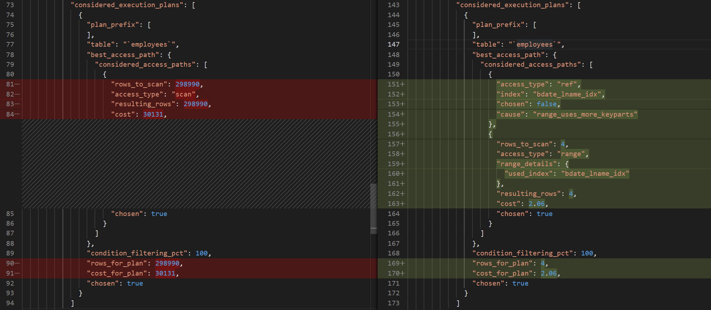

# 課題2

<!-- START doctoc generated TOC please keep comment here to allow auto update -->
<!-- DON'T EDIT THIS SECTION, INSTEAD RE-RUN doctoc TO UPDATE -->
<details>
<summary>Table of Contents</summary>

- [クエリその1](#%E3%82%AF%E3%82%A8%E3%83%AA%E3%81%9D%E3%81%AE1)
  - [インデックスの作成により統計情報の実行時間が伸びた原因の調査](#%E3%82%A4%E3%83%B3%E3%83%87%E3%83%83%E3%82%AF%E3%82%B9%E3%81%AE%E4%BD%9C%E6%88%90%E3%81%AB%E3%82%88%E3%82%8A%E7%B5%B1%E8%A8%88%E6%83%85%E5%A0%B1%E3%81%AE%E5%AE%9F%E8%A1%8C%E6%99%82%E9%96%93%E3%81%8C%E4%BC%B8%E3%81%B3%E3%81%9F%E5%8E%9F%E5%9B%A0%E3%81%AE%E8%AA%BF%E6%9F%BB)
- [クエリその2](#%E3%82%AF%E3%82%A8%E3%83%AA%E3%81%9D%E3%81%AE2)
- [クエリその3](#%E3%82%AF%E3%82%A8%E3%83%AA%E3%81%9D%E3%81%AE3)

</details>
<!-- END doctoc generated TOC please keep comment here to allow auto update -->

## クエリその1

> 1960年1月1日に生まれた `last_name` が `Kr` から始まる従業員の全情報を抽出する。

```sql
SELECT *
FROM employees
WHERE birth_date = '1960-01-01'
AND last_name LIKE 'Kr%';
```

実行結果は以下になる。

```bash
+--------+------------+------------+-----------+--------+------------+
| emp_no | birth_date | first_name | last_name | gender | hire_date  |
+--------+------------+------------+-----------+--------+------------+
|  41931 | 1960-01-01 | Bartek     | Kropatsch | F      | 1985-05-27 |
| 215045 | 1960-01-01 | Zhiwei     | Krybus    | F      | 1990-09-11 |
| 239203 | 1960-01-01 | Masamitsu  | Kropf     | M      | 1994-03-16 |
| 401838 | 1960-01-01 | Masadi     | Kroft     | F      | 1994-12-13 |
+--------+------------+------------+-----------+--------+------------+
```

ではクエリの高速化のために以下の複合インデックスを使用して検索速度を比較する。

```sql
CREATE INDEX bdate_lname_idx ON employees (birth_date, last_name);
```

まずは実行計画を確認する。

```bash
*************** w/o index ***************
           id: 1
  select_type: SIMPLE
        table: employees
   partitions: NULL
         type: ALL
possible_keys: NULL
          key: NULL
      key_len: NULL
          ref: NULL
         rows: 298990
     filtered: 1.11
        Extra: Using where
*************** w/ index ***************
           id: 1
  select_type: SIMPLE
        table: employees
   partitions: NULL
         type: range
possible_keys: bdate_lname_idx
          key: bdate_lname_idx
      key_len: 69
          ref: NULL
         rows: 4
     filtered: 100.00
        Extra: Using index condition
```

- 結果
  - `type: range`
    - 複合インデックスを使って範囲検索を行っている
  - `key: bdate_lname_idx`
    - Optimizerによって複合インデックスが使用されている
  - `Extra: Using index condition`
    - インデックスコンディションプッシュダウンによる最適化
    - つまりは、インデックスのキーを使用して WHERE による絞り込みを先に実行することで、不必要にテーブルのレコードを読み込みことを避けている

次に検索時間を比較する。

```bash
+------------------------------------------------+-----------+----------+
| Stage                                          | w/o index | w/ index |
+------------------------------------------------+-----------+----------+
| stage/sql/starting                             |    0.0001 |   0.0001 |
| stage/sql/Executing hook on transaction begin. |    0.0000 |   0.0000 |
| stage/sql/starting                             |    0.0000 |   0.0000 |
| stage/sql/checking permissions                 |    0.0000 |   0.0000 |
| stage/sql/Opening tables                       |    0.0001 |   0.0000 |
| stage/sql/init                                 |    0.0000 |   0.0000 |
| stage/sql/System lock                          |    0.0000 |   0.0000 |
| stage/sql/optimizing                           |    0.0000 |   0.0000 |
| stage/sql/statistics                           |    0.0000 |   0.0084 |
| stage/sql/preparing                            |    0.0000 |   0.0000 |
| stage/sql/executing                            |    0.0655 |   0.0009 |
| stage/sql/end                                  |    0.0000 |   0.0000 |
| stage/sql/query end                            |    0.0000 |   0.0000 |
| stage/sql/waiting for handler commit           |    0.0000 |   0.0000 |
| stage/sql/closing tables                       |    0.0000 |   0.0000 |
| stage/sql/freeing items                        |    0.0000 |   0.0004 |
| stage/sql/cleaning up                          |    0.0000 |   0.0000 |
+------------------------------------------------+-----------+----------+
| total                                          |    0.0659 |   0.0100 |
+------------------------------------------------+-----------+----------+
```

- 結果
  - `stage/sql/statistics`
    - スレッドが実行計画を構築するために統計情報を計算している状態
  - `stage/sql/executing`
    - スレッドがクエリを実行している状態

### インデックスの作成により統計情報の実行時間が伸びた原因の調査

以下の順番でクエリを実行することで、`potential_range_indexes` を確認してどのようなインデックスが認識されているのか、`considered_execution_plans` を確認して実行計画の計算自体に時間がかかっているのか確認する。

```sql
SET optimizer_trace='enabled=on';

-- ここでクエリを実行する

SELECT * FROM information_schema.optimizer_trace\G

SET optimizer_trace='enabled=off'
```

ここでそれぞれのログの違いを出力すると、実際に計算されているコストが変更されていたり、余分に実行計画の計算に時間がかかっていることがわかる。



おそらくはこうした実行計画の計算自体の増加により、`stage/sql/statistics` の実行時間が伸びているのではないかと考えられる。

全体のログはそれぞれ下記に記載している。

<details>
<summary>ログ</summary>
<div>

インデックスを使用しない場合のログ

```bash
*************************** 1. row ***************************
                            QUERY: SELECT *
FROM employees
WHERE birth_date = '1960-01-01'
AND last_name LIKE 'Kr%'
                            TRACE: {
  "steps": [
    {
      "join_preparation": {
        "select#": 1,
        "steps": [
          {
            "expanded_query": "/* select#1 */ select `employees`.`emp_no` AS `emp_no`,`employees`.`birth_date` AS `birth_date`,`employees`.`first_name` AS `first_name`,`employees`.`last_name` AS `last_name`,`employees`.`gender` AS `gender`,`employees`.`hire_date` AS `hire_date` from `employees` where ((`employees`.`birth_date` = '1960-01-01') and (`employees`.`last_name` like 'Kr%'))"
          }
        ]
      }
    },
    {
      "join_optimization": {
        "select#": 1,
        "steps": [
          {
            "condition_processing": {
              "condition": "WHERE",
              "original_condition": "((`employees`.`birth_date` = '1960-01-01') and (`employees`.`last_name` like 'Kr%'))",
              "steps": [
                {
                  "transformation": "equality_propagation",
                  "resulting_condition": "((`employees`.`last_name` like 'Kr%') and multiple equal('1960-01-01', `employees`.`birth_date`))"
                },
                {
                  "transformation": "constant_propagation",
                  "resulting_condition": "((`employees`.`last_name` like 'Kr%') and multiple equal('1960-01-01', `employees`.`birth_date`))"
                },
                {
                  "transformation": "trivial_condition_removal",
                  "resulting_condition": "((`employees`.`last_name` like 'Kr%') and multiple equal(DATE'1960-01-01', `employees`.`birth_date`))"
                }
              ]
            }
          },
          {
            "substitute_generated_columns": {
            }
          },
          {
            "table_dependencies": [
              {
                "table": "`employees`",
                "row_may_be_null": false,
                "map_bit": 0,
                "depends_on_map_bits": [
                ]
              }
            ]
          },
          {
            "ref_optimizer_key_uses": [
            ]
          },
          {
            "rows_estimation": [
              {
                "table": "`employees`",
                "table_scan": {
                  "rows": 298990,
                  "cost": 232.25
                }
              }
            ]
          },
          {
            "considered_execution_plans": [
              {
                "plan_prefix": [
                ],
                "table": "`employees`",
                "best_access_path": {
                  "considered_access_paths": [
                    {
                      "rows_to_scan": 298990,
                      "access_type": "scan",
                      "resulting_rows": 298990,
                      "cost": 30131,
                      "chosen": true
                    }
                  ]
                },
                "condition_filtering_pct": 100,
                "rows_for_plan": 298990,
                "cost_for_plan": 30131,
                "chosen": true
              }
            ]
          },
          {
            "attaching_conditions_to_tables": {
              "original_condition": "((`employees`.`birth_date` = DATE'1960-01-01') and (`employees`.`last_name` like 'Kr%'))",
              "attached_conditions_computation": [
              ],
              "attached_conditions_summary": [
                {
                  "table": "`employees`",
                  "attached": "((`employees`.`birth_date` = DATE'1960-01-01') and (`employees`.`last_name` like 'Kr%'))"
                }
              ]
            }
          },
          {
            "finalizing_table_conditions": [
              {
                "table": "`employees`",
                "original_table_condition": "((`employees`.`birth_date` = DATE'1960-01-01') and (`employees`.`last_name` like 'Kr%'))",
                "final_table_condition   ": "((`employees`.`birth_date` = DATE'1960-01-01') and (`employees`.`last_name` like 'Kr%'))"
              }
            ]
          },
          {
            "refine_plan": [
              {
                "table": "`employees`"
              }
            ]
          }
        ]
      }
    },
    {
      "join_execution": {
        "select#": 1,
        "steps": [
        ]
      }
    }
  ]
}
MISSING_BYTES_BEYOND_MAX_MEM_SIZE: 0
          INSUFFICIENT_PRIVILEGES: 0
```

インデックスを使用した場合のログ

```bash
*************************** 1. row ***************************
                            QUERY: SELECT * FROM employees WHERE birth_date = '1960-01-01' AND last_name LIKE 'Kr%'
                            TRACE: {
  "steps": [
    {
      "join_preparation": {
        "select#": 1,
        "steps": [
          {
            "expanded_query": "/* select#1 */ select `employees`.`emp_no` AS `emp_no`,`employees`.`birth_date` AS `birth_date`,`employees`.`first_name` AS `first_name`,`employees`.`last_name` AS `last_name`,`employees`.`gender` AS `gender`,`employees`.`hire_date` AS `hire_date` from `employees` where ((`employees`.`birth_date` = '1960-01-01') and (`employees`.`last_name` like 'Kr%'))"
          }
        ]
      }
    },
    {
      "join_optimization": {
        "select#": 1,
        "steps": [
          {
            "condition_processing": {
              "condition": "WHERE",
              "original_condition": "((`employees`.`birth_date` = '1960-01-01') and (`employees`.`last_name` like 'Kr%'))",
              "steps": [
                {
                  "transformation": "equality_propagation",
                  "resulting_condition": "((`employees`.`last_name` like 'Kr%') and multiple equal('1960-01-01', `employees`.`birth_date`))"
                },
                {
                  "transformation": "constant_propagation",
                  "resulting_condition": "((`employees`.`last_name` like 'Kr%') and multiple equal('1960-01-01', `employees`.`birth_date`))"
                },
                {
                  "transformation": "trivial_condition_removal",
                  "resulting_condition": "((`employees`.`last_name` like 'Kr%') and multiple equal(DATE'1960-01-01', `employees`.`birth_date`))"
                }
              ]
            }
          },
          {
            "substitute_generated_columns": {
            }
          },
          {
            "table_dependencies": [
              {
                "table": "`employees`",
                "row_may_be_null": false,
                "map_bit": 0,
                "depends_on_map_bits": [
                ]
              }
            ]
          },
          {
            "ref_optimizer_key_uses": [
              {
                "table": "`employees`",
                "field": "birth_date",
                "equals": "DATE'1960-01-01'",
                "null_rejecting": true
              }
            ]
          },
          {
            "rows_estimation": [
              {
                "table": "`employees`",
                "range_analysis": {
                  "table_scan": {
                    "rows": 298990,
                    "cost": 30133
                  },
                  "potential_range_indexes": [
                    {
                      "index": "PRIMARY",
                      "usable": false,
                      "cause": "not_applicable"
                    },
                    {
                      "index": "bdate_lname_idx",
                      "usable": true,
                      "key_parts": [
                        "birth_date",
                        "last_name",
                        "emp_no"
                      ]
                    }
                  ],
                  "setup_range_conditions": [
                  ],
                  "group_index_range": {
                    "chosen": false,
                    "cause": "not_group_by_or_distinct"
                  },
                  "skip_scan_range": {
                    "potential_skip_scan_indexes": [
                      {
                        "index": "bdate_lname_idx",
                        "usable": false,
                        "cause": "query_references_nonkey_column"
                      }
                    ]
                  },
                  "analyzing_range_alternatives": {
                    "range_scan_alternatives": [
                      {
                        "index": "bdate_lname_idx",
                        "ranges": [
                          "0x21500f <= birth_date <= 0x21500f AND Kr <= last_name <= Kr??????????????"
                        ],
                        "index_dives_for_eq_ranges": true,
                        "rowid_ordered": false,
                        "using_mrr": false,
                        "index_only": false,
                        "rows": 4,
                        "cost": 1.66,
                        "chosen": true
                      }
                    ],
                    "analyzing_roworder_intersect": {
                      "usable": false,
                      "cause": "too_few_roworder_scans"
                    }
                  },
                  "chosen_range_access_summary": {
                    "range_access_plan": {
                      "type": "range_scan",
                      "index": "bdate_lname_idx",
                      "rows": 4,
                      "ranges": [
                        "0x21500f <= birth_date <= 0x21500f AND Kr <= last_name <= Kr??????????????"
                      ]
                    },
                    "rows_for_plan": 4,
                    "cost_for_plan": 1.66,
                    "chosen": true
                  }
                }
              }
            ]
          },
          {
            "considered_execution_plans": [
              {
                "plan_prefix": [
                ],
                "table": "`employees`",
                "best_access_path": {
                  "considered_access_paths": [
                    {
                      "access_type": "ref",
                      "index": "bdate_lname_idx",
                      "chosen": false,
                      "cause": "range_uses_more_keyparts"
                    },
                    {
                      "rows_to_scan": 4,
                      "access_type": "range",
                      "range_details": {
                        "used_index": "bdate_lname_idx"
                      },
                      "resulting_rows": 4,
                      "cost": 2.06,
                      "chosen": true
                    }
                  ]
                },
                "condition_filtering_pct": 100,
                "rows_for_plan": 4,
                "cost_for_plan": 2.06,
                "chosen": true
              }
            ]
          },
          {
            "attaching_conditions_to_tables": {
              "original_condition": "((`employees`.`birth_date` = DATE'1960-01-01') and (`employees`.`last_name` like 'Kr%'))",
              "attached_conditions_computation": [
              ],
              "attached_conditions_summary": [
                {
                  "table": "`employees`",
                  "attached": "((`employees`.`birth_date` = DATE'1960-01-01') and (`employees`.`last_name` like 'Kr%'))"
                }
              ]
            }
          },
          {
            "finalizing_table_conditions": [
              {
                "table": "`employees`",
                "original_table_condition": "((`employees`.`birth_date` = DATE'1960-01-01') and (`employees`.`last_name` like 'Kr%'))",
                "final_table_condition   ": "((`employees`.`birth_date` = DATE'1960-01-01') and (`employees`.`last_name` like 'Kr%'))"
              }
            ]
          },
          {
            "refine_plan": [
              {
                "table": "`employees`",
                "pushed_index_condition": "((`employees`.`birth_date` = DATE'1960-01-01') and (`employees`.`last_name` like 'Kr%'))",
                "table_condition_attached": null
              }
            ]
          }
        ]
      }
    },
    {
      "join_execution": {
        "select#": 1,
        "steps": [
        ]
      }
    }
  ]
}
MISSING_BYTES_BEYOND_MAX_MEM_SIZE: 0
          INSUFFICIENT_PRIVILEGES: 0
```

</div>
</details>

参考情報

- [[MySQL 8.0 Reference] 8.14.3 General Thread States](https://dev.mysql.com/doc/refman/8.0/en/general-thread-states.html)

## クエリその2

> 1989年10月1日から1990年10月1日までに雇われた男性従業員の全情報を抽出する。

```sql
SELECT *
FROM employees
WHERE hire_date BETWEEN '1980-10-01' AND '1990-10-01'
AND gender = 'M';
```

実行結果は以下になる。

```bash
+--------+------------+------------+-------------+--------+------------+
| emp_no | birth_date | first_name | last_name   | gender | hire_date  |
+--------+------------+------------+-------------+--------+------------+
|  10077 | 1964-04-18 | Mona       | Azuma       | M      | 1990-03-02 |
|  10082 | 1963-09-09 | Parviz     | Lortz       | M      | 1990-01-03 |
|  10086 | 1962-11-19 | Somnath    | Foote       | M      | 1990-02-16 |
|  10096 | 1954-09-16 | Jayson     | Mandell     | M      | 1990-01-14 |
|  10097 | 1952-02-27 | Remzi      | Waschkowski | M      | 1990-09-15 |
   .....   ..........   .....        ...........   .        ..........
```

ではクエリの高速化のために以下の複合インデックスを使用して検索速度を比較する。

```sql
CREATE INDEX hdate_gender_idx ON employees (hire_date, gender);
```

まずは実行計画を確認する。

```bash
*************** w/o index ***************
           id: 1
  select_type: SIMPLE
        table: employees
   partitions: NULL
         type: ALL
possible_keys: NULL
          key: NULL
      key_len: NULL
          ref: NULL
         rows: 298990
     filtered: 5.56
        Extra: Using where
*************** w/  index ***************
           id: 1
  select_type: SIMPLE
        table: employees
   partitions: NULL
         type: range
possible_keys: hdate_gender_idx
          key: hdate_gender_idx
      key_len: 4
          ref: NULL
         rows: 50030
     filtered: 50.00
        Extra: Using index condition
1 row in set, 1 warning (0.00 sec)
```

- 結果
  - `type: range`
    - インデックスに対して範囲検索を行っている
  - `rows: 50030`
    - 推測値ではあるが、クエリその1と比較するとかなりのレコードを走査していることがわかる

次に検索時間を比較する。

```
+------------------------------------------------+-----------+----------+
| Stage                                          | w/o index | w/ index |
+------------------------------------------------+-----------+----------+
| stage/sql/starting                             |    0.0001 |   0.0001 |
| stage/sql/Executing hook on transaction begin. |    0.0000 |   0.0000 |
| stage/sql/starting                             |    0.0000 |   0.0000 |
| stage/sql/checking permissions                 |    0.0000 |   0.0000 |
| stage/sql/Opening tables                       |    0.0000 |   0.0000 |
| stage/sql/init                                 |    0.0000 |   0.0000 |
| stage/sql/System lock                          |    0.0000 |   0.0000 |
| stage/sql/optimizing                           |    0.0000 |   0.0000 |
| stage/sql/statistics                           |    0.0000 |   0.0014 |
| stage/sql/preparing                            |    0.0000 |   0.0000 |
| stage/sql/executing                            |    0.0975 |   0.0348 |
| stage/sql/end                                  |    0.0000 |   0.0000 |
| stage/sql/query end                            |    0.0000 |   0.0000 |
| stage/sql/waiting for handler commit           |    0.0000 |   0.0000 |
| stage/sql/closing tables                       |    0.0000 |   0.0000 |
| stage/sql/freeing items                        |    0.0000 |   0.0000 |
| stage/sql/cleaning up                          |    0.0000 |   0.0000 |
+------------------------------------------------+-----------+----------+
| total                                          |    0.0978 |   0.0366 |
+------------------------------------------------+-----------+----------+
```

検索速度が向上していることがわかる。

相変わらず統計情報の計算に多少時間がかかっていることがわかる。

## クエリその3

> 1989年10月1日から1990年10月1日までに雇われた女性従業員の中から最も若い従業員の全情報を抽出する。

```sql
WITH
TARGET_FEMALE AS (
    SELECT *
    FROM employees
    WHERE hire_date BETWEEN '1989-10-01' AND '1990-10-01'
    AND gender = 'F'
)
SELECT *
FROM TARGET_FEMALE
WHERE birth_date = (
    SELECT MAX(birth_date)
    FROM TARGET_FEMALE
);
```

実行結果は以下になる。

```bash
+--------+------------+------------+-----------+--------+------------+
| emp_no | birth_date | first_name | last_name | gender | hire_date  |
+--------+------------+------------+-----------+--------+------------+
| 411906 | 1965-02-01 | Anneli     | Pappas    | F      | 1990-07-09 |
+--------+------------+------------+-----------+--------+------------+
```

ではクエリの高速化のために以下の複合インデックスを使用して検索速度を比較する。

```sql
CREATE INDEX hdate_gender_idx ON employees (hire_date, gender);
```

まずは実行計画を確認する。

```bash
*************** w/o index 1 ***************
           id: 1
  select_type: PRIMARY
        table: employees
   partitions: NULL
         type: ALL
possible_keys: NULL
          key: NULL
      key_len: NULL
          ref: NULL
         rows: 298990
     filtered: 0.56
        Extra: Using where
*************** w/o index 2 ***************
           id: 3
  select_type: SUBQUERY
        table: employees
   partitions: NULL
         type: ALL
possible_keys: NULL
          key: NULL
      key_len: NULL
          ref: NULL
         rows: 298990
     filtered: 5.56
        Extra: Using where

*************** w/o index 1 ***************
           id: 1
  select_type: PRIMARY
        table: employees
   partitions: NULL
         type: range
possible_keys: hdate_gender_idx
          key: hdate_gender_idx
      key_len: 4
          ref: NULL
         rows: 49920
     filtered: 5.00
        Extra: Using index condition; Using where
*************** w/o index 2 ***************
           id: 3
  select_type: SUBQUERY
        table: employees
   partitions: NULL
         type: range
possible_keys: hdate_gender_idx
          key: hdate_gender_idx
      key_len: 4
          ref: NULL
         rows: 49920
     filtered: 50.00
        Extra: Using index condition
```

- 結果
  - `select_type: SUBQUERY`
    - `WITH`句で指定しているサブクエリを示している。
  - `select_type: PRIMARY`
    - 最も外側の `SELECT` 文の実行計画であり、`TARGET_FEMALE` 抽出時のインデックスの使用と、`birth_date` での `WHERE` 句指定の組み合わせである。

次に検索時間を比較する。

```
+------------------------------------------------+-----------+----------+
| Stage                                          | w/o index | w/ index |
+------------------------------------------------+-----------+----------+
| stage/sql/starting                             |    0.0001 |   0.0002 |
| stage/sql/Executing hook on transaction begin. |    0.0000 |   0.0000 |
| stage/sql/starting                             |    0.0000 |   0.0000 |
| stage/sql/checking permissions                 |    0.0000 |   0.0000 |
| stage/sql/checking permissions                 |    0.0000 |   0.0000 |
| stage/sql/Opening tables                       |    0.0002 |   0.0001 |
| stage/sql/init                                 |    0.0000 |   0.0000 |
| stage/sql/System lock                          |    0.0000 |   0.0000 |
| stage/sql/optimizing                           |    0.0000 |   0.0000 |
| stage/sql/statistics                           |    0.0000 |   0.0001 |
| stage/sql/preparing                            |    0.0000 |   0.0000 |
| stage/sql/optimizing                           |    0.0000 |   0.0000 |
| stage/sql/statistics                           |    0.0000 |   0.0000 |
| stage/sql/preparing                            |    0.0000 |   0.0000 |
| stage/sql/executing                            |    0.0000 |   0.0002 |
| stage/sql/executing                            |    0.1468 |   0.0342 |
| stage/sql/end                                  |    0.0000 |   0.0000 |
| stage/sql/query end                            |    0.0000 |   0.0000 |
| stage/sql/waiting for handler commit           |    0.0000 |   0.0000 |
| stage/sql/closing tables                       |    0.0000 |   0.0000 |
| stage/sql/freeing items                        |    0.0081 |   0.0000 |
| stage/sql/cleaning up                          |    0.0000 |   0.0000 |
+------------------------------------------------+-----------+----------+
|                                                |    0.1556 |   0.0352 |
+------------------------------------------------+-----------+----------+
```

検索速度が向上していることがわかる。
