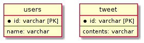

# クイズ

<!-- START doctoc generated TOC please keep comment here to allow auto update -->
<!-- DON'T EDIT THIS SECTION, INSTEAD RE-RUN doctoc TO UPDATE -->
<details>
<summary>Table of Contents</summary>

- [&#035;1 クイズ](#1-%E3%82%AF%E3%82%A4%E3%82%BA)
- [&#035;2 クイズ](#2-%E3%82%AF%E3%82%A4%E3%82%BA)
- [&#035;3 クイズ](#3-%E3%82%AF%E3%82%A4%E3%82%BA)
- [&#035;4 クイズ](#4-%E3%82%AF%E3%82%A4%E3%82%BA)

</details>
<!-- END doctoc generated TOC please keep comment here to allow auto update -->

## #1 クイズ

以下のようなユーザーとツイートのテーブルを持つSNSを考える。



ユーザーがツイートに対して「いいね」を実行すると、そのユーザーとツイートが紐づく設計である。

では以下の条件を満たすようにユーザーテーブルとツイートテーブルを紐づけみましょう。

- ユーザーは1つのツイートに対して1つの「いいね」を実行できる
- 「いいね」は解除できる
- ツイートに紐づく「いいね」の数を数えることができる

<details>
<summary>回答例</summary>


</details>


## #2 クイズ

以下のようなテーブル設計を考える。


このテーブル設計では以下の仕様を満たすようにしている。

- ユーザーは投稿された記事に対して「いいね」をすることができる。
- ユーザーはコメントに対して「いいね」をすることができる。
- 「いいね」は投稿された記事か、あるいはコメントのどちらかに紐づいている

ただし現状の設計だと以下のように紐づけ対象のカラムに `NULL` が入り込んでしまう可能性がある。

```bash
+------+---------+----------+------------+
|   id | user_id |  post_id | comment_id |
+------+---------+----------+------------+
|    1 |       3 |        1 |       NULL |
|    2 |       5 |     NULL |          2 |
|    3 |      10 |        2 |       NULL |
|    4 |       1 |        5 |       NULL |
|    5 |       2 |     NULL |          1 |
+------+---------+----------+------------+
```

<details>
<summary>回答例</summary>

Polymorphic Associations

</details>

## #3 クイズ

`samples`テーブルには以下のデータが格納されている。

```bash
mysql> SELECT * FROM samples;
+-----------+---------+------------+------------+-------------+---------------------+
| sample_id | title   | from_date  | to_date    | description | created_at          |
+-----------+---------+------------+------------+-------------+---------------------+
|         1 | sample1 | 1990-01-01 | 1991-01-01 | sample      | 2021-04-18 22:47:28 |
|         2 | sample2 | 1991-01-02 | 1992-01-02 | praha       | 2021-04-18 22:47:28 |
|         3 | sample3 | 1992-01-03 | 1993-01-03 | NULL        | 2021-04-18 22:47:28 |
|         4 | sample4 | 1993-01-04 | 1994-01-04 | challenge   | 2021-04-18 22:47:28 |
|         5 | sample5 | 1994-01-05 | NULL       | NULL        | 2021-04-18 22:47:28 |
|        11 | sample1 | 1990-01-06 | 1991-01-01 | NULL        | 2021-04-22 14:31:44 |
|        12 | sample2 | 1991-01-07 | 1992-01-02 | praha       | 2021-04-22 14:31:44 |
|        13 | sample3 | 1992-01-08 | 1993-01-03 | NULL        | 2021-04-22 14:31:44 |
|        14 | sample4 | 1993-01-09 | 1994-01-04 | challenge   | 2021-04-22 14:31:44 |
|        15 | sample5 | 1994-01-10 | NULL       | NULL        | 2021-04-22 14:31:44 |
+-----------+---------+------------+------------+-------------+---------------------+
```

このテーブルに対して以下の2つのクエリを実行した場合、どのような結果が得られるでしょうか。

- クエリ1
  
  ```sql
  SELECT description, count(*) FROM samples GROUP BY description;
  ```

- クエリ2
  
  ```sql
  SELECT description, count(description) FROM samples GROUP BY description;
  ```

<details>
<summary>回答例</summary>
<div>

参考資料

- [B.3.4.3 Problems with NULL Values](https://dev.mysql.com/doc/refman/8.0/en/problems-with-null.html)

</div>
</details>

## #4 クイズ

クイズ3と同じく以下の`samples`テーブルを使用する。

```bash
mysql> SELECT * FROM samples;
+-----------+---------+------------+------------+-------------+---------------------+
| sample_id | title   | from_date  | to_date    | description | created_at          |
+-----------+---------+------------+------------+-------------+---------------------+
|         1 | sample1 | 1990-01-01 | 1991-01-01 | sample      | 2021-04-18 22:47:28 |
|         2 | sample2 | 1991-01-02 | 1992-01-02 | praha       | 2021-04-18 22:47:28 |
|         3 | sample3 | 1992-01-03 | 1993-01-03 | NULL        | 2021-04-18 22:47:28 |
|         4 | sample4 | 1993-01-04 | 1994-01-04 | challenge   | 2021-04-18 22:47:28 |
|         5 | sample5 | 1994-01-05 | NULL       | NULL        | 2021-04-18 22:47:28 |
|        11 | sample1 | 1990-01-06 | 1991-01-01 | NULL        | 2021-04-22 14:31:44 |
|        12 | sample2 | 1991-01-07 | 1992-01-02 | praha       | 2021-04-22 14:31:44 |
|        13 | sample3 | 1992-01-08 | 1993-01-03 | NULL        | 2021-04-22 14:31:44 |
|        14 | sample4 | 1993-01-09 | 1994-01-04 | challenge   | 2021-04-22 14:31:44 |
|        15 | sample5 | 1994-01-10 | NULL       | NULL        | 2021-04-22 14:31:44 |
+-----------+---------+------------+------------+-------------+---------------------+
```

このテーブルに対して以下のクエリを実行した場合、どのような結果が得られるでしょうか。
  
```sql
SELECT * FROM samples ORDER BY to_date;
```

参考資料

- [B.3.4.3 Problems with NULL Values](https://dev.mysql.com/doc/refman/8.0/en/problems-with-null.html)

</div>
</details>