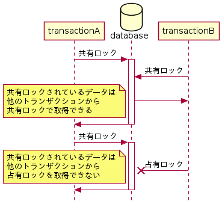
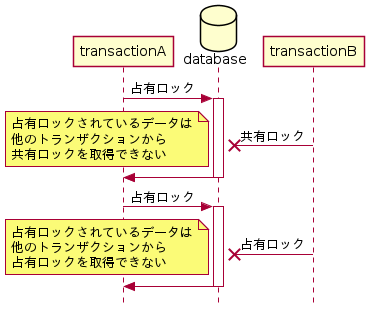

# 課題1

<!-- START doctoc generated TOC please keep comment here to allow auto update -->
<!-- DON'T EDIT THIS SECTION, INSTEAD RE-RUN doctoc TO UPDATE -->
<details>
<summary>Table of Contents</summary>

- [デッドロックとは何か](#%E3%83%87%E3%83%83%E3%83%89%E3%83%AD%E3%83%83%E3%82%AF%E3%81%A8%E3%81%AF%E4%BD%95%E3%81%8B)
- [ISOLATION LEVELとは何か](#isolation-level%E3%81%A8%E3%81%AF%E4%BD%95%E3%81%8B)
  - [READ UNCOMMITTED](#read-uncommitted)
  - [READ COMMITTED](#read-committed)
  - [REPEATABLE READ](#repeatable-read)
  - [SERIALIZABLE](#serializable)
- [行レベルロック、テーブルレベルロックの違いとは何か](#%E8%A1%8C%E3%83%AC%E3%83%99%E3%83%AB%E3%83%AD%E3%83%83%E3%82%AF%E3%83%86%E3%83%BC%E3%83%96%E3%83%AB%E3%83%AC%E3%83%99%E3%83%AB%E3%83%AD%E3%83%83%E3%82%AF%E3%81%AE%E9%81%95%E3%81%84%E3%81%A8%E3%81%AF%E4%BD%95%E3%81%8B)
- [悲観ロックと楽観ロックの違いは何か](#%E6%82%B2%E8%A6%B3%E3%83%AD%E3%83%83%E3%82%AF%E3%81%A8%E6%A5%BD%E8%A6%B3%E3%83%AD%E3%83%83%E3%82%AF%E3%81%AE%E9%81%95%E3%81%84%E3%81%AF%E4%BD%95%E3%81%8B)
- [ACIDモデル](#acid%E3%83%A2%E3%83%87%E3%83%AB)
  - [Atomicity (原子性)](#atomicity-%E5%8E%9F%E5%AD%90%E6%80%A7)
  - [Consistency (一貫性)](#consistency-%E4%B8%80%E8%B2%AB%E6%80%A7)
  - [Isolation (独立性)](#isolation-%E7%8B%AC%E7%AB%8B%E6%80%A7)
  - [Durability (永続性)](#durability-%E6%B0%B8%E7%B6%9A%E6%80%A7)
- [Lock Types](#lock-types)
  - [Shared and Exclusive Locks](#shared-and-exclusive-locks)
  - [Intention Locks](#intention-locks)
  - [Record Locks](#record-locks)
  - [Gap Locks](#gap-locks)
  - [Next-Key Locks](#next-key-locks)

</details>
<!-- END doctoc generated TOC please keep comment here to allow auto update -->

## デッドロックとは何か

**デッドロック**とは、他のトランザクションが必要としているロックを、それぞれが保持したままであるために、お互いのトランザクションが続行できない状態のことを表している。

では実際にデッドロックを発生させてみる。

まずはターミナルからMySQLサーバーにアクセスし、トランザクションを開始させた後で、共有ロックを取得する。

```bash
A> START TRANSACTION;
Query OK, 0 rows affected (0.00 sec)

A> SELECT * FROM employees WHERE emp_no = 500001 FOR SHARE;
+--------+------------+------------+-----------+--------+------------+
| emp_no | birth_date | first_name | last_name | gender | hire_date  |
+--------+------------+------------+-----------+--------+------------+
| 500001 | 1981-01-01 | ccccccc    | ddddddd   | F      | 1991-03-30 |
+--------+------------+------------+-----------+--------+------------+
1 row in set (0.00 sec)
```

次に異なるセッションでMySQLサーバーにアクセスして、トランザクションを開始した後で、指定のレコードを削除しようとしてみる。

```bash
B> DELETE FROM employees WHERE emp_no = 500001;
# ここで待機処理が発生する
```

この際に処理を実行した段階で、セッションAが共有ロックを取得しているレコードに対して、占有ロックを取得しようとして、セッションAがロックを解放することを待機している状態である。

ではこの状態でセッションAから指定のレコードを削除してみる。

```bash
A> DELETE FROM employees WHERE emp_no = 500001;
Query OK, 1 row affected (0.01 sec)
```

このときセッションAでの処理は正常に終了するが、セッションBではデッドロックが発生したことを示すエラーが発生する。

```bash
B> DELETE FROM employees WHERE emp_no = 500001;
ERROR 1213 (40001): Deadlock found when trying to get lock; try restarting transaction
```

デフォルト設定ではInnoDBは自動的にデッドロックを検知するための機能を有効にしており、デッドロックが検知された場合には、より小さな単位のトランザクションをロールバックさせるようにしている。

そのため自動的にセッションBで作成したトランザクションがロールバックされている。

参考資料

- [15.7.5.1 An InnoDB Deadlock Example](https://dev.mysql.com/doc/refman/8.0/en/innodb-deadlock-example.html)
- [15.7.5.2 Deadlock Detection](https://dev.mysql.com/doc/refman/8.0/en/innodb-deadlock-detection.html)
- [15.7.5.3 How to Minimize and Handle Deadlocks](https://dev.mysql.com/doc/refman/8.0/en/innodb-deadlocks-handling.html)

## ISOLATION LEVELとは何か

トランザクションの **分離レベル (ISOLATION LEVEL)** とは、複数のトランザクションが同時にレコードの変更や読み込みを行う場合に、性能・信頼性・一貫性・再現性のバランスを調整するための設定である。

InnoDBは以下の4種類の分離レベルを実装しており、上から下にいくにつれてよりトランザクション間の分離を強化することで、性能は落ちるが一貫性や信頼性を向上させることができる。

- `READ UNCOMMITTED`
- `READ COMMITTED`
- `REPEATABLE READ`: InnoDBのデフォルト設定はコレ
- `SERIALIZABLE`

### READ UNCOMMITTED

### READ COMMITTED

### REPEATABLE READ


### SERIALIZABLE

参考資料

- [トランザクション分離レベルについてのまとめ](https://qiita.com/song_ss/items/38e514b05e9dabae3bdb)

## 行レベルロック、テーブルレベルロックの違いとは何か


## 悲観ロックと楽観ロックの違いは何か


参考資料

- [排他制御（楽観ロック・悲観ロック）の基礎](https://qiita.com/NagaokaKenichi/items/73040df85b7bd4e9ecfc)
- [Optimistic locking in MySQL](https://stackoverflow.com/questions/17431338/optimistic-locking-in-mysql)

## ACIDモデル

**ACIDモデル** とは、1つ以上のSQL文を含んでいる論理的な操作を示すトランザクションに信頼性を持たせるために定義された概念であり、Atomicity (原子性)、Consistency (一貫性)、Isolation (独立性)、Durability (永続性) に分解される。

参考資料

- [15.2 InnoDB and the ACID Model](https://dev.mysql.com/doc/refman/8.0/en/mysql-acid.html)

### Atomicity (原子性)

- 1つのトランザクションの処理は、全てのタスクが実行されるか、1つも実行されないかのいずれかのみである
- トランザクションで10行の更新が開始され、5行が更新されたときにシステム障害が発生した場合、データベースではトランザクションがロールバックされる

### Consistency (一貫性)

- トランザクション内の処理により、データベースはある一貫した状態から、異なる一貫した状態に遷移する

### Isolation (独立性)

- トランザクション内で行われた変更は、トランザクションがコミットされるまで、他のトランザクションに影響を与えない

### Durability (永続性)

- トランザクションがコミットされると、行われた変更は永続的に確定される
- システム障害が発生したとしても、コミットされた状態は保持される

## Lock Types

### Shared and Exclusive Locks

InnoDBでは行レベルのロックとして **共有ロック (S)** と **占有ロック (X)** を実装している。

共有ロックは read lock とも呼ばれており、名前の通りテーブルからレコードをSELECT文で読み 取るときに使用するロックである。



占有ロックは write lock とも呼ばれており、名前の通りテーブルから読み取ったレコードに対して更新や削除を行うときに使用するロックである。



とあるトランザクション T1 が行に対してロックを取得しているとき、ほかのトランザクション T2 が同じ行に対して取得できるロックは以下の組み合わせで表現できる。

|       |   S   |   X   |
| :---: | :---: | :---: |
|   S   |  Yes  |  No   |
|   X   |  No   |  No   |

つまりトランザクション T1 が共有ロックを取得している場合にのみ、ほかのトランザクション T2 は同じ行に対して共有ロックのみを取得することができる。

### Intention Locks

InnoDBでは、行ロックとテーブルロックの共存を可能にする、複数の粒度でのロックをサポートするために、 **インテンションロック** を採用している。

インテンションロックとは、 **テーブルレベルのロック** であり、トランザクションがテーブル内の行に対して、**後から必要になる**ロックのタイプ（共有ロックや占有ロック）を表している。

| lock type                     | description                                                                              | SQL                     |
| :---------------------------- | :--------------------------------------------------------------------------------------- | :---------------------- |
| インテンション共有ロック (IS) | トランザクションがテーブルの行に対して**共有ロック**を設定**するつもり**であることを示す | `SELECT ... FOR SHARE`  |
| インテンション占有ロック (IX) | トランザクションがテーブルの行に対して**共有ロック**を設定**するつもり**であることを示す | `SELECT ... FOR UPDATE` |

インテンションロックを取得する流れとしては、トランザクションが共有ロックを **行に** 対して **取得する前** に、トランザクションは **事前に** に **テーブル** に対してISロック、あるいはより強力なロックを取得しておく必要がある。

これは占有ロックの場合も同じであり、トランザクションが占有ロックを行に対して取得する前に、トランザクションは事前にテーブルに対してIXロックを取得しておく必要がある。

インテンションロックは、 `LOCK TABLES ... WRITE` のようにフルテーブルリクエストを除いてどのような操作もブロックしたりせず、あくまでもほかのユーザーに対して**これから取得するロックのタイプを示すだけ**である。

そのためインテンションロック同士 (IS/IX) では競合は発生しないため、排他制御は行ロックで行うことになる。 

実際に挙動を確認してみる。

```bash
# トランザクション内で `FOR SHARE` によるインテンション共有ロックを取得する
A> START TRANSACTION;
A> SELECT * FROM employees WHERE emp_no = 10001 FOR SHARE;
+--------+------------+---------------+-----------+--------+------------+
| emp_no | birth_date | first_name    | last_name | gender | hire_date  |
+--------+------------+---------------+-----------+--------+------------+
|  10001 | 1953-09-02 | Georgi Georgi | Facello   | M      | 1986-06-26 |
+--------+------------+---------------+-----------+--------+------------+

# ロックの状況を確認する
A> SELECT engine, object_schema, object_name, index_name, lock_type, lock_mode, lock_status, lock_data FROM PERFORMANCE_SCHEMA.data_locks;
+--------+---------------+-------------+------------+-----------+---------------+-------------+-----------+
| engine | object_schema | object_name | index_name | lock_type | lock_mode     | lock_status | lock_data |
+--------+---------------+-------------+------------+-----------+---------------+-------------+-----------+
| INNODB | employees     | employees   | NULL       | TABLE     | IS
| GRANTED     | NULL      |
| INNODB | employees     | employees   | PRIMARY    | RECORD    | S,REC_NOT_GAP | GRANTED     | 10001     |
+--------+---------------+-------------+------------+-----------+---------------+-------------+-----------+
```

上記でインテンション共有ロックを実行した後でロックの状況を確認してみると、確かにテーブルロックとしてインテンション共有ロックが取得されており、またそのあとにレコードロックによる共有ロックが取得されていることがわかる。

ではインテンションロックは他のトランザクションからのインテンションロックで排他制御されないことを確認するために、異なるトランザクションから占有ロックの取得を実行する。

```bash
# 下記のクエリを実行すると、トランザクションAの共有ロックの解除待ち状態となる
B> START TRANSACTION;
B> SELECT * FROM employees WHERE emp_no = 10001 FOR UPDATE; 

```

すると処理は実行されずにトランザクションAが取得している共有ロックが解除されるのを待機している状態となる。

ではこの状態で、以下のようにロックの状態を確認すると確かにインテンションロックは待機状態になっていないことがわかる。（インテンション占有ロックは `GRANTED` となっており、占有ロックは `WAITING` となっている。）

```bash
A> SELECT engine, object_schema, object_name, index_name, lock_type, lock_mode, lock_status, lock_data FROM PERFORMANCE_SCHEMA.data_locks;
+--------+---------------+-------------+------------+-----------+---------------+-------------+-----------+
| engine | object_schema | object_name | index_name | lock_type | lock_mode     | lock_status | lock_data |
+--------+---------------+-------------+------------+-----------+---------------+-------------+-----------+
| INNODB | employees     | employees   | NULL       | TABLE     | IX
| GRANTED     | NULL      |
| INNODB | employees     | employees   | PRIMARY    | RECORD    | X,REC_NOT_GAP | WAITING     | 10001     |
| INNODB | employees     | employees   | NULL       | TABLE     | IS
| GRANTED     | NULL      |
| INNODB | employees     | employees   | PRIMARY    | RECORD    | S,REC_NOT_GAP | GRANTED     | 10001     |
+--------+---------------+-------------+------------+-----------+---------------+-------------+-----------+
```

しばらく待機すればトランザクションBの待機処理がタイムアウトしてしまう。

```bash
# 待機処理のタイムアウトが発生する。
B> SELECT * FROM employees WHERE emp_no = 10001 FOR UPDATE; 
ERROR 1205 (HY000): Lock wait timeout exceeded; try restarting transaction

# 占有ロックの待機処理が消えていることがわかる
A> SELECT engine, object_schema, object_name, index_name, lock_type, lock_mode, lock_status, lock_data FROM PERFORMANCE_SCHEMA.data_locks;
+--------+---------------+-------------+------------+-----------+---------------+-------------+-----------+
| engine | object_schema | object_name | index_name | lock_type | lock_mode     | lock_status | lock_data |
+--------+---------------+-------------+------------+-----------+---------------+-------------+-----------+
| INNODB | employees     | employees   | NULL       | TABLE     | IX
| GRANTED     | NULL      |
| INNODB | employees     | employees   | NULL       | TABLE     | IS
| GRANTED     | NULL      |
| INNODB | employees     | employees   | PRIMARY    | RECORD    | S,REC_NOT_GAP | GRANTED     | 10001     |
+--------+---------------+-------------+------------+-----------+---------------+-------------+-----------+
```

ロックの状態を確認しても、インテンション占有ロックは残っているが、占有ロックは削除されていることがわかる。

### Record Locks

**レコードロック** とは、インデックスレコードに対するロックであり、`SELECT c1 FROM t WHERE c1 = 10 FOR UPDATE`などの文を発行した際に取得し、他のトランザクションが `t.c1` が `10` である行の挿入や更新、削除を禁止することができる。

InnoDBでは、テーブルにインデックスが存在しない場合でも、クラスタインデックスを背後で作成し、このインデックスに対してロックを取得するらしい。

### Gap Locks

**ギャップロック** とは、インデックスレコードのある**範囲に対して**取得したり、最初のインデックスレコードの1つ前や最後のインデックスレコードの1つ後に対して取得するロックである。

例えばあるトランザクションが以下のクエリを発行した際に、他のトランザクションが `t.c1` が `15` のように範囲内に存在している値に対してレコードを挿入・更新することを禁止する。

```sql
SELECT c1 FROM t WHERE c1 BETWEEN 10 AND 20 FOR UPDATE
```

注意点としては `t.c1` が10から20までの範囲に対して、レコードを挿入することもできず、SロックもXロックも取得することもできない点である。

ギャップロックの特徴は、処理の性能と平衡実効性のトレードオフであり、トランザクションの**分離レベル**によって使用されるかどうかが決定する。

ギャップロックは複数行にまたがるロックを取得する際に使用されるため、もしも主キーなどの一意に定まる検索条件を使用するクエリでは、ギャップロッ
クは使用されずに先述したレコードロックが取得される。

参考資料

- [良く分かるMySQL Innodbのギャップロック](https://qiita.com/kenjiszk/items/05f7f6e695b93570a9e1)

### Next-Key Locks


