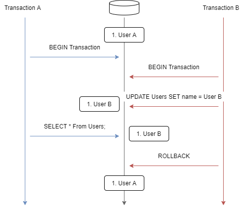

# 課題2

<!-- START doctoc generated TOC please keep comment here to allow auto update -->
<!-- DON'T EDIT THIS SECTION, INSTEAD RE-RUN doctoc TO UPDATE -->

Table of Contents

- [課題2](#課題2)
  - [トランザクション分離レベルの種類](#トランザクション分離レベルの種類)
  - [Dirty Read](#dirty-read)
    - [Concepts](#concepts)
    - [実演](#実演)
  - [Non-repeatable Read](#non-repeatable-read)
  - [Phantom Read](#phantom-read)

<!-- END doctoc generated TOC please keep comment here to allow auto update -->

## トランザクション分離レベルの種類

トランザクションの分離レベルは4種類存在しているが、レコードの読み込み時に発生する問題に対して以下のように対応している。

| Isolation Level  | Dirty Read | Non-Repeatable Read | Phantom Read |
| :--------------: | :--------: | :-----------------: | :----------: |
| READ UNCOMMITTED |     O      |          O          |      O       |
|  READ COMMITTED  |     X      |          O          |      O       |
| REPEATABLE READ  |     X      |          O          |      O       |
|   SERIALIZABLE   |     X      |          X          |      X       |

## Dirty Read

### Concepts

**ダーティ・リード (Dirty Read)** は、コミットされていないトランザクションが書き込んだデータを、別のトランザクションが読み込んでしまう現象である。

例えば上記の図では、トランザクションBが書き込んだ未コミット状態でのデータ `User B` を、別のトランザクションAが読み込んでしまっている。

その後、トランザクションBがロールバックされるとデータは `User A` に戻ってしまう。そうなると、トランザクションAは存在しないデータ `User B` を読み込んでしまったことになる。

### 実演

## Non-repeatable Read

## Phantom Read
