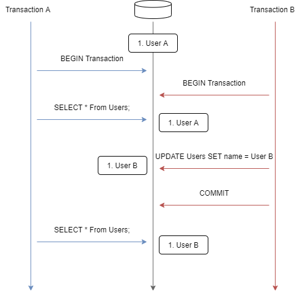
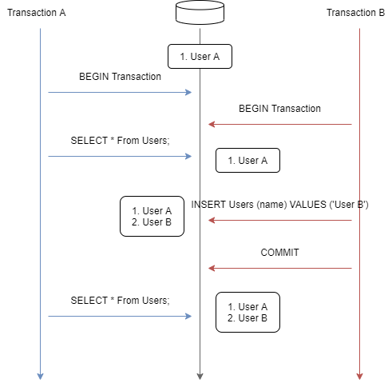

# 課題2

<!-- START doctoc generated TOC please keep comment here to allow auto update -->
<!-- DON'T EDIT THIS SECTION, INSTEAD RE-RUN doctoc TO UPDATE -->
<details>
<summary>Table of Contents</summary>

- [トランザクション分離レベルの種類](#%E3%83%88%E3%83%A9%E3%83%B3%E3%82%B6%E3%82%AF%E3%82%B7%E3%83%A7%E3%83%B3%E5%88%86%E9%9B%A2%E3%83%AC%E3%83%99%E3%83%AB%E3%81%AE%E7%A8%AE%E9%A1%9E)
- [Dirty Read](#dirty-read)
  - [Concepts](#concepts)
  - [実演](#%E5%AE%9F%E6%BC%94)
- [Non-repeatable Read](#non-repeatable-read)
  - [Concepts](#concepts-1)
  - [実演](#%E5%AE%9F%E6%BC%94-1)
- [Phantom Read](#phantom-read)
  - [Concepts](#concepts-2)
  - [実演](#%E5%AE%9F%E6%BC%94-2)

</details>
<!-- END doctoc generated TOC please keep comment here to allow auto update -->

## トランザクション分離レベルの種類

トランザクションの分離レベルは `ASCI/ISO SQL標準` で4種類が定められており、レコードの読み込み時に発生する問題に対してそれぞれ以下のように対応している。

| Isolation Level  | Dirty Read | Non-Repeatable Read | Phantom Read |
| :--------------: | :--------: | :-----------------: | :----------: |
| READ UNCOMMITTED |     O      |          O          |      O       |
|  READ COMMITTED  |     X      |          O          |      O       |
| REPEATABLE READ  |     X      |          X          |      O       |
|   SERIALIZABLE   |     X      |          X          |      X       |

ただし実際の挙動はそれぞれのストレージエンジンで異なっているため、アプリで使用するRDBMSによってロックの動作を理解しておく必要がある。

## Dirty Read

### Concepts

**ダーティ・リード (Dirty Read)** は、 **コミットされていない** トランザクションが書き込んだデータを、別のトランザクションが読み込んでしまう現象である。


例えば上記の図では、トランザクションBが書き込んだ未コミット状態でのデータ `User B` を、別のトランザクションAが読み込んでしまっている。

その後、トランザクションBがロールバックされるとデータは `User A` に戻ってしまう。そうなると、トランザクションAは存在しないデータ `User B` を読み込んでしまったことになる。

### 実演

ダーティ・リードは、トランザクションの分離レベルが `READ UNCOMMITTED` の状態で発生する。

```bash
# トランザクションAで分離レベルを設定する
A> SET SESSION TRANSACTION ISOLATION LEVEL READ UNCOMMITTED;
A> START TRANSACTION;
A> SELECT * FROM employees WHERE emp_no = 10001;
+--------+------------+------------+-----------+--------+------------+
| emp_no | birth_date | first_name | last_name | gender | hire_date  |
+--------+------------+------------+-----------+--------+------------+
|  10001 | 1953-09-02 | Georgi     | Facello   | M      | 1986-06-26 |
+--------+------------+------------+-----------+--------+------------+

# トランザクションBで同じレコードに変更を加える
# 変更を加えた後はコミットはしない
B> SET SESSION TRANSACTION ISOLATION LEVEL READ UNCOMMITTED;
B> START TRANSACTION;
B> UPDATE employees SET first_name = 'Georgi Georgi' WHERE emp_no = 10001;
B> SELECT * FROM employees WHERE emp_no = 10001;
+--------+------------+---------------+-----------+--------+------------+
| emp_no | birth_date | first_name    | last_name | gender | hire_date  |
+--------+------------+---------------+-----------+--------+------------+
|  10001 | 1953-09-02 | Georgi Georgi | Facello   | M      | 1986-06-26 |
+--------+------------+---------------+-----------+--------+------------+

# トランザクションAはトランザクションBの未コミットの変更を読み取ってしまう
A> SELECT * FROM employees WHERE emp_no = 10001;
+--------+------------+---------------+-----------+--------+------------+
| emp_no | birth_date | first_name    | last_name | gender | hire_date  |
+--------+------------+---------------+-----------+--------+------------+
|  10001 | 1953-09-02 | Georgi Georgi | Facello   | M      | 1986-06-26 |
+--------+------------+---------------+-----------+--------+------------+

# ロールバックすると元のレコードの状態に戻る
B> ROLLBACK;
B> SELECT * FROM employees WHERE emp_no = 10001;
+--------+------------+------------+-----------+--------+------------+
| emp_no | birth_date | first_name | last_name | gender | hire_date  |
+--------+------------+------------+-----------+--------+------------+
|  10001 | 1953-09-02 | Georgi     | Facello   | M      | 1986-06-26 |
+--------+------------+------------+-----------+--------+------------+
```

これでトランザクションの分離レベルが `READ UNCOMMITTED` に設定されている場合には、トランザクションAはトランザクションBによるコミットされていない変更を読み取ってしまっていることがわかる。

次にトランザクションの分離レベルを `READ COMMITTED` を設定した際に同じ現象が発生しないことを確認する。

```bash
# トランザクションAで分離レベルを設定する
A> SET SESSION TRANSACTION ISOLATION LEVEL READ COMMITTED;
A> START TRANSACTION;
A> SELECT * FROM employees WHERE emp_no = 10001;
+--------+------------+------------+-----------+--------+------------+
| emp_no | birth_date | first_name | last_name | gender | hire_date  |
+--------+------------+------------+-----------+--------+------------+
|  10001 | 1953-09-02 | Georgi     | Facello   | M      | 1986-06-26 |
+--------+------------+------------+-----------+--------+------------+

# トランザクションBで同じレコードに変更を加える
# 変更を加えた後はコミットはしない
B> SET SESSION TRANSACTION ISOLATION LEVEL READ UNCOMMITTED;
B> START TRANSACTION;
B> UPDATE employees SET first_name = 'Georgi Georgi' WHERE emp_no = 10001;
B> SELECT * FROM employees WHERE emp_no = 10001;
+--------+------------+---------------+-----------+--------+------------+
| emp_no | birth_date | first_name    | last_name | gender | hire_date  |
+--------+------------+---------------+-----------+--------+------------+
|  10001 | 1953-09-02 | Georgi Georgi | Facello   | M      | 1986-06-26 |
+--------+------------+---------------+-----------+--------+------------+

# トランザクションAはコミットされていないトランザクションBの影響を受けていない
# ここが先ほどの READ UNCOMMITTED と異なる点である
A> SELECT * FROM employees WHERE emp_no = 10001;
+--------+------------+------------+-----------+--------+------------+
| emp_no | birth_date | first_name | last_name | gender | hire_date  |
+--------+------------+------------+-----------+--------+------------+
|  10001 | 1953-09-02 | Georgi     | Facello   | M      | 1986-06-26 |
+--------+------------+------------+-----------+--------+------------+

# ロールバックすると元のレコードの状態に戻る
B> ROLLBACK;
B> SELECT * FROM employees WHERE emp_no = 10001;
+--------+------------+------------+-----------+--------+------------+
| emp_no | birth_date | first_name | last_name | gender | hire_date  |
+--------+------------+------------+-----------+--------+------------+
|  10001 | 1953-09-02 | Georgi     | Facello   | M      | 1986-06-26 |
+--------+------------+------------+-----------+--------+------------+
```

確かにトランザクションの分離レベルを `READ COMMITTED` にした場合には、別のトランザクションの未コミットの変更の影響を受けていないことがわかる。

## Non-repeatable Read

### Concepts

**ノンリピータブル・リード (Non-Rpeatable Read)** は、同じトランザクション内で同じレコードを複数回読み込む間に、別のトランザクションにより **コミットされた** レコードを読み込んでしまい、同じトランザクション内でのレコードの読み込み結果が変化してしまう現象である。



例えば上記の図では、トランザクションAで同じレコードを2回取得しているが1回目では `User A` と読み取っており、2回目は他のトランザクションのコミットされたレコード `User B` を読み込んでしまっている。

### 実演

ノンリピータブル・リードは、トランザクションの分離レベルが `READ UNCOMMITTED` と `READ COMMITTED` の2つの状態で発生する。
 
ではより分離レベルの高い `READ COMMITTED` でノンリピータブル・リードを発生させる。

```bash
# トランザクションAの分離レベルをREAD COMMITTEDに変更する
A> SET SESSION TRANSACTION ISOLATION LEVEL READ COMMITTED;
A> START TRANSACTION;
A> SELECT * FROM employees WHERE emp_no = 10001;
+--------+------------+------------+-----------+--------+------------+
| emp_no | birth_date | first_name | last_name | gender | hire_date  |
+--------+------------+------------+-----------+--------+------------+
|  10001 | 1953-09-02 | Georgi     | Facello   | M      | 1986-06-26 |
+--------+------------+------------+-----------+--------+------------+

# トランザクションBの分離レベルをREAD COMMITTEDに変更してレコードを変更する
B> SET SESSION TRANSACTION ISOLATION LEVEL READ COMMITTED;
B> START TRANSACTION;
B> UPDATE employees SET first_name = 'Georgi Georgi' WHERE emp_no = 10001;
B> SELECT * FROM employees WHERE emp_no = 10001;
+--------+------------+---------------+-----------+--------+------------+
| emp_no | birth_date | first_name    | last_name | gender | hire_date  |
+--------+------------+---------------+-----------+--------+------------+
|  10001 | 1953-09-02 | Georgi Georgi | Facello   | M      | 1986-06-26 |
+--------+------------+---------------+-----------+--------+------------+

# トランザクションBは変更をコミットする
B> COMMIT;

# トランザクションAはコミットされた変更取り込んでしまっている
A> SELECT * FROM employees WHERE emp_no = 10001;
+--------+------------+---------------+-----------+--------+------------+
| emp_no | birth_date | first_name    | last_name | gender | hire_date  |
+--------+------------+---------------+-----------+--------+------------+
|  10001 | 1953-09-02 | Georgi Georgi | Facello   | M      | 1986-06-26 |
+--------+------------+---------------+-----------+--------+------------+
```

ではトランザクションの分離レベルが1つ高い `REPEATABLE READ` に変更して同じ実験をしてみる。なおこのトランザクションの分離レベルが MySQL のデフォルトである。

```bash
# トランザクションAの分離レベルを REPEATABLE READ に設定する
A> SET SESSION TRANSACTION ISOLATION LEVEL REPEATABLE READ;
A> START TRANSACTION;
A> SELECT * FROM employees WHERE emp_no = 10001;
+--------+------------+------------+-----------+--------+------------+
| emp_no | birth_date | first_name | last_name | gender | hire_date  |
+--------+------------+------------+-----------+--------+------------+
|  10001 | 1953-09-02 | Georgi     | Facello   | M      | 1986-06-26 |
+--------+------------+------------+-----------+--------+------------+

# トランザクションBの分離レベルを REPEATABLE READ に設定する
B> SET SESSION TRANSACTION ISOLATION LEVEL REPEATABLE READ;
B> START TRANSACTION;
B> UPDATE employees SET first_name = 'Georgi Georgi' WHERE emp_no = 10001;
B> SELECT * FROM employees WHERE emp_no = 10001;
+--------+------------+---------------+-----------+--------+------------+
| emp_no | birth_date | first_name    | last_name | gender | hire_date  |
+--------+------------+---------------+-----------+--------+------------+
|  10001 | 1953-09-02 | Georgi Georgi | Facello   | M      | 1986-06-26 |
+--------+------------+---------------+-----------+--------+------------+

# トランザクションBで変更をコミットする
B> COMMIT;

# トランザクションAはコミットされた変更に影響を受けていないことがわかる
A> SELECT * FROM employees WHERE emp_no = 10001;
+--------+------------+------------+-----------+--------+------------+
| emp_no | birth_date | first_name | last_name | gender | hire_date  |
+--------+------------+------------+-----------+--------+------------+
|  10001 | 1953-09-02 | Georgi     | Facello   | M      | 1986-06-26 |
+--------+------------+------------+-----------+--------+------------+
```

確かに `REPEATABLE READ` を設定している場合には、他のトランザクションのコミットされた結果に影響を受けていないことがわかる。

## Phantom Read

### Concepts

**ファントム・リード (Phantom Read)** は、同じトランザクション内で同じレコードを複数回読み込む間に、別のトランザクションによりレコードが追加・削除されてしまうことで、1回目と取得されるレコード数が変化してしまう現象である。



例えば上記の図では、トランザクションAが1回目にレコードを取得した後で、別のトランザクションBがレコードを追加してしまい、2回目のレコードが取得されたレコード数が増加してしまっている。

### 実演

ではトランザクションの分離レベルを `REPEATABLE READ` に設定した場合に、ファントム・リードの挙動を確認する。

```bash
# トランザクションAの分離レベルを REPEATABLE READ に設定する
A> SET SESSION TRANSACTION ISOLATION LEVEL REPEATABLE READ;
A> START TRANSACTION;
A> SELECT * FROM employees WHERE emp_no >= 499999;
+--------+------------+------------+-----------+--------+------------+
| emp_no | birth_date | first_name | last_name | gender | hire_date  |
+--------+------------+------------+-----------+--------+------------+
| 499999 | 1958-05-01 | Sachin     | Tsukuda   | M      | 1997-11-30 |
+--------+------------+------------+-----------+--------+------------+

# トランザクションBの分離レベルを REPEATABLE READ に設定する
B> SET SESSION TRANSACTION ISOLATION LEVEL REPEATABLE READ;
B> START TRANSACTION;
B> INSERT INTO employees (emp_no, birth_date, first_name, last_name, gender, hire_date)
   VALUES (500000, '1990-01-01', 'Keisuke', 'Shimokawa', 'M', '2020-01-01');
B> SELECT * FROM employees WHERE emp_no >= 499999;
+--------+------------+------------+-----------+--------+------------+
| emp_no | birth_date | first_name | last_name | gender | hire_date  |
+--------+------------+------------+-----------+--------+------------+
| 499999 | 1958-05-01 | Sachin     | Tsukuda   | M      | 1997-11-30 |
| 500000 | 1990-01-01 | Keisuke    | Shimokawa | M      | 2020-01-01 |
+--------+------------+------------+-----------+--------+------------+

# 挿入したレコードをコミットする
B> COMMIT;

# トランザクションAには挿入されたレコードは反映されていない
A> SELECT * FROM employees WHERE emp_no >= 499999;
+--------+------------+------------+-----------+--------+------------+
| emp_no | birth_date | first_name | last_name | gender | hire_date  |
+--------+------------+------------+-----------+--------+------------+
| 499999 | 1958-05-01 | Sachin     | Tsukuda   | M      | 1997-11-30 |
+--------+------------+------------+-----------+--------+------------+
```

実行結果からわかることは `MySQL` は トランザクションの分離レベルが `REPEATABLE READ` であっても **ファントム・リードを防ぐ** 実装になっている。

- [MySQLのMVCC](https://qiita.com/nkriskeeic/items/24b7714b749d38bba87b)

ちなみにトランザクションの分離レベルを `READ COMMITTED` に設定すればファントム・リードが発生することが確認できる。

```bash
# トランザクションAの分離レベルを READ COMMITTED に設定する
A> SET SESSION TRANSACTION ISOLATION LEVEL READ COMMITTED;
A> START TRANSACTION;
A> SELECT * FROM employees WHERE emp_no >= 499999;
+--------+------------+------------+-----------+--------+------------+
| emp_no | birth_date | first_name | last_name | gender | hire_date  |
+--------+------------+------------+-----------+--------+------------+
| 499999 | 1958-05-01 | Sachin     | Tsukuda   | M      | 1997-11-30 |
+--------+------------+------------+-----------+--------+------------+

# トランザクションBの分離レベルを READ COMMITTED に設定する
B> SET SESSION TRANSACTION ISOLATION LEVEL READ COMMITTED;
B> START TRANSACTION;
B> INSERT INTO employees (emp_no, birth_date, first_name, last_name, gender, hire_date)
   VALUES (500000, '1990-01-01', 'Keisuke', 'Shimokawa', 'M', '2020-01-01');
B> SELECT * FROM employees WHERE emp_no >= 499999;
+--------+------------+------------+-----------+--------+------------+
| emp_no | birth_date | first_name | last_name | gender | hire_date  |
+--------+------------+------------+-----------+--------+------------+
| 499999 | 1958-05-01 | Sachin     | Tsukuda   | M      | 1997-11-30 |
| 500000 | 1990-01-01 | Keisuke    | Shimokawa | M      | 2020-01-01 |
+--------+------------+------------+-----------+--------+------------+

# 挿入されたレコードをコミットする
B> COMMIT;

# トランザクションAに挿入されたレコードが確認できてしまっている
A> SELECT * FROM employees WHERE emp_no >= 499999;
+--------+------------+------------+-----------+--------+------------+
| emp_no | birth_date | first_name | last_name | gender | hire_date  |
+--------+------------+------------+-----------+--------+------------+
| 499999 | 1958-05-01 | Sachin     | Tsukuda   | M      | 1997-11-30 |
| 500000 | 1990-01-01 | Keisuke    | Shimokawa | M      | 2020-01-01 |
+--------+------------+------------+-----------+--------+------------+
```

確かにトランザクションの分離レベルを `READ COMMITTED` に設定した場合に、ファントムリードが発生していることが確認できる。
