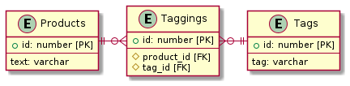

# 課題2

<!-- START doctoc -->
<!-- END doctoc -->

## 交差テーブル

今回の課題を解決する1つの方法は、`Products` テーブルと `Tags` テーブルを紐づけるための交差テーブルを導入することである。

交差テーブル `Taggings` を導入することで、2つのテーブルを以下のように紐づけることができる。



MySQLでのテーブル定義では以下のように宣言できる。

```sql
-- Productsテーブルの作成
CREATE TABLE IF NOT EXISTS Products (
    id INT AUTO_INCREMENT PRIMARY KEY,
    text VARCHAR(255)
) ENGINE=INNODB;

-- Tagsテーブルの作成
CREATE TABLE IF NOT EXISTS Tags (
    id INT AUTO_INCREMENT PRIMARY KEY,
    tag VARCHAR(255)
) ENGINE=INNODB;

-- Taggingsテーブルの作成
CREATE TABLE IF NOT EXISTS Taggings (
    id INT AUTO_INCREMENT PRIMARY KEY,
    product_id INT NOT NULL,
    tag_id INT NOT NULL,
    FOREIGN KEY (product_id)
        REFERENCES Products(id),
    FOREIGN KEY (tag_id)
        REFERENCES Tags(id)
) ENGINE=INNODB;
```

これでテーブル定義は完了したので、事前に以下のデータを用意しておく。

```sql
INSERT INTO Products (text)
VALUES ('Sample Product #1');

INSERT INTO Tags (tag)
VALUES
    ('web'),
    ('test'),
    ('database');

INSERT INTO Taggings (product_id, tag_id)
VALUES
    (1, 1),
    (1, 2),
    (1, 3);
```

これでコンマ区切りを使用していたテーブル設計で発生していた課題を解決することができる。

### 課題1 特定のタグで検索することが困難

コンマ区切りを使用したいた場合は `LIKE` 句を使用したり、正規表現を活用しなければ特定のタグに紐づく製品を検索することが困難だった。

交差テーブルを導入することで、テーブルを結合させるクエリで検索することができる。

```sql
SELECT * FROM Products
INNER JOIN Taggings ON Products.id = Taggings.product_id
INNER JOIN Tags ON Taggings.tag_id = Tags.id
AND Tags.tag = 'test';
```

この場合はインデックスを活用できるため、コンマ区切りの場合よりも高速に結果を得ることができる。