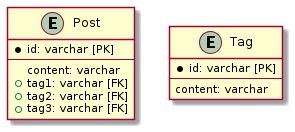

# 課題1

<!-- START doctoc generated TOC please keep comment here to allow auto update -->
<!-- DON'T EDIT THIS SECTION, INSTEAD RE-RUN doctoc TO UPDATE -->
<details>
<summary>Table of Contents</summary>

- [問題設定](#%E5%95%8F%E9%A1%8C%E8%A8%AD%E5%AE%9A)
  - [課題1 タグ名での検索が冗長になる](#%E8%AA%B2%E9%A1%8C1-%E3%82%BF%E3%82%B0%E5%90%8D%E3%81%A7%E3%81%AE%E6%A4%9C%E7%B4%A2%E3%81%8C%E5%86%97%E9%95%B7%E3%81%AB%E3%81%AA%E3%82%8B)
  - [課題2 整合性の担保が難しい](#%E8%AA%B2%E9%A1%8C2-%E6%95%B4%E5%90%88%E6%80%A7%E3%81%AE%E6%8B%85%E4%BF%9D%E3%81%8C%E9%9B%A3%E3%81%97%E3%81%84)
  - [課題3 タグを追加する仕様変更への対応が難しい](#%E8%AA%B2%E9%A1%8C3-%E3%82%BF%E3%82%B0%E3%82%92%E8%BF%BD%E5%8A%A0%E3%81%99%E3%82%8B%E4%BB%95%E6%A7%98%E5%A4%89%E6%9B%B4%E3%81%B8%E3%81%AE%E5%AF%BE%E5%BF%9C%E3%81%8C%E9%9B%A3%E3%81%97%E3%81%84)

</details>
<!-- END doctoc generated TOC please keep comment here to allow auto update -->

## 問題設定

QiitaやZennなどのブログサービスでは、投稿された記事に対してタグを付与することができる。

タグは記事に対して1つだけではなく、最大で3つまで紐づけることできるように、以下のようなテーブルを設計した。

```puml
entity Post {
    * id: varchar [PK]
    ---
    content: varchar
    + tag1: varchar [FK]
    + tag2: varchar [FK]
    + tag3: varchar [FK]
}

entity Tag {
    * id: varchar [PK]
    ---
    content: varchar
}
```



ではこのテーブル設計で発生する問題を、CRUD操作の観点や将来的な仕様変更への耐性から考えていく。

なお下記のテーブル設計を使用していく。

```sql
CREATE TABLE IF NOT EXISTS Post (
    id INT AUTO_INCREMENT PRIMARY KEY,
    content VARCHAR(255),
    tag1 VARCHAR(255),
    tag2 VARCHAR(255),
    tag3 VARCHAR(255)
) ENGINE=InnoDB;

CREATE TABLE IF NOT EXISTS Tag (
    id INT AUTO_INCREMENT PRIMARY KEY,
    content VARCHAR(255)
) ENGINE=InnoDB;

INSERT INTO Post (content, tag1, tag2, tag3)
VALUES
    ('記事の1つ目', 'web', NULL, NULL),
    ('記事の2つ目', 'web', 'test', NULL),
    ('記事の3つ目', 'web', 'database', NULL),
    ('記事の4つ目', 'web', 'frontend', 'backend');

INSERT INTO Tag (content)
VALUES
    ('web'),
    ('test'),
    ('database'),
    ('frontend'),
    ('backend');
```

なおここでは `Post` テーブルの各タグカラムには外部キー制約などを設けておらず、`Tag`テーブルの`content` の値がそのまま格納されていると仮定する。

### 課題1 タグ名での検索が冗長になる

もしも `test` のタグが付与されている記事を検索する場合、3つ存在しているタグのカラムのうち、どのカラムに格納されているのかわからないため、以下のように全てのカラムに対して検索条件を指定する必要が出てしまう。

```sql
SELECT * FROM Post
WHERE tag1 = 'test'
   OR tag2 = 'test'
   OR tag3 = 'test';
```

これで以下のように対象のレコードを抽出することができる。

```bash
+----+---------+------+------+------+
| id | content | tag1 | tag2 | tag3 |
+----+---------+------+------+------+
|  2 | 2       | web  | test | NULL |
+----+---------+------+------+------+
```

この検索方法は、タグが `web` と `database` を含むレコードを抽出する場合など複数の条件を指定する場合にさらに複雑化する。

これは3つのタグの中のどれか1つが `web` である条件と、同じく3つのタグの中からどれか1つが `database` である条件の論理積で表現される。

```sql
SELECT * FROM Post
WHERE (tag1 = 'web' OR tag2 = 'web' OR tag3 = 'web')
  AND (tag1 = 'database' OR tag2 = 'database' OR tag3 = 'database');

-- 以下でも同じ
SELECT * FROM Post
WHERE 'web' IN (tag1, tag2, tag3)
  AND 'database' IN (tag1, tag2, tag3);
```

こうした冗長かる複雑なクエリを使用しなければ、以下のような条件を満たすレコードを抽出することができない。

```bash
+----+---------+------+----------+------+
| id | content | tag1 | tag2     | tag3 |
+----+---------+------+----------+------+
|  3 | 3       | web  | database | NULL |
+----+---------+------+----------+------+
```

### 課題2 整合性の担保が難しい

通常は1つの記事に同じタグを付与することはできないが、もしも記事の更新時にクエリにバグが存在していた場合、以下のようにレコードが更新されてしまう可能性がある。

```bash
+----+---------+------+----------+----------+
| id | content | tag1 | tag2     | tag3     |
+----+---------+------+----------+----------+
|  3 | 3       | web  | database | database |
+----+---------+------+----------+----------+
```

### 課題3 タグを追加する仕様変更への対応が難しい

例えばZennの記事「[ぼくのかんがえたさいきょうの個人開発あーきてくちゃ](https://zenn.dev/eringiv3/articles/c44d5400e5603e)」ではタグが5つ紐づいている。

では実際に5つのタグを使用できるようにするためには、以下のようにテーブル設計を変更する必要がある。

```sql
ALTER TABLE Post Add COLUMN tag4 VARCHAR(255);
ALTER TABLE Post Add COLUMN tag5 VARCHAR(255);
```

また既存クエリにも、新しく追加したタグで検索できるように条件を追加する必要があったりと、多くの変更が必要になってしまう。
