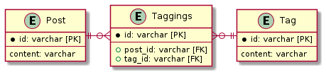

# 課題2

<!-- START doctoc generated TOC please keep comment here to allow auto update -->
<!-- DON'T EDIT THIS SECTION, INSTEAD RE-RUN doctoc TO UPDATE -->
<details>
<summary>Table of Contents</summary>

- [交差テーブル](#%E4%BA%A4%E5%B7%AE%E3%83%86%E3%83%BC%E3%83%96%E3%83%AB)

</details>
<!-- END doctoc generated TOC please keep comment here to allow auto update -->

## 交差テーブル

この問題は **マルチカラムアトリビュート** と呼ばれており、課題23と同じく交差テーブルの導入で解決できる。

つまり複数の列ではなく、複数の行で記事とタグの関係性を表現する。

```puml
entity Post {
    * id: varchar [PK]
    ---
    content: varchar
}

entity Taggings {
    * id: varchar [PK]
    ---
    post_id: varchar [FK]
    tag_id: varchar [FK]
}

entity Tag {
    * id: varchar [PK]
    ---
    content: varchar
}

Post ||-r-o{ Taggings
Tag ||-l-o{ Taggings
```


