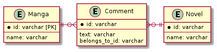

# 課題1

<!-- START doctoc generated TOC please keep comment here to allow auto update -->
<!-- DON'T EDIT THIS SECTION, INSTEAD RE-RUN doctoc TO UPDATE -->
<details>
<summary>Table of Contents</summary>

- [問題設定](#%E5%95%8F%E9%A1%8C%E8%A8%AD%E5%AE%9A)

</details>
<!-- END doctoc generated TOC please keep comment here to allow auto update -->

## 問題設定

[読書メーター](https://bookmeter.com/) のように漫画や小説などのリソースが存在しており、どちらのリソースにもユーザーはコメントを追加できるサービスとする。

このときに以下のテーブル設計を考える。

```puml
entity Manga {
    * id: varchar [PK]
    ---
    name: varchar 
}

entity Novel {
    * id: varchar
    ---
    name: varchar
}

entity Comment {
    * id: varchar
    ---
    text: varchar
    belongs_to_id: varchar [FK]
}

Manga ||-r-o{ Comment
Novel ||-l-o{ Comment
```



ここでは `Comment` テーブルに対して `belongs_to_id` カラムを持たせ、値として `Manga.id` や `Novel.id` を持たせることでそれぞれのリソースを紐づけている。

ではこのテーブル設計で発生する問題を、CRUD操作の観点や将来的な仕様変更への耐性から考えていく。

なお下記のテーブル設計を使用していく。

```sql
CREATE TABLE IF NOT EXISTS Manga (
    manga_id INT AUTO_INCREMENT PRIMARY KEY,
    name VARCHAR(255)
) ENGINE=InnoDB;

CREATE TABLE IF NOT EXISTS Novel (
    novel_id INT AUTO_INCREMENT PRIMARY KEY,
    name VARCHAR(255)
) ENGINE=InnoDB;

CREATE TABLE IF NOT EXISTS Comments (
    comment_id INT AUTO_INCREMENT PRIMARY KEY,
    text VARCHAR(255),
    belong_to_id INT
) ENGINE=InnoDB;
```

### 課題1 参照整合性を担保できない

あるカラムに対して外部キー制約などの参照整合性を作成する場合、必ず **1つの** テーブルに対する参照整合性を保つ必要がある。

今回のように `belong_to_id` カラムに対して、`Manga` テーブルのIDや `Novel` テーブルのIDのように複数のテーブルを横断するような外部キー制約を設けることはできない。

そのため `belong_to_id` に外部キー制約を設けることができず、どんなデータでも挿入することができてしまう。

もしもこうした状況を防ぐ必要がある場合、アプリケーション側で制御する必要がある。

### 課題2 SELECTクエリの結果に一意性がない

課題1の内容と被っているが、複数のテーブルに対して参照整合性を保つことができないため、`belong_to_id` が `Manga` テーブルと `Novel` テーブルのどちらに紐づいているのか判断ができない。

例えば以下の状況を考える。

```sql
INSERT INTO Manga (name)
VALUES ('kimetsu'), ('jujutsu'), ('yakusoku');

INSERT INTO Novel (name)
VALUES ('kokuhaku'), ('kakera'), ('for N');

INSERT INTO Comments (name, belong_to_id)
VALUES
    ('excellent !!!', 1);
```

上記の `Comments` テーブルの `belong_to_id` カラムが1であるレコードの紐づきがどちらに帰属するのか判断できない。

