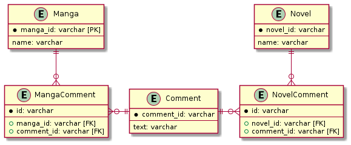

# 課題2

<!-- START doctoc generated TOC please keep comment here to allow auto update -->
<!-- DON'T EDIT THIS SECTION, INSTEAD RE-RUN doctoc TO UPDATE -->
<details>
<summary>Table of Contents</summary>

- [交差テーブル](#%E4%BA%A4%E5%B7%AE%E3%83%86%E3%83%BC%E3%83%96%E3%83%AB)
  - [課題1 参照整合性を担保できない](#%E8%AA%B2%E9%A1%8C1-%E5%8F%82%E7%85%A7%E6%95%B4%E5%90%88%E6%80%A7%E3%82%92%E6%8B%85%E4%BF%9D%E3%81%A7%E3%81%8D%E3%81%AA%E3%81%84)
  - [課題2](#%E8%AA%B2%E9%A1%8C2)

</details>
<!-- END doctoc generated TOC please keep comment here to allow auto update -->

## 交差テーブル

この問題は **ポリモーフィック・アソシエーション** と呼ばれており、あるテーブルのカラムに対して、複数のテーブルと紐づいてしまうような、多重的な関係性を持たせているアンチパターンである。

交差テーブルを導入することで解決することができる。

```puml
entity Manga {
    * manga_id: varchar [PK]
    ---
    name: varchar 
}

entity Novel {
    * novel_id: varchar
    ---
    name: varchar
}

entity Comment {
    * comment_id: varchar
    ---
    text: varchar
}

entity MangaComment {
    * id: varchar
    ---
    + manga_id: varchar [FK]
    + comment_id: varchar [FK]
}

entity NovelComment {
    * id: varchar
    ---
    + novel_id: varchar [FK]
    + comment_id: varchar [FK]
}

Comment ||-l-o{ MangaComment
Manga ||--o{ MangaComment
Comment ||-r-o{ NovelComment
Novel ||--o{ NovelComment
```



課題23の「ジェイウォーク」や課題24の「マルチカラムアトリビュート」で導入した交差テーブルと異なる点は、あるコメントは必ず漫画、あるいは小説に対してどれか1つに紐づいている点である。

これは例えば `MangaComment` テーブル内に、`comment_id` が複数存在している、つまり異なる漫画に対して全く同じコメントのレコードが紐づくことはありえないという意味である。

この関係性は、以下のように表現できる。

```sql
CREATE TABLE IF NOT EXISTS Manga (
    manga_id INT AUTO_INCREMENT PRIMARY KEY,
    name VARCHAR(255)
) ENGINE=InnoDB;

CREATE TABLE IF NOT EXISTS Novel (
    novel_id INT AUTO_INCREMENT PRIMARY KEY,
    name VARCHAR(255)
) ENGINE=InnoDB;

CREATE TABLE IF NOT EXISTS Comment (
    comment_id INT AUTO_INCREMENT PRIMARY KEY,
    text VARCHAR(255)
) ENGINE=InnoDB;

CREATE TABLE IF NOT EXISTS MangaComment (
    id INT AUTO_INCREMENT PRIMARY KEY,
    manga_id INT,
    comment_id INT,
    UNIQUE(comment_id),  -- あるコメントは1つの漫画のみに紐づく
    FOREIGN KEY (manga_id)
        REFERENCES Manga(manga_id),
    FOREIGN KEY (comment_id)
        REFERENCES Comment(comment_id)
) ENGINE=InnoDB;

CREATE TABLE IF NOT EXISTS NovelComment (
    id INT AUTO_INCREMENT PRIMARY KEY,
    novel_id INT,
    comment_id INT,
    UNIQUE(comment_id),  -- あるコメントは1つの小説のみに紐づく
    FOREIGN KEY (novel_id)
        REFERENCES Novel(novel_id),
    FOREIGN KEY (comment_id)
        REFERENCES Comment(comment_id)
) ENGINE=InnoDB;
```

データとしては以下の挿入する。

```sql
INSERT INTO Manga (name)
VALUES ('kimetsu'), ('jujutsu'), ('yakusoku');

INSERT INTO Novel (name)
VALUES ('kokuhaku'), ('kakera'), ('for N');

INSERT INTO Comment (text)
VALUES ('excellent'), ('good'), ('normal'), ('not good'), ('bad');

INSERT INTO MangaComment (manga_id, comment_id)
VALUES (1, 1), (2, 2), (3, 3);

INSERT INTO NovelComment (novel_id, comment_id)
VALUES (1, 4), (2, 5);
```

### 課題1 参照整合性を担保できない

変更前のテーブル定義では、コメントというリソースと漫画や小説との関係性という2つの異なる内容が、1つのテーブルのみで表現されていた。

今回は漫画や小説など、紐づける対象ごとに交差テーブルを導入することで、複数のテーブルの1つ1つに対して外部キー制約を設けることが可能となり、参照整合性をある程度保つことができる。

しかし、注意点として完全に参照整合性を保つことができているわけではなく、以下のようにあるコメントを漫画と小説の両方に紐づけてしまうことができる点は注意が必要である。

```sql
-- あるコメント (id=1) が漫画と小説の両方に紐づいており、整合性が取れていない
INSERT INTO MangaComment (manga_id, comment_id)
VALUES (10, 1);

INSERT INTO MangaComment (manga_id, comment_id)
VALUES (10, 1);
```

これはアプリケーション側で防ぐ必要がある。

### 課題2

改善後のテーブル定義では、複数のテーブルに対して交差テーブルをそれぞれ導入しているため、コメントが紐づいている漫画や小説のデータを抽出することができる。

例えば以下では漫画のタイトルが `kimetsu` である漫画に紐づくコメントを抽出している。

```sql
SELECT Manga.manga_id, Manga.name, Comment.comment_id, Comment.text
FROM Comment
INNER JOIN MangaComment ON Comment.comment_id = MangaComment.comment_id 
INNER JOIN Manga ON MangaComment.manga_id = Manga.manga_id
AND Manga.name = 'kimetsu';
```

このクエリを実行すれば以下のようにコメントを抽出できる。

```bash
+----------+---------+------------+-----------+
| manga_id | name    | comment_id | text      |
+----------+---------+------------+-----------+
|        1 | kimetsu |          1 | excellent |
+----------+---------+------------+-----------+
```

また外部結合を使用することで、コメントをもとに漫画あるいは小説の情報を抽出することも可能である。

```sql
SELECT Comment.comment_id, Manga.manga_id, Novel.novel_id
FROM Comment
LEFT OUTER JOIN (
    MangaComment INNER JOIN Manga ON Manga.manga_id = MangaComment.manga_id
) ON Comment.comment_id = MangaComment.comment_id
LEFT OUTER JOIN (
    NovelComment INNER JOIN Novel ON Novel.novel_id = NovelComment.novel_id
) ON Comment.comment_id = NovelComment.comment_id
WHERE Comment.comment_id = 4;
```

このクエリを実行すれば以下のようにコメントに紐づく漫画ID、あるいは小説IDを取得できる。

```bash
+------------+----------+----------+
| comment_id | manga_id | novel_id |
+------------+----------+----------+
|          4 |     NULL |        1 |
+------------+----------+----------+
```
