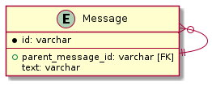

# 課題1

<!-- START doctoc -->
<!-- END doctoc -->

## 問題設定

Slackのようなチャットアプリで使用するメッセージのやり取りを考える。

- ユーザーはメッセージを送信することができる
- ユーザーはメッセージを起点にスレッドという形で、メッセージに対するメッセージを送信することができる

この仕様を満たすために、以下のようにメッセージ自身を親にもつ自己参照のテーブルを設計している。

```puml
entity Message {
    * id: varchar
    ---
    + parent_message_id: varchar [FK]
    text: varchar
}

Message }o--|| Message
```



ではこのテーブル設計で発生する問題を、CRUD操作の観点や将来的な仕様変更への耐性から考えていく。

なお下記のテーブル設計を使用していく。

```sql
CREATE TABLE IF NOT EXISTS Message (
    message_id INT AUTO_INCREMENT PRIMARY KEY,
    text VARCHAR(255),
    parent_message_id INT,
    FOREIGN KEY (parent_message_id)
        REFERENCES Message(message_id)
) ENGINE=InnoDB;

INSERT INTO Message (text, parent_message_id)
VALUES
    ('parent root', NULL),
    ('intermediate root 1', 1),
    ('intermediate root 2', 1),
    ('leaf 1', 2),
    ('leaf 2', 2),
    ('leaf 3', 3),
    ('leaf 4', 6);
```

格納されているデータとしては以下を想定している。

```bash
#                    'parent root'
#                     /          \
#   'intermediate root 1'         'intermediate root 2'
#     /             \                     |
# 'leaf 1'        'leaf 2'             'leaf 3'
#                                         |
#                                      'leaf 4'

+------------+---------------------+-------------------+
| message_id | text                | parent_message_id |
+------------+---------------------+-------------------+
|          1 | parent root         |              NULL |
|          2 | intermediate root 1 |                 1 |
|          3 | intermediate root 2 |                 1 |
|          4 | leaf 1              |                 2 |
|          5 | leaf 2              |                 2 |
|          6 | leaf 3              |                 3 |
|          7 | leaf 4              |                 6 |
+------------+---------------------+-------------------+
```

### 課題1 全階層からのメッセージ抽出が難しい

メッセージは親テーブルとして自身を参照する階層構造を有しているため、1レコード内に子ノードを含めようとすると、階層分の外部結合が必要になってしまう。

例えば以下のクエリでは、1レコードで2階層分のノードしか追跡することができない。

```sql
SELECT m1.message_id, m1.parent_message_id
      ,m2.message_id, m2.parent_message_id
FROM Message m1
LEFT OUTER JOIN Message m2 ON m1.message_id = m2.parent_message_id;

+------------+-------------------+------------+-------------------+
| message_id | parent_message_id | message_id | parent_message_id |
+------------+-------------------+------------+-------------------+
|          1 |              NULL |          2 |                 1 |
|          1 |              NULL |          3 |                 1 |
|          2 |                 1 |          4 |                 2 |
|          2 |                 1 |          5 |                 2 |
|          3 |                 1 |          6 |                 3 |
|          4 |                 2 |       NULL |              NULL |
|          5 |                 2 |       NULL |              NULL |
|          6 |                 3 |          7 |                 6 |
|          7 |                 6 |       NULL |              NULL |
+------------+-------------------+------------+-------------------+
```

1レコード内に3階層分のノードを追跡したい場合には、以下のようにさらに外部結合を行う必要がある。

```sql
SELECT m1.message_id, m1.parent_message_id
      ,m2.message_id, m2.parent_message_id
      ,m3.message_id, m3.parent_message_id
FROM Message m1
LEFT OUTER JOIN Message m2 ON m1.message_id = m2.parent_message_id
LEFT OUTER JOIN Message m3 ON m2.message_id = m3.parent_message_id;

+------------+-------------------+------------+-------------------+------------+-------------------+
| message_id | parent_message_id | message_id | parent_message_id | message_id | parent_message_id |
+------------+-------------------+------------+-------------------+------------+-------------------+
|          1 |              NULL |          2 |                 1 |          4 |                 2 |
|          1 |              NULL |          2 |                 1 |          5 |                 2 |
|          1 |              NULL |          3 |                 1 |          6 |                 3 |
|          2 |                 1 |          4 |                 2 |       NULL |              NULL |
|          2 |                 1 |          5 |                 2 |       NULL |              NULL |
|          3 |                 1 |          6 |                 3 |          7 |                 6 |
|          4 |                 2 |       NULL |              NULL |       NULL |              NULL |
|          5 |                 2 |       NULL |              NULL |       NULL |              NULL |
|          6 |                 3 |          7 |                 6 |       NULL |              NULL |
|          7 |                 6 |       NULL |              NULL |       NULL |              NULL |
+------------+-------------------+------------+-------------------+------------+-------------------+
```

このように1レコード内で全ての階層分のノードを抽出することが難しい。

### 課題2 ノードの削除が難しい

例えば現在のデータから左側のサブツリー全体 (`intermediate root 1`以下) を削除する場合、クエリを何度も実行する必要がある。

まずは `intermediate root 1` のノードのIDを確認してみる。

```sql
mysql> SELECT * FROM Message WHERE text = 'intermediate root 1';

+------------+---------------------+-------------------+
| message_id | text                | parent_message_id |
+------------+---------------------+-------------------+
|          2 | intermediate root 1 |                 1 |
+------------+---------------------+-------------------+
```

対象のノード以下のツリーを削除するには、対象のノードを親に持つノードを順番に検索していく必要がある。

```sql
SELECT * FROM Message WHERE parent_message_id = 2; -- (4, 5)が返る
SELECT * FROM Message WHERE parent_message_id = 4; -- Empty
SELECT * FROM Message WHERE parent_message_id = 5; -- Empty

DELETE FROM Message WHERE message_id = 4;
DELETE FROM Message WHERE message_id = 5;
DELETE FROM Message WHERE message_id = 2;
```

このようにノードを削除するために、子ノードまで全てを検索して子ノードから順番に削除していく処理は、データの階層が深くなるに連れてますます複雑なクエリになってしまう。

### 注意点

MySQL8.0からは、**共通テーブル式 (Common Table Expression : CTE)** が導入されたため、各ノードとその階層や子ノードを抽出することができる。

例えば以下のクエリを実行すれば各メッセージの内容を階層付きで抽出できる。

```sql
WITH RECURSIVE MessageTree AS (
        SELECT *, 0 AS depth FROM Message
        WHERE parent_message_id IS NULL
    UNION ALL
        SELECT m.*, mt.depth + 1 AS depth FROM MessageTree mt
        INNER JOIN Message m ON mt.message_id = m.parent_message_id 
)
SELECT * FROM MessageTree;

+------------+---------------------+-------------------+-------+
| message_id | text                | parent_message_id | depth |
+------------+---------------------+-------------------+-------+
|          1 | parent root         |              NULL |     0 |
|          2 | intermediate root 1 |                 1 |     1 |
|          3 | intermediate root 2 |                 1 |     1 |
|          4 | leaf 1              |                 2 |     2 |
|          5 | leaf 2              |                 2 |     2 |
|          6 | leaf 3              |                 3 |     2 |
|          7 | leaf 4              |                 6 |     3 |
+------------+---------------------+-------------------+-------+
```

また以下のクエリを実行すれば、`message_id=3` に紐づくメッセージとその子ノードを全て抽出することができる。

```sql
WITH RECURSIVE MessageTree AS (
    SELECT * FROM Message WHERE message_id = 3
    UNION ALL
    SELECT Message.* FROM Message
    INNER JOIN MessageTree ON Message.parent_message_id = MessageTree.message_id
)
SELECT * FROM MessageTree;

+------------+---------------------+-------------------+
| message_id | text                | parent_message_id |
+------------+---------------------+-------------------+
|          2 | intermediate root 1 |                 1 |
|          4 | leaf 1              |                 2 |
|          5 | leaf 2              |                 2 |
+------------+---------------------+-------------------+
```

参考資料

- [SQL: ナイーブツリーと再帰クエリ](https://blog.amedama.jp/entry/2016/05/05/215954)
