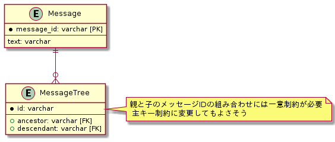

# 課題2

<!-- START doctoc generated TOC please keep comment here to allow auto update -->
<!-- DON'T EDIT THIS SECTION, INSTEAD RE-RUN doctoc TO UPDATE -->
<details>
<summary>Table of Contents</summary>

- [閉包テーブル (Closure Table)](#%E9%96%89%E5%8C%85%E3%83%86%E3%83%BC%E3%83%96%E3%83%AB-closure-table)
  - [課題1 全階層からのメッセージ抽出が難しい](#%E8%AA%B2%E9%A1%8C1-%E5%85%A8%E9%9A%8E%E5%B1%A4%E3%81%8B%E3%82%89%E3%81%AE%E3%83%A1%E3%83%83%E3%82%BB%E3%83%BC%E3%82%B8%E6%8A%BD%E5%87%BA%E3%81%8C%E9%9B%A3%E3%81%97%E3%81%84)
  - [課題2 ノードの削除が難しい](#%E8%AA%B2%E9%A1%8C2-%E3%83%8E%E3%83%BC%E3%83%89%E3%81%AE%E5%89%8A%E9%99%A4%E3%81%8C%E9%9B%A3%E3%81%97%E3%81%84)

</details>
<!-- END doctoc generated TOC please keep comment here to allow auto update -->

## 閉包テーブル (Closure Table)

この問題は **ナイーブツリー** と呼ばれており、ノードの直近の親と子だけを抽出する用途以外では、複雑なクエリが必要になってしまうアンチパターンである。

この問題を解決する方法はいくつか存在しているが、シンプルな手法は **閉包テーブル (Closure Table)** であり、各ノードが有しているデータとノード同士の関係性を別々のテーブルで表現する方法である。

具体的には以下のようなノード間の関係性だけをもつテーブルを導入する。

```puml
entity Message {
    * message_id: varchar [PK]
    ---
    text: varchar
}

entity MessageTree {
    * id: varchar
    ---
    + ancestor: varchar [FK]
    + descendant: varchar [FK]
}

Message ||--o{ MessageTree
```



この関係性は以下のように定義することができる。

```sql
CREATE TABLE IF NOT EXISTS Message (
    message_id INT PRIMARY KEY,
    text VARCHAR(255)
) ENGINE=InnoDB;

CREATE TABLE IF NOT EXISTS MessageTree (
    id INT AUTO_INCREMENT PRIMARY KEY,
    ancestor INT,
    descendant INT,
    UNIQUE(ancestor, descendant),
    FOREIGN KEY (ancestor)
        REFERENCES Message(message_id),
    FOREIGN KEY (descendant)
        REFERENCES Message(message_id)
) ENGINE=InnoDB;
```

なお `MessageTree` にはノード自身への参照も含めたノードの組み合わせを追加する。

```sql
INSERT INTO Message (message_id, text)
VALUES
    (1, 'parent root'),
    (2, 'intermediate root 1'),
    (3, 'intermediate root 2'),
    (4, 'leaf 1'),
    (5, 'leaf 2'),
    (6, 'leaf 3'),
    (7, 'leaf 4');

INSERT INTO MessageTree (ancestor, descendant)
VALUES
    -- メッセージIDが1は、全ての子孫に対するメッセージへの紐づけをもつ
    (1, 1),
    (1, 2),
    (1, 3),
    (1, 4),
    (1, 5),
    (1, 6),
    (1, 7),
    -- メッセージIDが2は、ID3の子孫のみをもつ
    (2, 2),
    (2, 4),
    (2, 5),
    -- メッセージIDが4と5は、自身のIDをもつ
    (4, 4),
    (5, 5),
    -- メッセージIDが3は、自身の全ての子メッセージのIDをもつ
    (3, 3),
    (3, 6),
    (3, 7),
    -- メッセージIDが6は、自身と子メッセージのIDをもつ
    (6, 6),
    (6, 7),
    -- メッセージIDが7は、自身のIDをもつ
    (7, 7);
```

このデータ構造は以下のようになっている。

```bash
# (1) parent root
#  ├── (2) intermediate root 1
#  │    ├── (4) leaf 1
#  │    └── (5) leaf 2
#  │
#  └── (3) intermediate root 2
#       └── (6) leaf 3
#            └── (7) leaf 4
```

### 課題1 全階層からのメッセージ抽出が難しい

このテーブル設計にしていれば、 メッセージIDが3のメッセージの子孫となるメッセージを全て取得することができる。

これは以下のように、単純に親となる `ancestor` に抽出元となるメッセージIDを指定すればいい。

```sql
SELECT m.* FROM Message m
INNER JOIN MessageTree mt ON m.message_id = mt.descendant
WHERE mt.ancestor = 3;

+------------+---------------------+
| message_id | text                |
+------------+---------------------+
|          3 | intermediate root 2 |
|          6 | leaf 3              |
|          7 | leaf 4              |
+------------+---------------------+
```

逆に子孫となる `descendant` を指定することで、特定のメッセージIDの親となるメッセージを全て抽出することもできる。

```sql
SELECT m.* FROM Message m
INNER JOIN MessageTree mt ON m.message_id = mt.ancestor
WHERE mt.descendant = 7;

+------------+---------------------+
| message_id | text                |
+------------+---------------------+
|          1 | parent root         |
|          3 | intermediate root 2 |
|          6 | leaf 3              |
|          7 | leaf 4              |
+------------+---------------------+
```

またノードを追加することも簡単にできる。

例えば現在のデータに新たにメッセージを追加して以下の状態にしてみる。

```bash
# (1) parent root
#  ├── (2) intermediate root 1
#  │    ├── (4) leaf 1
#  │    └── (5) leaf 2
#  │         └── (8) leaf 5
#  │
#  └── (3) intermediate root 2
#       └── (6) leaf 3
#            └── (7) leaf 4
```

このためには自己参照となる紐づけも合わせて、以下のデータを追加する必要がある。

| ancestor | descendant |
|:--------:|:----------:|
|    1     |     8      |
|    2     |     8      |
|    5     |     8      |
|    8     |     8      |

このためには、自分自身への参照に合わせて、挿入先となるメッセージID (=`5`) を子孫にもつ全てのメッセージID (= `1, 2`) との紐づけも挿入する必要がある。

そのため以下のようにレコードを挿入する際に、別途親となるメッセージを抽出するクエリが必要となる。

```sql
INSERT INTO Message (message_id, text)
VALUES (8, 'leaf 5');

-- SELECT文を使用して抽出した内容でレコードを挿入できる
INSERT INTO MessageTree (ancestor, descendant)
    SELECT mt.ancestor, 8
    FROM MessageTree mt
    WHERE mt.descendant = 5
UNION ALL
    SELECT 8, 8;
```

このクエリを実行すれば以下のように新しくメッセージが挿入されていることが確認できる。

```sql
SELECT * FROM MessageTree mt WHERE mt.descendant = 8;

+----+----------+------------+
| id | ancestor | descendant |
+----+----------+------------+
| 21 |        1 |          8 |
| 22 |        2 |          8 |
| 23 |        5 |          8 |
| 24 |        8 |          8 |
+----+----------+------------+
```

### 課題2 ノードの削除が難しい


