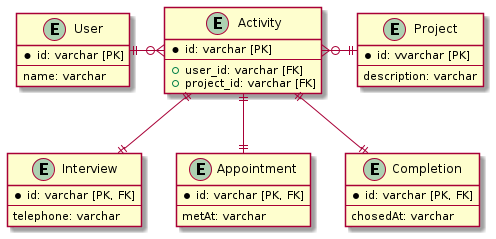

# 課題2

<!-- START doctoc generated TOC please keep comment here to allow auto update -->
<!-- DON'T EDIT THIS SECTION, INSTEAD RE-RUN doctoc TO UPDATE -->
<details>
<summary>Table of Contents</summary>

- [テーブル継承](#%E3%83%86%E3%83%BC%E3%83%96%E3%83%AB%E7%B6%99%E6%89%BF)

</details>
<!-- END doctoc generated TOC please keep comment here to allow auto update -->

## テーブル継承

問題点としては以下の2点が考えられる。

- 顧客と営業イベントという異なる事実情報が1つのテーブルで表現されている
- 1つ1つの営業イベントがカラムで分離されていること

そこで解決策として以下の2つを考える

- 顧客と営業イベントを異なるテーブルで管理する
- 営業イベントの1つ1つをレコード (行) として保存する
- 各営業イベント自体はテーブルを分離して表現する。

具体的には以下の論理設計を行った。



まずは顧客と案件という2つのリソースに分離する。

各営業イベントは案件に紐づく形で行うため、顧客と案件を紐づける形で各営業イベントをレコードとして管理できるようにする。

物理設計は以下のように行った。

```sql
CREATE TABLE IF NOT EXISTS User (
    id INT PRIMARY KEY,
    name VARCHAR(255)
) ENGINE=InnoDB;

CREATE TABLE IF NOT EXISTS Project (
    id INT PRIMARY KEY,
    description VARCHAR(255)
) ENGINE=InnoDB;

CREATE TABLE IF NOT EXISTS Activity (
    id INT PRIMARY KEY,
    user_id INT,
    project_id INT,
    FOREIGN KEY (user_id)
        REFERENCES User(id),
    FOREIGN KEY (project_id)
        REFERENCES Project(id)
) ENGINE=InnoDB;

CREATE TABLE IF NOT EXISTS Interview (
    id INT AUTO_INCREMENT PRIMARY KEY,
    activity_id INT,
    calledAt DATE,
    FOREIGN KEY (activity_id)
        REFERENCES Activity(id)
) ENGINE=InnoDB;

CREATE TABLE IF NOT EXISTS Appointment (
    id INT AUTO_INCREMENT PRIMARY KEY,
    activity_id INT,
    metAt DATE,
    FOREIGN KEY (activity_id)
        REFERENCES Activity(id)
) ENGINE=InnoDB;

CREATE TABLE IF NOT EXISTS Completion (
    id INT AUTO_INCREMENT PRIMARY KEY,
    activity_id INT,
    chosedAt DATE,
    FOREIGN KEY (activity_id)
        REFERENCES Activity(id)
) ENGINE=InnoDB;
```

サンプルデータとして以下を挿入する。

<details>
<summary>サンプルデータ</summary>

```sql
INSERT INTO User (id, name)
VALUES (1, 'google'), (2, 'amazon'), (3, 'facebook'), (4, 'apple');

INSERT INTO Project (id, description)
VALUES (1, 'praha challenge project');

INSERT INTO Activity (id, user_id, project_id)
VALUES (1, 1, 1), (2, 2, 1), (3, 3, 1);

INSERT INTO Interview (activity_id, calledAt)
VALUES (1, '2021-04-01'), (2, '2021-04-05'), (3, '2021-04-10');

INSERT INTO Appointment (activity_id, metAt)
VALUES (1, '2021-04-20'), (2, '2021-04-25');

INSERT INTO Completion (activity_id, chosedAt)
VALUES (1, '2021-05-01');
```

</details>

### 課題1 NULLが入り込む設計となる

今回の設計では、顧客に対する営業イベントの関係をカラムではなくレコードとして表現しているため、アポイントで面談をしていない場合や成約が取れていない場合はレコードが存在しないため、`NULL` が入り込まない設計となっている。

例えばサンプルデータの場合、顧客 `apple` に対して電話を書けていない状態は、`Interview` レコードが存在しないという状態で表現できる。

```sql
SELECT * FROM Interview;

+----+-------------+------------+
| id | activity_id | calledAt   |
+----+-------------+------------+
|  1 |           1 | 2021-04-01 |
|  2 |           2 | 2021-04-05 |
|  3 |           3 | 2021-04-10 |
+----+-------------+------------+
```

改善前のテーブルと同じように、その他のアポイントでの面談や成約状況を確認したい場合は `LEFT OUTER JOIN` を使用すればいい。

```sql
SELECT A.id
      ,A.user_id
      ,A.project_id
      ,IV.calledAt
      ,AP.metAt
      ,CP.chosedAt
FROM Activity A
LEFT OUTER JOIN Interview IV   ON IV.activity_id = A.id
LEFT OUTER JOIN Appointment AP ON AP.activity_id = A.id
LEFT OUTER JOIN Completion CP  ON CP.activity_id = A.id;

+----+---------+------------+------------+------------+------------+
| id | user_id | project_id | calledAt   | metAt      | chosedAt   |
+----+---------+------------+------------+------------+------------+
|  1 |       1 |          1 | 2021-04-01 | 2021-04-20 | 2021-05-01 |
|  2 |       2 |          1 | 2021-04-05 | 2021-04-25 | NULL       |
|  3 |       3 |          1 | 2021-04-10 | NULL       | NULL       |
+----+---------+------------+------------+------------+------------+
```

### 課題2 顧客と各イベントが1対1に紐づいてしまう

カラムではなくレコードとして営業イベントを格納しているため、2回のアポイントをとって面談した場合は、新たにレコードとして対象の営業イベントを実施すればいい。

例えば以下では `google` に対して2回目の

```sql
INSERT INTO Appointment (activity_id, metAt)
VALUES (1, '2021-04-22');
```

これで再度外部結合を使って営業状況を確認すれば、複数レコードに分かれている状態で面談日を取得することができる。

```sql
+----+---------+------------+------------+------------+------------+
| id | user_id | project_id | calledAt   | metAt      | chosedAt   |
+----+---------+------------+------------+------------+------------+
|  1 |       1 |          1 | 2021-04-01 | 2021-04-20 | 2021-05-01 |
|  1 |       1 |          1 | 2021-04-01 | 2021-04-22 | 2021-05-01 | -- コレ!
|  2 |       2 |          1 | 2021-04-05 | 2021-04-25 | NULL       |
|  3 |       3 |          1 | 2021-04-10 | NULL       | NULL       |
+----+---------+------------+------------+------------+------------+
```

ただし複数のテーブルに分離した影響で、面談の日付を挿入する際に他のテーブルに格納済みの日程との整合性を検証することができない。

### 注意点

この設計であってもいくつか課題が残っている。

- 新たな営業イベントが発生した場合に、新しくテーブルを作成する必要がある。
  - 新たな営業イベントの追加はアプリケーション側でも改変が必要になるため、新しくテーブルを作成することになっても問題ないのでは?
  - むしろテーブルを分けていることで、他のイベントへの影響などは考慮する必要がなくなる?
- 日付の制約はアプリケーション側で実現する必要がある
  - 課題2の実験でわかるように、成約が実行された後でも過去の面談の日程を追加することができてしまう
  - このように複数のテーブルを跨ぐような制約はアプリケーション側で制御する
