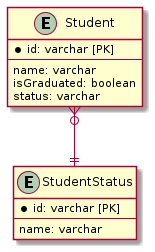
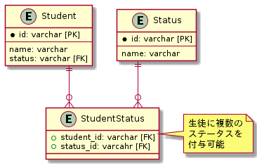

# 疑問点

<!-- START doctoc -->
<!-- END doctoc -->

## Q1 生徒のステータスに関して

生徒のステータスを考えた場合、「在学中」と「卒業」は排他的な関係にあるので、生徒テーブルにカラムを設ける場合でもいいのではないか。

この際に生徒のステータスとして「停学中」は交差テーブルを導入することで、1人の生徒に対して「在学中」と「停学中」を共存させたほうがいいのではないかと思いました。

そうしていない場合、例えば教員がWeb画面で在学中の生徒の一覧を表示する際に、「停学中」の生徒は表示されないのではないかと思いました。

