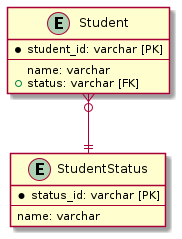

# 課題2

<!-- START doctoc generated TOC please keep comment here to allow auto update -->
<!-- DON'T EDIT THIS SECTION, INSTEAD RE-RUN doctoc TO UPDATE -->
<details>
<summary>Table of Contents</summary>

- [参照テーブル](#%E5%8F%82%E7%85%A7%E3%83%86%E3%83%BC%E3%83%96%E3%83%AB)

</details>
<!-- END doctoc generated TOC please keep comment here to allow auto update -->

## 参照テーブル

この問題は **サーティワンフレーバー** と呼ばれており、有効な値が相互排他的なもの (ON/OFF、RIGHT/LEFTなど) 以外で将来的に変更する可能性があるコード値などを制約として表現にしてしまうアンチパターンである。

解決策としては、生徒の状態の状態を制約ではなく **参照テーブル** で設定する方法が存在する。

```puml
entity Student {
    * student_id: varchar [PK]
    ---
    name: varchar
    + status: varchar [FK]
}

entity StudentStatus {
    * status_id: varchar [PK]
    ---
    name: varchar
}

Student }o--|| StudentStatus
```



この関係性は以下のように定義することができる。

```sql
CREATE TABLE IF NOT EXISTS StudentStatus (
    status_id INT PRIMARY KEY,
    name VARCHAR(255)
) ENGINE=InnoDB;

CREATE TABLE IF NOT EXISTS Student (
    student_id INT PRIMARY KEY,
    name VARCHAR(255),
    status_id INT,
    FOREIGN KEY (status_id)
        REFERENCES StudentStatus(status_id)
        ON UPDATE CASCADE
) ENGINE=InnoDB;
```

なお外部キー制約を設定する際に、データを削除・更新した場合のふるまいを設定することができる。

| 参照設定    | 挙動                                                                                 | 
| ----------- | ------------------------------------------------------------------------------------ | 
| RESTRICT    | ・親テーブルに対する削除・更新がエラーとなる<br>・省略した場合はこの設定が採用される | 
| CASCADE     | ・親テーブルに対する削除・更新時に子テーブルの該当カラムのデータも削除・更新する     | 
| SET NULL    | ・親テーブルに対する削除・更新時に子テーブルの該当カラムの値をNULLに設定する         | 
| NO ACTION   | ・親テーブルに対する削除・更新はエラーとなる                                         | 
| SET DEFAULT | ※現在、この設定を含むテーブル定義は拒否される                                       | 

では以下のデータを事前に準備しておく。

```sql
INSERT INTO StudentStatus (status_id, name)
VALUES
    (1, 'studying'),
    (2, 'graduated'),
    (3, 'suspended'),
    (4, 'transferred');

INSERT INTO Student (student_id, name, status_id)
VALUES
    (1, 'John', 1),
    (2, 'Mike', 2),
    (3, 'Lisa', 3),
    (4, 'Keisuke', 4);
```

### 課題1 制約の変更が難しい
