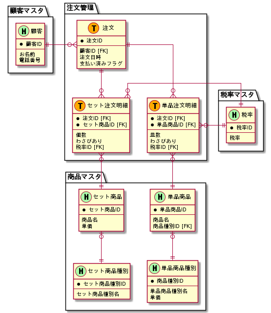

# 課題1

<!-- START doctoc generated TOC please keep comment here to allow auto update -->
<!-- DON'T EDIT THIS SECTION, INSTEAD RE-RUN doctoc TO UPDATE -->

Table of Contents

- [モデリング](#%E3%83%A2%E3%83%87%E3%83%AA%E3%83%B3%E3%82%B0)
  - [イベント系エンティティの抽出](#%E3%82%A4%E3%83%99%E3%83%B3%E3%83%88%E7%B3%BB%E3%82%A8%E3%83%B3%E3%83%86%E3%82%A3%E3%83%86%E3%82%A3%E3%81%AE%E6%8A%BD%E5%87%BA)
  - [リソース系エンティティの抽出](#%E3%83%AA%E3%82%BD%E3%83%BC%E3%82%B9%E7%B3%BB%E3%82%A8%E3%83%B3%E3%83%86%E3%82%A3%E3%83%86%E3%82%A3%E3%81%AE%E6%8A%BD%E5%87%BA)

<!-- END doctoc generated TOC please keep comment here to allow auto update -->

## モデリング

モデリング対象のデータは [課題](https://airtable.com/tblTnXBXFOYJ0J7lZ/viwyi8muFtWUlhNKG/recWPAwB0NWLdQTxO?blocks=hide) を参照する。

モデリングの手順は [楽々ERDレッスン](https://www.amazon.co.jp/%E6%A5%BD%E3%80%85ERD%E3%83%AC%E3%83%83%E3%82%B9%E3%83%B3-CodeZine-BOOKS-%E3%82%B9%E3%82%BF%E3%83%BC%E3%83%AD%E3%82%B8%E3%83%83%E3%82%AF-%E7%BE%BD%E7%94%9F/dp/4798110663) を参考にする。

