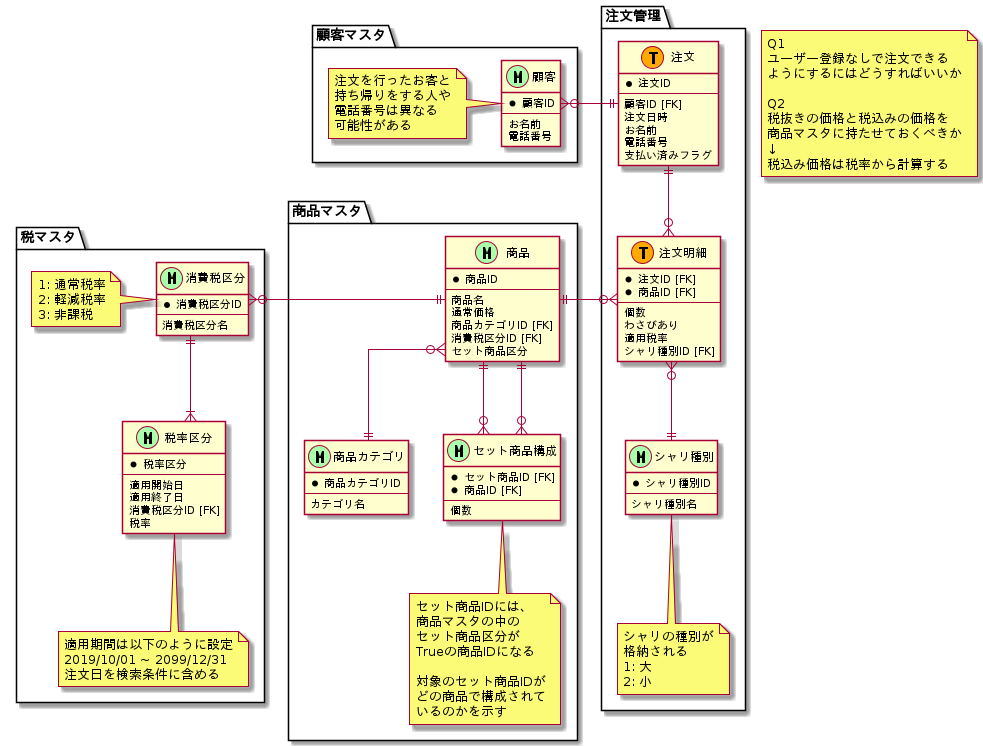

# 課題2

<!-- START doctoc generated TOC please keep comment here to allow auto update -->
<!-- DON'T EDIT THIS SECTION, INSTEAD RE-RUN doctoc TO UPDATE -->

Table of Contents

- [追加要件](#%E8%BF%BD%E5%8A%A0%E8%A6%81%E4%BB%B6)

<!-- END doctoc generated TOC please keep comment here to allow auto update -->

## 追加要件

- シャリの大小を追加したい
  - これは各商品の注文の仕方に関する事実
  - つまり商品マスタではなく、注文マスタに所属させる
- セット商品でも寿司商品をカウントしたい
  - セット商品 (例えば「わだつみ」など) を注文した際に、そのセット商品に単品商品がいくつ存在しているのかがわかればいい
  - セット商品は単品商品の組み合わせだと考えると、セット商品を構成する交差テーブルを導入する

