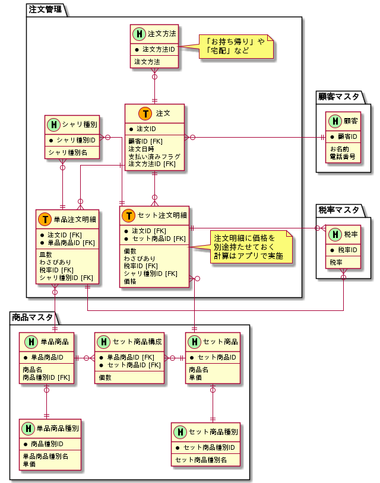

# 課題3

<!-- START doctoc generated TOC please keep comment here to allow auto update -->
<!-- DON'T EDIT THIS SECTION, INSTEAD RE-RUN doctoc TO UPDATE -->

Table of Contents

- [追加仕様](#%E8%BF%BD%E5%8A%A0%E4%BB%95%E6%A7%98)

<!-- END doctoc generated TOC please keep comment here to allow auto update -->

## 追加仕様

- 注文した商品の受け取り方法を変更する
  - 「お持ち帰り」か「宅配」のどちらかを選択できる
  - 「お持ち帰り」の場合は税別で5000円以上のセット商品を5%OFFにする
  - [京寿司](http://kyousushi.co.jp/shop/deliverymenu.html)を参考にした

