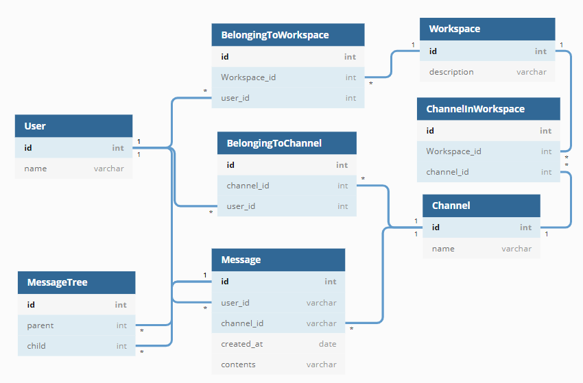
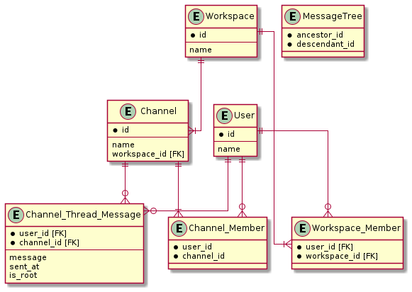

# 課題1

<!-- START doctoc generated TOC please keep comment here to allow auto update -->
<!-- DON'T EDIT THIS SECTION, INSTEAD RE-RUN doctoc TO UPDATE -->
<details>
<summary>Table of Contents</summary>

- [チャットサービスのモデリング](#%E3%83%81%E3%83%A3%E3%83%83%E3%83%88%E3%82%B5%E3%83%BC%E3%83%93%E3%82%B9%E3%81%AE%E3%83%A2%E3%83%87%E3%83%AA%E3%83%B3%E3%82%B0)
- [物理設計](#%E7%89%A9%E7%90%86%E8%A8%AD%E8%A8%88)
- [サンプルデータ](#%E3%82%B5%E3%83%B3%E3%83%97%E3%83%AB%E3%83%87%E3%83%BC%E3%82%BF)
- [要件](#%E8%A6%81%E4%BB%B6)
  - [ユーザーはチャンネルにメッセージを投稿できる](#%E3%83%A6%E3%83%BC%E3%82%B6%E3%83%BC%E3%81%AF%E3%83%81%E3%83%A3%E3%83%B3%E3%83%8D%E3%83%AB%E3%81%AB%E3%83%A1%E3%83%83%E3%82%BB%E3%83%BC%E3%82%B8%E3%82%92%E6%8A%95%E7%A8%BF%E3%81%A7%E3%81%8D%E3%82%8B)
  - [メッセージに対してスレッドメッセージを投稿できる](#%E3%83%A1%E3%83%83%E3%82%BB%E3%83%BC%E3%82%B8%E3%81%AB%E5%AF%BE%E3%81%97%E3%81%A6%E3%82%B9%E3%83%AC%E3%83%83%E3%83%89%E3%83%A1%E3%83%83%E3%82%BB%E3%83%BC%E3%82%B8%E3%82%92%E6%8A%95%E7%A8%BF%E3%81%A7%E3%81%8D%E3%82%8B)
  - [ユーザーは所属しているチャンネル内のメッセージしか見れない](#%E3%83%A6%E3%83%BC%E3%82%B6%E3%83%BC%E3%81%AF%E6%89%80%E5%B1%9E%E3%81%97%E3%81%A6%E3%81%84%E3%82%8B%E3%83%81%E3%83%A3%E3%83%B3%E3%83%8D%E3%83%AB%E5%86%85%E3%81%AE%E3%83%A1%E3%83%83%E3%82%BB%E3%83%BC%E3%82%B8%E3%81%97%E3%81%8B%E8%A6%8B%E3%82%8C%E3%81%AA%E3%81%84)
  - [ユーザーはワークスペースやチャンネルに参加・脱退できる](#%E3%83%A6%E3%83%BC%E3%82%B6%E3%83%BC%E3%81%AF%E3%83%AF%E3%83%BC%E3%82%AF%E3%82%B9%E3%83%9A%E3%83%BC%E3%82%B9%E3%82%84%E3%83%81%E3%83%A3%E3%83%B3%E3%83%8D%E3%83%AB%E3%81%AB%E5%8F%82%E5%8A%A0%E3%83%BB%E8%84%B1%E9%80%80%E3%81%A7%E3%81%8D%E3%82%8B)
  - [メッセージとスレッドメッセージを横断的に検索できる](#%E3%83%A1%E3%83%83%E3%82%BB%E3%83%BC%E3%82%B8%E3%81%A8%E3%82%B9%E3%83%AC%E3%83%83%E3%83%89%E3%83%A1%E3%83%83%E3%82%BB%E3%83%BC%E3%82%B8%E3%82%92%E6%A8%AA%E6%96%AD%E7%9A%84%E3%81%AB%E6%A4%9C%E7%B4%A2%E3%81%A7%E3%81%8D%E3%82%8B)

</details>
<!-- END doctoc generated TOC please keep comment here to allow auto update -->

## チャットサービスのモデリング

仕様の詳細は [airtable](https://airtable.com/tblTnXBXFOYJ0J7lZ/viwyi8muFtWUlhNKG/recCDmAj926oLfOde?blocks=hide) を確認する。



リンクは [ここ](https://dbdiagram.io/d/60a27221b29a09603d1535b5)



## 物理設計

以下の物理設計を載せておく。

```sql
CREATE TABLE IF NOT EXISTS User (
    id INT PRIMARY KEY,
    name VARCHAR(255)
) ENGINE=InnoDB;

CREATE TABLE IF NOT EXISTS Channel (
    id INT PRIMARY KEY,
    name VARCHAR(255)
) ENGINE=InnoDB;

CREATE TABLE IF NOT EXISTS Workspace (
    id INT PRIMARY KEY,
    description VARCHAR(255)
) ENGINE=InnoDB;

CREATE TABLE IF NOT EXISTS Message (
    id INT PRIMARY KEY,
    user_id INT,
    channel_id INT,
    created_at TIMESTAMP,
    contents VARCHAR(255),
    FOREIGN KEY (user_id)
        REFERENCES User(id),
    FOREIGN KEY (channel_id)
        REFERENCES Channel(id)
) ENGINE=InnoDB;

CREATE TABLE IF NOT EXISTS BelongingToChannel (
    id INT AUTO_INCREMENT PRIMARY KEY,
    user_id INT,
    channel_id INT,
    FOREIGN KEY (user_id)
        REFERENCES User(id),
    FOREIGN KEY (channel_id)
        REFERENCES Channel(id)
) ENGINE=InnoDB;

CREATE TABLE IF NOT EXISTS BelongingToWorkspace (
    id INT AUTO_INCREMENT PRIMARY KEY,
    user_id INT,
    workspace_id INT,
    FOREIGN KEY (user_id)
        REFERENCES User(id),
    FOREIGN KEY (workspace_id)
        REFERENCES Workspace(id)
) ENGINE=InnoDB;

CREATE TABLE IF NOT EXISTS ChannelInWorkspace (
    id INT AUTO_INCREMENT PRIMARY KEY,
    workspace_id INT,
    channel_id INT,
    FOREIGN KEY (workspace_id)
        REFERENCES Workspace(id),
    FOREIGN KEY (channel_id)
        REFERENCES Channel(id)
) ENGINE=InnoDB;

CREATE TABLE IF NOT EXISTS MessageTree (
    id INT AUTO_INCREMENT PRIMARY KEY,
    parent INT,
    child INT,
    FOREIGN KEY (parent)
        REFERENCES Message(id),
    FOREIGN KEY (child)
        REFERENCES Message(id)
) ENGINE=InnoDB;
```

## サンプルデータ

ユーザーやチャンネル、ワークスペースは事前にサンプルデータとして用意しておく。

```sql
INSERT INTO User (id, name)
VALUES (1, 'member1'), (2, 'member2'), (3, 'member3'), (4, 'member4'), (5, 'member5');

INSERT INTO Workspace (id, description)
VALUES (1, 'sample workspace for modeling');

INSERT INTO Channel (id, name)
VALUES (1, '_general'), (2, 'pair-1c'), (3, 'team-1');

-- 全チャンネルはワークスペース内に存在する
INSERT INTO ChannelInWorkspace (workspace_id, channel_id)
VALUES (1, 1), (1, 2), (1, 3);

-- ユーザーは全員ワークスペースに所属している
INSERT INTO BelongingToWorkspace (user_id, workspace_id)
VALUES (1, 1), (2, 1), (3, 1), (4, 1), (5, 1);

-- ユーザーとチャンネルとの紐づけ
INSERT INTO BelongingToChannel (user_id, Channel_id)
VALUES
    -- _generalには全員が所属している 
    (1, 1), (2, 1), (3, 1), (4, 1), (5, 1),
    -- pair-1cには、メンバー1と2が所属している
    (1, 2), (2, 2),
    -- team-1には、メンバー1,2,3,4までが所属している
    (1, 3), (2, 3), (3, 3), (4, 3);
```

## 要件

### ユーザーはチャンネルにメッセージを投稿できる

Slackでチャンネルにメッセージを投稿することを考えると、ユーザーがメッセージを入力した段階で、メッセージを投稿するAPIに対して `channel_id` と `user_id`、`contents` が入力とすることが考えられる。

そこでチャンネルID、ユーザーID、メッセージの内容を入力に持つようなデータを投稿すクエリを考える。

```sql
-- 単純にMessage
INSERT
```

### スレッドメッセージに対してメッセージを投稿できる

```sql
INSERT INTO ()
VALUES ();
```

### ユーザーは所属しているチャンネル内のメッセージしか見れない

```sql

```

### ユーザーはワークスペースやチャンネルに参加・脱退できる

```sql
INSERT INTO Channel_Member (user_id, channel_id)
VALUES (1, 1);

INSERT INTO Workspace_Member (user_id, workspace_id)
VALUES (1, 1);
```

### メッセージとスレッドメッセージを横断的に検索できる

```sql

```
