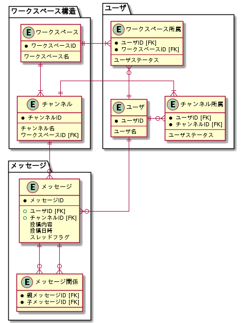

# 課題1

<!-- START doctoc generated TOC please keep comment here to allow auto update -->
<!-- DON'T EDIT THIS SECTION, INSTEAD RE-RUN doctoc TO UPDATE -->

Table of Contents

- [チャットサービスのモデリング](#%E3%83%81%E3%83%A3%E3%83%83%E3%83%88%E3%82%B5%E3%83%BC%E3%83%93%E3%82%B9%E3%81%AE%E3%83%A2%E3%83%87%E3%83%AA%E3%83%B3%E3%82%B0)

<!-- END doctoc generated TOC please keep comment here to allow auto update -->

## チャットサービスのモデリング

仕様の詳細は [airtable](https://airtable.com/tblTnXBXFOYJ0J7lZ/viwyi8muFtWUlhNKG/recCDmAj926oLfOde?blocks=hide) を確認する。

- 下記の案はスレッドメッセージとメッセージを同じテーブルで扱い、紐づけを閉包テーブルで行うモデルである。
- スレッドメッセージとメッセージの識別は、`Channel_Thread_Message` の `is_thread` で行う

参考資料

- [イミュータブルデータモデル(入門編)](https://www.slideshare.net/kawasima/ss-40471672)
- [イミュータブルデータモデル](https://scrapbox.io/kawasima/%E3%82%A4%E3%83%9F%E3%83%A5%E3%83%BC%E3%82%BF%E3%83%96%E3%83%AB%E3%83%87%E3%83%BC%E3%82%BF%E3%83%A2%E3%83%87%E3%83%AB)
- [チャットアプリの実例でDynamoDBのモデリングを考えてみる](https://zenn.dev/dove/scraps/576858405f1411)
