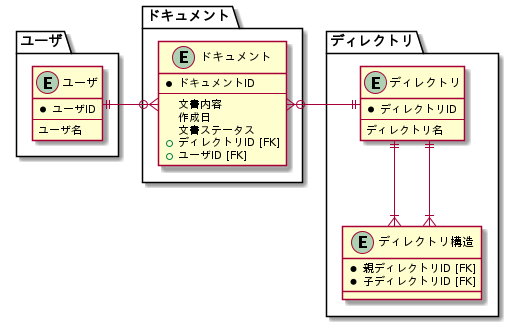

# 課題1

<!-- START doctoc generated TOC please keep comment here to allow auto update -->
<!-- DON'T EDIT THIS SECTION, INSTEAD RE-RUN doctoc TO UPDATE -->

Table of Contents

- [モデリング](#%E3%83%A2%E3%83%87%E3%83%AA%E3%83%B3%E3%82%B0)

<!-- END doctoc generated TOC please keep comment here to allow auto update -->

## モデリング

仕様の詳細は [airtable](https://airtable.com/tblTnXBXFOYJ0J7lZ/viwyi8muFtWUlhNKG/recQgEc0Z8Ic0AzLQ?blocks=hide) を参照する。

