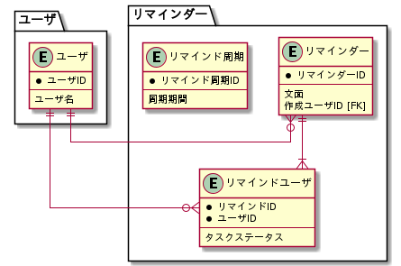

# 課題1

<!-- START doctoc generated TOC please keep comment here to allow auto update -->
<!-- DON'T EDIT THIS SECTION, INSTEAD RE-RUN doctoc TO UPDATE -->

Table of Contents

- [論理設計](#%E8%AB%96%E7%90%86%E8%A8%AD%E8%A8%88)

<!-- END doctoc generated TOC please keep comment here to allow auto update -->

## 論理設計

仕様の詳細は [airtable](https://airtable.com/tblTnXBXFOYJ0J7lZ/viwyi8muFtWUlhNKG/reckOBNlLbwf5m8ut?blocks=hide) を参照する。

