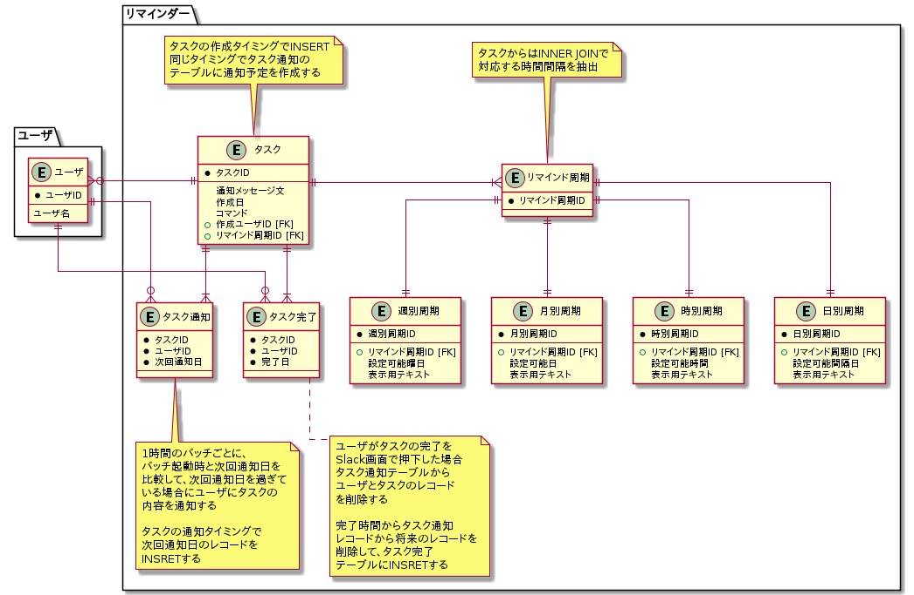

# 課題1

<!-- START doctoc generated TOC please keep comment here to allow auto update -->
<!-- DON'T EDIT THIS SECTION, INSTEAD RE-RUN doctoc TO UPDATE -->

Table of Contents

- [論理設計](#%E8%AB%96%E7%90%86%E8%A8%AD%E8%A8%88)

<!-- END doctoc generated TOC please keep comment here to allow auto update -->

## 論理設計

仕様の詳細は [airtable](https://airtable.com/tblTnXBXFOYJ0J7lZ/viwyi8muFtWUlhNKG/reckOBNlLbwf5m8ut?blocks=hide) を参照する。

- 前提事項
  - システムを最も複雑化させてしまうものは `UPDATE` であるという前提でモデリングを行う
  - `SELECT` と `DELETE` と `INSERT` のみを使用する
- 懸念点
  - 今回は配信頻度を事前にテーブルに設定されたものだけを許可する形
  - 頻度の想定は以下の4種類
    - 時別: `every 2 hours`
    - 日別: `every 3 days`
    - 週別: `every Monday`
    - 月別: `the second of the month` 
  - 正規表現で4つの分類と、具体的な設定時間を抽出する
  - 設定時間が対象の周期テーブルに登録されている場合にのみ、タスクを作成する
    - Penpenでは、リマインド周期の設定に失敗した場合には、デフォルトで1時間を設定している
  - 該当なしの場合、対応の分類で設定可能な値を列挙する
