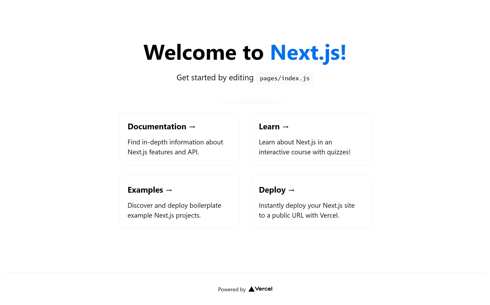

# 課題1

<!-- START doctoc generated TOC please keep comment here to allow auto update -->
<!-- DON'T EDIT THIS SECTION, INSTEAD RE-RUN doctoc TO UPDATE -->
<details>
<summary>Table of Contents</summary>

- [初めてのセットアップ](#%E5%88%9D%E3%82%81%E3%81%A6%E3%81%AE%E3%82%BB%E3%83%83%E3%83%88%E3%82%A2%E3%83%83%E3%83%97)

</details>
<!-- END doctoc generated TOC please keep comment here to allow auto update -->

## 初めてのセットアップ

[公式のチュートリアル](https://nextjs.org/learn/basics/create-nextjs-app?utm_source=next-site&utm_medium=homepage-cta&utm_campaign=next-website) に従って Next.js に入門する。

```bash
npx create-next-app nextjs-blog --use-npm --example "https://github.com/vercel/next-learn-starter/tree/master/learn-starter"

yarn create next-app nextjs-blog --example "https://github.com/vercel/next-learn-starter/tree/master/learn-starter"
```

これでサーバを起動すればトップ画面にブログサイトが表示される。


