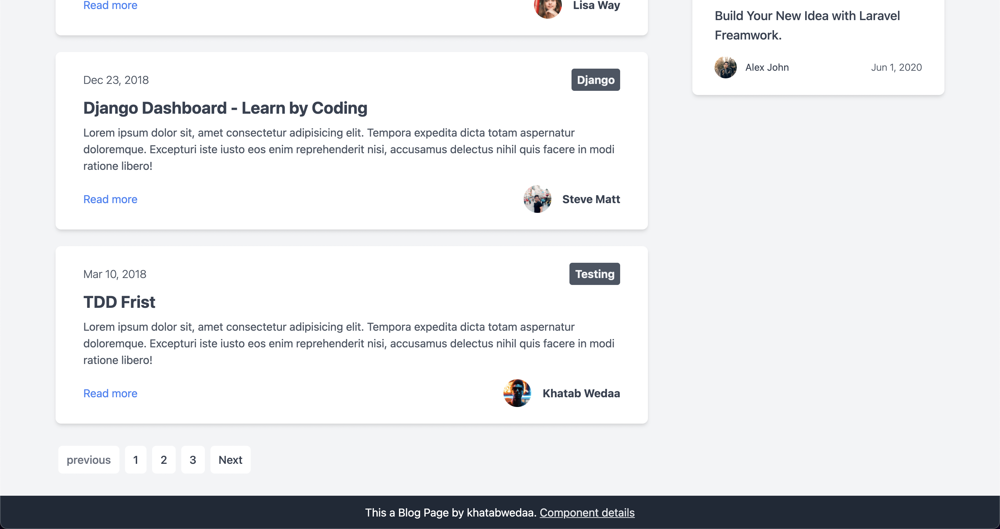

# 課題 2

<!-- START doctoc generated TOC please keep comment here to allow auto update -->
<!-- DON'T EDIT THIS SECTION, INSTEAD RE-RUN doctoc TO UPDATE -->

Table of Contents

- [対象ウェブサイト](#%E5%AF%BE%E8%B1%A1%E3%82%A6%E3%82%A7%E3%83%96%E3%82%B5%E3%82%A4%E3%83%88)

<!-- END doctoc generated TOC please keep comment here to allow auto update -->

## 対象ウェブサイト

今回模写するサイトは、以下の [tailwindcss](https://tailwindcomponents.com/component/blog-page/landing) のサイトである。

以下の点が特徴的である。

- ヘッダーを有していること
- メインコンテンツとサイドコンテンツで 2 カラムレイアウトであること
- パージネーションがあること
- フッターはスクロールに依存せず固定された場所に配置されていること

[../practice](../practice/) で実装する。
