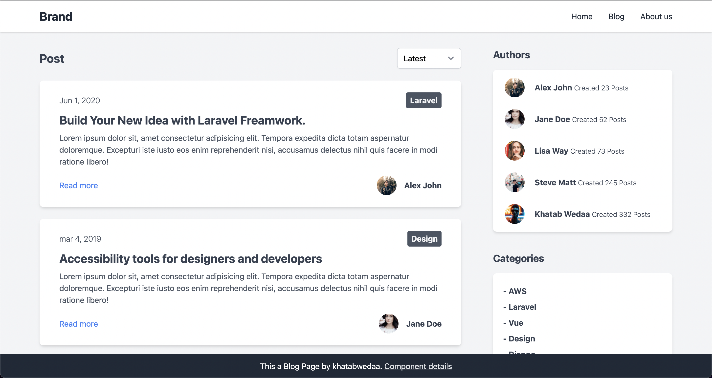

# 課題 2

<!-- START doctoc -->
<!-- END doctoc -->

## 対象ウェブサイト

今回模写するサイトは、以下の [tailwindcss](https://tailwindcomponents.com/component/blog-page/landing) のサイトである。

以下の点が特徴的である。

- ヘッダーを有していること
- メインコンテンツとサイドコンテンツで 2 カラムレイアウトであること
- パージネーションがあること
- フッターはスクロールに依存せず固定された場所に配置されていること
