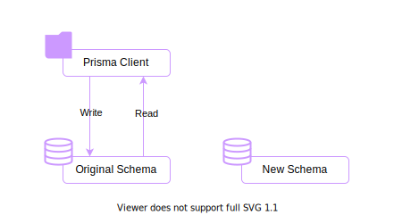
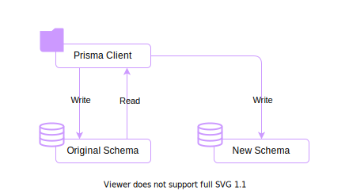
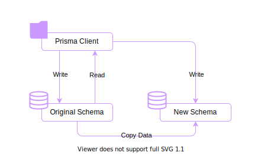
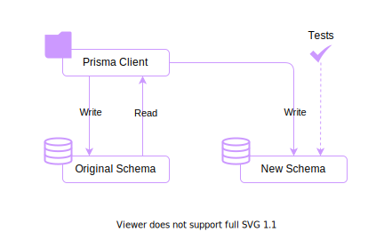
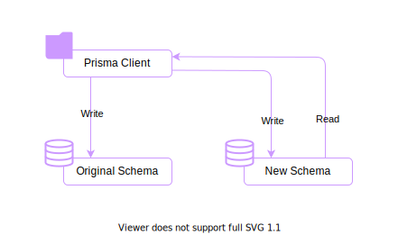
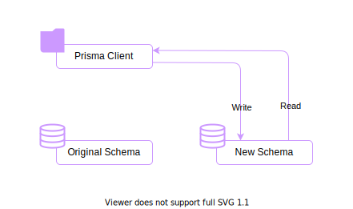
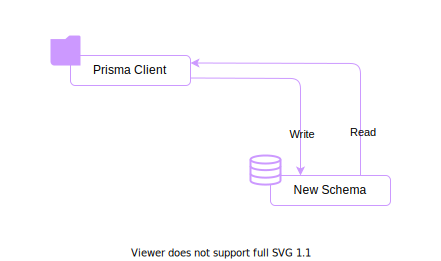

# 課題 1

<!-- START doctoc generated TOC please keep comment here to allow auto update -->
<!-- DON'T EDIT THIS SECTION, INSTEAD RE-RUN doctoc TO UPDATE -->

Table of Contents

- [Expand and Contract Pattern](#expand-and-contract-pattern)
  - [Step 1: 新しいスキーマをデプロイする](#step-1-%E6%96%B0%E3%81%97%E3%81%84%E3%82%B9%E3%82%AD%E3%83%BC%E3%83%9E%E3%82%92%E3%83%87%E3%83%97%E3%83%AD%E3%82%A4%E3%81%99%E3%82%8B)
  - [Step 2: インターフェースを拡張する](#step-2-%E3%82%A4%E3%83%B3%E3%82%BF%E3%83%BC%E3%83%95%E3%82%A7%E3%83%BC%E3%82%B9%E3%82%92%E6%8B%A1%E5%BC%B5%E3%81%99%E3%82%8B)
  - [Step 3: 古いデータ構造から新しいデータ構造へのマイグレーション](#step-3-%E5%8F%A4%E3%81%84%E3%83%87%E3%83%BC%E3%82%BF%E6%A7%8B%E9%80%A0%E3%81%8B%E3%82%89%E6%96%B0%E3%81%97%E3%81%84%E3%83%87%E3%83%BC%E3%82%BF%E6%A7%8B%E9%80%A0%E3%81%B8%E3%81%AE%E3%83%9E%E3%82%A4%E3%82%B0%E3%83%AC%E3%83%BC%E3%82%B7%E3%83%A7%E3%83%B3)
  - [Step 4: インターフェースを検証する](#step-4-%E3%82%A4%E3%83%B3%E3%82%BF%E3%83%BC%E3%83%95%E3%82%A7%E3%83%BC%E3%82%B9%E3%82%92%E6%A4%9C%E8%A8%BC%E3%81%99%E3%82%8B)
  - [Step 5: 新しいデータ構造への読み取りを追加する](#step-5-%E6%96%B0%E3%81%97%E3%81%84%E3%83%87%E3%83%BC%E3%82%BF%E6%A7%8B%E9%80%A0%E3%81%B8%E3%81%AE%E8%AA%AD%E3%81%BF%E5%8F%96%E3%82%8A%E3%82%92%E8%BF%BD%E5%8A%A0%E3%81%99%E3%82%8B)
  - [Step 6: 古いデータ構造への書き込みを止める](#step-6-%E5%8F%A4%E3%81%84%E3%83%87%E3%83%BC%E3%82%BF%E6%A7%8B%E9%80%A0%E3%81%B8%E3%81%AE%E6%9B%B8%E3%81%8D%E8%BE%BC%E3%81%BF%E3%82%92%E6%AD%A2%E3%82%81%E3%82%8B)
- [参考資料](#%E5%8F%82%E8%80%83%E8%B3%87%E6%96%99)

<!-- END doctoc generated TOC please keep comment here to allow auto update -->

## Expand and Contract Pattern

開発を進めていく中で、データ自体を新しいフォーマットに変換したり、異なるテーブルにカラムを移したりなどの変更を加える場面が存在する。

**Expand and Contract Pattern** というマルチステップのプロセスを採用すれば、開発者はシステムの稼働時間に影響を与えることなく、古いデータ構造から新しいデータ構造へとデータを移行することができる様になる。

これは新しい変更をバックグラウンドで導入し、実際に使用するためのデータを準備した後で、新しい構造にシームレスに切り替えることができる様に設計された、一連の個別ステップを適用することが実現することができる。

### Step 1: 新しいスキーマをデプロイする

まずは新しい要件を満たす、新しいスキーマを設計する。これは例えば以下の様なものである。

- 現在のカラムをそのままにして、必要となる特性を追加した新しいカラムをテーブルに追加する
- 新しいデータ構造を表す、新しいテーブルを作成する

### Step 2: インターフェースを拡張する

データベースに対して新しいスキーマを配置した後は、クライアント側のインターフェースが追加されたスキーマを認識できる様にする。

重要な点は、書き込みを行う際にクライアントからは古いデータ構造と新しいデータ構造の両方にデータを追加したり、変更したりする点である。

これで 2 つの構造間のインターフェースを検証することができ、今後は全てのデータが新しいデータ構造にも永続化されることを保証できる。なお、読み取りは元のデータ構造を排他的に参照するため、外部動作は変化しない。

### Step 3: 古いデータ構造から新しいデータ構造へのマイグレーション

古いデータ構造に元々登録されていたデータは、新しいデータ構造にはまだ登録されていない状態である。

この場合、データタイプの変更や値の分割などの新旧のデータ構造の違いを、何らかの形式で修正する必要がある。このプロセスは慎重に設計する必要がある。

### Step 4: インターフェースを検証する

ここまでの段階で、古いデータ構造と新しいデータ構造には同じデータが格納されているはずである。

そこで、本番で稼働するシステムが必要とするクエリを新しいデータ構造でテストを実施し、期待通りの結果が得られるのか検証を行う必要がある。このプロセスは、新しいデータ構造を本番で使用する前の最後のステップなので、慎重に要求を満たしていることを検証する必要がある。

### Step 5: 新しいデータ構造への読み取りを追加する

ここまでで古いデータ構造と新しいデータ構造はデータを共有できており、インターフェースの検証も完了している状態である。

このプロセスでは、本番環境で使用する読み取りに新しいデータ構造に採用する様に変更を加える。

このプロセスはデータを失ってしまう可能性があるため、ステークホルダーと調整しながら実施する必要がある。

### Step 6: 古いデータ構造への書き込みを止める

新しいデータ構造が意図した通りに動作していることが検証できれば、データベースのクライアンどを更新して古いデータ構造への書き込みを停止する。

### Step 7: 古いデータ構造を廃棄する

ここまでで古いデータ構造は完全に使用していない状態になっている。

これで古いデータ構造を安全に廃棄することが可能となったため、データベースから削除すればデータ移行の完了である。

## 参考資料

- [Using the expand and contract pattern for schema changes](https://www.prisma.io/dataguide/types/relational/expand-and-contract-pattern)
- [Migration troubleshooting in production](https://www.prisma.io/docs/guides/database/production-troubleshooting)
