# 課題 1

<!-- START doctoc generated TOC please keep comment here to allow auto update -->
<!-- DON'T EDIT THIS SECTION, INSTEAD RE-RUN doctoc TO UPDATE -->
<details>
<summary>Table of Contents</summary>

- [Github Actions とは](#github-actions-%E3%81%A8%E3%81%AF)
- [サンプルリポジトリ](#%E3%82%B5%E3%83%B3%E3%83%97%E3%83%AB%E3%83%AA%E3%83%9D%E3%82%B8%E3%83%88%E3%83%AA)

</details>
<!-- END doctoc generated TOC please keep comment here to allow auto update -->

## Github Actions とは

Github Actions とは、リポジトリで発生したイベントに応じて、自動的に設定されているワークフローをサーバー上で実行するための仕組みである。



Github Actions を使用したい場合は、リポジトリの `.github/workflows` ディレクトリにワークフローを記述している YAML ファイルを配置すればいい。

例えば以下はリポジトリに何かしらが push された際に、node のバージョン 14 で `bats` というライブラリをインストールして、そのバージョンを表示しているワークフローになる。

```yml
# 任意項目であり、ワークフロー自体の名称を設定できる
# この名称で 「Actions」 タブには表示される
name: learn-github-actions
# ワークフローを起動するトリガーを設定できる
# ここでは全ての push イベントが発生した際にワークフローを起動する設定となっている
on: [push]
# ワークフローで実行する処理をジョブという形でまとめることができる
jobs:
  # 実行するジョブに名称を設定できる
  check-bats-version:
    # Githubでホスティングされている最新のUbuntuイメージの仮想環境でジョブを実行する
    runs-on: ubuntu-latest
    # 実行する処理をグルーピングする
    steps:
      # リポジトリをランナー上にチェックするアクションになる
      # ワークフローがリポジトリのコードに対して実行される場合は、必ず必要となるアクションである
      - uses: actions/checkout@v2
      # Nodeのv14をインストールしてr、PATHに node と npm を追加する
      - uses: actions/setup-node@v2
        with:
          node-version: "14"
      # "run" はランナー上で実行したいコマンドを指定する
      # ここでは単純に指定のライブラリをインストールしてそのバージョンを表示しているだけである
      - run: npm install -g bats
      - run: bats -v
```

参考資料

- [Create an example workflow](https://docs.github.com/en/actions/learn-github-actions/understanding-github-actions#create-an-example-workflow)

## サンプルリポジトリ

プルリクエストが作成された場合に、自動的に ESLint を実行するワークフローを作成する。

https://github.com/shimopino/github-actions-playground

ここでは以下のイベントで発火するワークフローを作成している。

```yml
on:
  pull_request:
    types: [opened, reopend, synchronize]
```

- プルリクエストに関して
  - 新規作成されたとき
  - 一時閉じたプルリクが再度開かれたとき
  - プルリクに対してコミットをプッシュしたとき

参考資料

- [Events and trigger workflows](https://docs.github.com/en/actions/learn-github-actions/events-that-trigger-workflows)
- [on.<event_name>.types](https://docs.github.com/en/actions/learn-github-actions/workflow-syntax-for-github-actions#onevent_nametypes)
