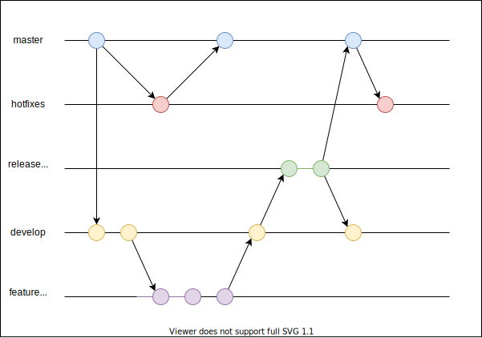

# 課題１

<!-- START doctoc generated TOC please keep comment here to allow auto update -->
<!-- DON'T EDIT THIS SECTION, INSTEAD RE-RUN doctoc TO UPDATE -->

Table of Contents

- [Git flow](#git-flow)
- [Github flow](#github-flow)
- [GitLab flow](#gitlab-flow)
- [Git Feature flow](#git-feature-flow)

<!-- END doctoc generated TOC please keep comment here to allow auto update -->

## Git flow

**Git flow** は以下のブランチで構成されている。

| ブランチ名 | 用途                                                                                                                           |
| ---------- | ------------------------------------------------------------------------------------------------------------------------------ |
| master     | ・ユーザーにリリースしたソースコードを管理する ・タグでバージョンを管理                                                     |
| hotfix     | ・リリースされたバージョンで発生したバグを修正するブランチ                                                                     |
| release    | ・develop ブランチをベースに作成されるブランチ ・QA などを実施するブランチ ・QA 終了後に、maste/develop ブランチにマージ |
| develop    | ・開発作業を行うブランチ ・新しい機能は feature ブランチに切って開発                                                        |
| feature    | ・develop ブランチをベースに作成されるブランチ ・新しい機能を開発する                                                       |

## Github flow

## GitLab flow

## Git Feature flow
