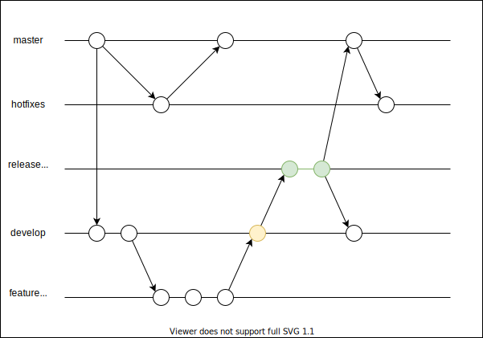
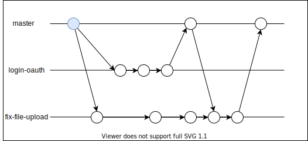

# 課題１

<!-- START doctoc generated TOC please keep comment here to allow auto update -->
<!-- DON'T EDIT THIS SECTION, INSTEAD RE-RUN doctoc TO UPDATE -->

Table of Contents

- [Git flow](#git-flow)
  - [概要](#%E6%A6%82%E8%A6%81)
  - [開発プロセス](#%E9%96%8B%E7%99%BA%E3%83%97%E3%83%AD%E3%82%BB%E3%82%B9)
- [Github flow](#github-flow)
  - [概要](#%E6%A6%82%E8%A6%81-1)
  - [開発プロセス](#%E9%96%8B%E7%99%BA%E3%83%97%E3%83%AD%E3%82%BB%E3%82%B9-1)
- [GitLab flow](#gitlab-flow)
  - [概要](#%E6%A6%82%E8%A6%81-2)
  - [開発プロセス](#%E9%96%8B%E7%99%BA%E3%83%97%E3%83%AD%E3%82%BB%E3%82%B9-2)
- [Git Feature flow](#git-feature-flow)
  - [概要](#%E6%A6%82%E8%A6%81-3)
  - [開発プロセス](#%E9%96%8B%E7%99%BA%E3%83%97%E3%83%AD%E3%82%BB%E3%82%B9-3)

<!-- END doctoc generated TOC please keep comment here to allow auto update -->

## Git flow

### 概要

[**Git flow**](https://nvie.com/posts/a-successful-git-branching-model/) は以下のブランチで構成されている。

| ブランチ名 | 用途                                                                                                                           |
| ---------- | ------------------------------------------------------------------------------------------------------------------------------ |
| master     | ・ユーザーにリリースしたソースコードを管理する ・タグでバージョンを管理                                                     |
| hotfix     | ・リリースされたバージョンで発生したバグを修正するブランチ                                                                     |
| release    | ・develop ブランチをベースに作成されるブランチ ・QA などを実施するブランチ ・QA 終了後に、maste/develop ブランチにマージ |
| develop    | ・開発作業を行うブランチ ・新しい機能は feature ブランチに切って開発                                                        |
| feature    | ・develop ブランチをベースに作成されるブランチ ・新しい機能を開発する                                                       |

### 開発プロセス

| プロセス                                     | ブランチの流れ                            |
| :------------------------------------------- | :---------------------------------------- |
| 開発用ブランチを作成する                     |  |
| ブランチを切って新機能を実装する             |  |
| 新機能の開発が完了すると開発用ブランチに戻す |  |
| リリース準備を行う                           |  |
| リリースを行う                               |  |
| 緊急のバグ対応を行う                         |  |

合間合間で CI でのテストなどを実施する。

## Github flow

### 概要

[**GitHub flow**](http://scottchacon.com/2011/08/31/github-flow.html) は Git-flow のワークフローが複雑すぎるため、よりシンプルなワークフローとして提案された。

具体的には以下のブランチで構成されている。

### 開発プロセス

まずは以前のブランチ戦略の問題点を考えていく。

Git-flow の問題点とは、hotfixブランチとreleaseブランチが余計な複雑性を持ち込んでしまうことである。継続的デリバリが主流の場合、デフォルトのブランチがデプロイされるため、多くのブランチが存在していることはそれだけデプロイする機能を管理することが難しくなってしまうことを意味している。

Github Flow では、プロダクション環境へのデプロイ頻度が非常に短い（１日に何回も行う）ことを前提としたワークフローである。

| プロセス                                                                                                                            | プロセスの流れ                               |
| ----------------------------------------------------------------------------------------------------------------------------------- | -------------------------------------------- |
| 1. master ブランチは常にデプロイ可能  ・ブランチをロールバックすることはまれ ・revert コミットや修正コミットを追加するだけ |  |
| 2. master から開発用ブランチを作成する  ・ブランチ名を機能に合わせて命名する ・開発しているトピックを一覧できる            |  |
| 3. 開発用ブランチに定期的に push する  ・デプロイ観点は master のみ ・master ブランチ以外は単に作業中であるのみ            |  |
| 4. プルリクエストを作成する  ・コードレビューを実施する ・修正対応はコミットするのみ                                       |  |
| 5. マージする  ・レビュー後にのみマージする ・直接 master ブランチで作業はしない                                           |  |
| 6. デプロイする  ・master ブランチにマージ後にデプロイする ・小さなコミットでもデプロイしていく                            |  |

## GitLab flow

[**GitLab flow**](https://postd.cc/gitlab-flow/) は以下のブランチで構成されている。

### 概要

### 開発プロセス

まずは以前のブランチ戦略の問題点を考えていく。

GitHub-flow の問題点とは、ブランチを必要最小限にすることでデプロイ待ちのコード量を可能な限り少なくしている反面、デプロイ時間を制御できない様なソフトウェアでは適用することができない。これは例えば iOS アプリでデプロイするためには審査が必要であったり、デプロイの時間枠が設定されている場合などである。

GitLab-flow では、以下の様に 本番環境へデプロイするための production ブランチなどが存在している。

## Git Feature flow

### 概要

[**GitFeature flow**](https://developers.gnavi.co.jp/entry/GitFeatureFlow/**koyama**) は以下のブランチで構成されている。

### 開発プロセス
