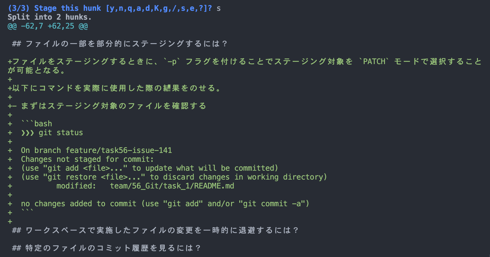

# 課題 1

<!-- START doctoc generated TOC please keep comment here to allow auto update -->
<!-- DON'T EDIT THIS SECTION, INSTEAD RE-RUN doctoc TO UPDATE -->
<details>
<summary>Table of Contents</summary>

- [特定のコミットとの差分を表示するには？](#%E7%89%B9%E5%AE%9A%E3%81%AE%E3%82%B3%E3%83%9F%E3%83%83%E3%83%88%E3%81%A8%E3%81%AE%E5%B7%AE%E5%88%86%E3%82%92%E8%A1%A8%E7%A4%BA%E3%81%99%E3%82%8B%E3%81%AB%E3%81%AF)
- [差分があるファイル名だけを一覧表示するには？](#%E5%B7%AE%E5%88%86%E3%81%8C%E3%81%82%E3%82%8B%E3%83%95%E3%82%A1%E3%82%A4%E3%83%AB%E5%90%8D%E3%81%A0%E3%81%91%E3%82%92%E4%B8%80%E8%A6%A7%E8%A1%A8%E7%A4%BA%E3%81%99%E3%82%8B%E3%81%AB%E3%81%AF)
- [ファイルの一部を部分的にステージングするには？](#%E3%83%95%E3%82%A1%E3%82%A4%E3%83%AB%E3%81%AE%E4%B8%80%E9%83%A8%E3%82%92%E9%83%A8%E5%88%86%E7%9A%84%E3%81%AB%E3%82%B9%E3%83%86%E3%83%BC%E3%82%B8%E3%83%B3%E3%82%B0%E3%81%99%E3%82%8B%E3%81%AB%E3%81%AF)
- [ワークスペースで実施したファイルの変更を一時的に退避するには？](#%E3%83%AF%E3%83%BC%E3%82%AF%E3%82%B9%E3%83%9A%E3%83%BC%E3%82%B9%E3%81%A7%E5%AE%9F%E6%96%BD%E3%81%97%E3%81%9F%E3%83%95%E3%82%A1%E3%82%A4%E3%83%AB%E3%81%AE%E5%A4%89%E6%9B%B4%E3%82%92%E4%B8%80%E6%99%82%E7%9A%84%E3%81%AB%E9%80%80%E9%81%BF%E3%81%99%E3%82%8B%E3%81%AB%E3%81%AF)
- [特定のファイルのコミット履歴を見るには？](#%E7%89%B9%E5%AE%9A%E3%81%AE%E3%83%95%E3%82%A1%E3%82%A4%E3%83%AB%E3%81%AE%E3%82%B3%E3%83%9F%E3%83%83%E3%83%88%E5%B1%A5%E6%AD%B4%E3%82%92%E8%A6%8B%E3%82%8B%E3%81%AB%E3%81%AF)
- [複数のコミットを 1 つにまとめるには？](#%E8%A4%87%E6%95%B0%E3%81%AE%E3%82%B3%E3%83%9F%E3%83%83%E3%83%88%E3%82%92-1-%E3%81%A4%E3%81%AB%E3%81%BE%E3%81%A8%E3%82%81%E3%82%8B%E3%81%AB%E3%81%AF)
- [特定のブランチをもとに新しいブランチを作成するには？](#%E7%89%B9%E5%AE%9A%E3%81%AE%E3%83%96%E3%83%A9%E3%83%B3%E3%83%81%E3%82%92%E3%82%82%E3%81%A8%E3%81%AB%E6%96%B0%E3%81%97%E3%81%84%E3%83%96%E3%83%A9%E3%83%B3%E3%83%81%E3%82%92%E4%BD%9C%E6%88%90%E3%81%99%E3%82%8B%E3%81%AB%E3%81%AF)
- [最新のコミットのみをクローンするには？](#%E6%9C%80%E6%96%B0%E3%81%AE%E3%82%B3%E3%83%9F%E3%83%83%E3%83%88%E3%81%AE%E3%81%BF%E3%82%92%E3%82%AF%E3%83%AD%E3%83%BC%E3%83%B3%E3%81%99%E3%82%8B%E3%81%AB%E3%81%AF)
- [マージ中にコンフリクトが発生した場合に作業を中断するには？](#%E3%83%9E%E3%83%BC%E3%82%B8%E4%B8%AD%E3%81%AB%E3%82%B3%E3%83%B3%E3%83%95%E3%83%AA%E3%82%AF%E3%83%88%E3%81%8C%E7%99%BA%E7%94%9F%E3%81%97%E3%81%9F%E5%A0%B4%E5%90%88%E3%81%AB%E4%BD%9C%E6%A5%AD%E3%82%92%E4%B8%AD%E6%96%AD%E3%81%99%E3%82%8B%E3%81%AB%E3%81%AF)

</details>
<!-- END doctoc generated TOC please keep comment here to allow auto update -->

## 特定のコミットとの差分を表示するには？

まずは比較を行いたいコミットを確認する。

```bash
❯❯❯ git log --oneline -3

7887cc5 (HEAD -> feature/task56-issue-141, origin/feature/task56-issue-141) chore(docs): update TOC
d94dbb0 docs: 項目名が間違っていたため修正 #141
397138e chore(docs): update TOC
```

ここで以下のコマンドを実行すればコミット間の差分を表示することが可能となる。

```git
❯❯❯ git diff d94dbb0 397138e

diff --git a/team/56_Git/task_1/README.md b/team/56_Git/task_1/README.md
index cc048fd..0f8fe84 100644
--- a/team/56_Git/task_1/README.md
+++ b/team/56_Git/task_1/README.md
@@ -18,7 +18,7 @@
 </details>
 <!-- END doctoc generated TOC please keep comment here to allow auto update -->

-## 特定のコミットとの差分を表示するには？
+## 特定のコミットとの差分をひょうじするには？

 ## 差分があるファイル名だけを一覧表示するには？
```

## 差分があるファイル名だけを一覧表示するには？

`diff` コマンドを実行する際に `--name-only` フラグを付けることで、差分があるファイル名だけを表示することが可能となる。

```bash
❯❯❯ git diff 2f707dd 9b640a7 --name-only

team/56_Git/README.md
team/56_Git/task_1/README.md
```

## ファイルの一部を部分的にステージングするには？

ファイルをステージングするときに、`-p` フラグを付けることでステージング対象を `PATCH` モードで選択することが可能となる。

以下にコマンドを実際に使用した際の結果をのせる。

- まずはステージング対象のファイルを確認する

  ```bash
  ❯❯❯ git status

  On branch feature/task56-issue-141
  Changes not staged for commit:
  (use "git add <file>..." to update what will be committed)
  (use "git restore <file>..." to discard changes in working directory)
          modified:   team/56_Git/task_1/README.md

  no changes added to commit (use "git add" and/or "git commit -a")
  ```

- 次に `git add -p team/56_Git/task_1/README.md` を使用して所定の箇所のみをステージングする

  

- これでステータスを確認すると以下の様に一部の行のみがステージングされている

  ```bash
  ❯❯❯ git status

  On branch feature/task56-issue-141
  Changes to be committed:
  (use "git restore --staged <file>..." to unstage)
          modified:   team/56_Git/task_1/README.md

  Changes not staged for commit:
  (use "git add <file>..." to update what will be committed)
  (use "git restore <file>..." to discard changes in working directory)
          modified:   team/56_Git/task_1/README.md
  ```

## ワークスペースで実施したファイルの変更を一時的に退避するには？

ワークスペースでおこなっていた作業を一時的に退避させる場合には `stash` コマンドを使用することができる。

上記の文章を作成した段階で差分を確認すると以下の様に表示されているはずである。

```bash
❯❯❯ git diff team/56_Git/task_1/README.md

diff --git a/team/56_Git/task_1/README.md b/team/56_Git/task_1/README.md
index 7503248..5b770ae 100644
--- a/team/56_Git/task_1/README.md
+++ b/team/56_Git/task_1/README.md
@@ -102,6 +102,8 @@ team/56_Git/task_1/README.md

 ## ワークスペースで実施したファイルの変更を一時的に退避するには？

+ワークスペースでおこなっていた作業を一時的に退避させる場合には `stash` コマンドを使用することができる。
+
 ## 特定のファイルのコミット履歴を見るには？
```

後は `git stash` コマンドを実行すればワークスペース内の編集ファイルを一時的な保存領域に退避させることが可能となる。

```bash
❯❯❯ git stash

Saved working directory and index state WIP on task56-issue-141: c6ce923 docs: patchモードでの編集過程を追加 #141
```

`git stash list` コマンドを使用すれば一時的に退避させた内容を一覧で確認することができる。

```bash
❯❯❯ git stash list

stash@{0}: WIP on task56-issue-141: c6ce923 docs: patchモードでの編集過程を追加 #141
```

一時的に退避させた内容は `git stash pop` コマンドで復元することができる。

```bash
❯❯❯ git stash pop
```

上記以外にも `git stash` のコマンドは数多く存在している。

| コマンド                             | 内容                                                                       |
| ------------------------------------ | -------------------------------------------------------------------------- |
| `git stash save "stash message"`     | 一次退避させた内容に対してメッセージを割り当てることができる               |
| `git stash save --include-untracked` | 新規作成したファイルも含めて一時退避を行う                                 |
| `git stash apply stash@{1}`          | 一次退避させた内容から、復元させたいものを選択してワークスペースに反映する |
| `git stash pop stash@{1}`            | 一次退避させた内容を復元した後で、退避させている一時ファイルを削除する     |
| `git stash show stash@{1}`           | 一次退避させた内容を差分を確認できる                                       |
| `git stash clear`                    | 一次退避させていた内容をすべて削除する                                     |
| `git stash drop stash@{1}`           | 一次退避させていた、特定の内容のみを削除する                               |

## 特定のファイルのコミット履歴を見るには？

`git log` コマンドを実行する際にファイルを直接指定すれば、そのファイルの過去のコミット履歴を確認することができる。

```bash
# --oneline を付与して履歴を見やすい状態にしている
❯❯❯ git log --oneline team/56_Git/task_1/README.md

c6ce923 (HEAD -> feature/task56-issue-141) docs: patchモードでの編集過程を追加 #141
f5861da docs: フォーマットの適用が漏れていたので適用結果を追加 #141
63d488e docs: サンプルとして git add -p の使用例を追加 #141
7133022 docs: 特定のコミット間の差分が存在するファイル名のみを表示するためのコマンドを追加 #141
9b640a7 docs: 特定のコミット間の差分を表示するためのコマンドを追加 #141
7887cc5 chore(docs): update TOC
d94dbb0 docs: 項目名が間違っていたため修正 #141
397138e chore(docs): update TOC
2f707dd docs: 課題56でGitに関する項目を追加 #138
```

## 複数のコミットを 1 つにまとめるには？

## 特定のブランチをもとに新しいブランチを作成するには？

ブランチをチェックアウトする際に、`-b` フラグを付与することで、ブランチを新規作成することができる。

例えば `main` ブランチをもとにして、`feature/task56-issue-141` ブランチを新規作成する場合には以下のコマンドを実行すればいい。

```bash
git checkout -b feature/task56-issue-141 main
```

## 最新のコミットのみをクローンするには？

最新のコミットのみをクローンするには、`--depth` フラグを使用すればいい。

例えば本リポジトリをクローンした際の挙動で確認する。

- 全ての履歴を含めてクローンする
  - コミットログを見ると過去の履歴分も含めて取得していることがわかる

    ```bash
    ❯❯❯ git clone git@github.com:shimopino/praha-challenges.git

    Cloning into 'praha-challenges'...
    remote: Enumerating objects: 13160, done.
    remote: Counting objects: 100% (982/982), done.
    remote: Compressing objects: 100% (533/533), done.
    remote: Total 13160 (delta 463), reused 685 (delta 306), pack-reused 12178
    Receiving objects: 100% (13160/13160), 42.21 MiB | 5.98 MiB/s, done.
    Resolving deltas: 100% (6503/6503), done.

    ❯❯❯ cd praha-challenges

    ~ praha-challenges ❯❯❯ git log --oneline

    1e7b972 (HEAD -> main, origin/main, origin/HEAD) Merge pull request #162 from shimopino/fix/task15-delete
    513bf20 chore(docs): update TOC
    97f530c feat: 削除されてしまっていた課題15の内容を復元
    8cd01c2 Merge pull request #150 from shimopino/feature/task39-issue-119
    dcfac6f Merge pull request #158 from shimopino/feature/nestjs-auth-issue-155
    0ecc341 fix: 変数名を統一する #155
    3d7e66c feat: 検証ようのログインフォームを追加 #155
    e691332 feat: CSRF対策を追加 #155
    53156bf feat: axiosでの例外処理を追加 #155
    6ceefb8 feat: 登録されているクッキーを送信するための設定を追加 #155
    0bde22f feat: ユーザー登録するための処理を追加 #155
    4af88e3 feat: アプリケーションを起動する際のエントリーファイル名を変更 #155
    ef53c09 feat: クッキーを受け取ることができるようにCORS設定を変更 #155
    1191b64 feat: JWTの暗号化キーを別々に指定 #155
    d11df22 feat: 有効期限の環境変数は数値型であることを検証する #155
    c87d326 feat: リフレッシュが実行された場合には、リフレッシュトークンの有効期限内でアクセストークンを再発行する #155
    d388b6d feat: インターセプターの変数名にトークンの種類を明記 #155
    ad50e46 feat: 認証関連の処理を検証するためのリクエストを追加 #155
    ```

- 最新のコミットのみをクローンする
  - 最新のコミット履歴しか取得してきていないことがわかる
  - そのため、今回のリポジトリではクローンしてきた際のサイズも半分以下になっていることがわかる

    ```bash
    ❯❯❯ git clone git@github.com:shimopino/praha-challenges.git

    Cloning into 'praha-challenges'...
    remote: Enumerating objects: 1218, done.
    remote: Counting objects: 100% (1218/1218), done.
    remote: Compressing objects: 100% (887/887), done.
    remote: Total 1218 (delta 249), reused 838 (delta 158), pack-reused 0
    Receiving objects: 100% (1218/1218), 16.73 MiB | 5.63 MiB/s, done.
    Resolving deltas: 100% (249/249), done.

    ❯❯❯ cd praha-challenges

    ~ praha-challenges ❯❯❯ git log --oneline

    1e7b972 (grafted, HEAD -> main, origin/main, origin/HEAD) Merge pull request #162 from shimopino/fix/task15-delete
    ```

## マージ中にコンフリクトが発生した場合に作業を中断するには？
