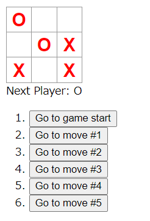

# 課題13「ビジュアルリグレッションテストを書こう」

<!-- START doctoc generated TOC please keep comment here to allow auto update -->
<!-- DON'T EDIT THIS SECTION, INSTEAD RE-RUN doctoc TO UPDATE -->
<details>
<summary>Table of Contents</summary>

- [課題1](#%E8%AA%B2%E9%A1%8C1)
  - [StoryShots + Puppeteer を導入する](#storyshots--puppeteer-%E3%82%92%E5%B0%8E%E5%85%A5%E3%81%99%E3%82%8B)
  - [Squareの中身を変更して差分を検知しよう](#square%E3%81%AE%E4%B8%AD%E8%BA%AB%E3%82%92%E5%A4%89%E6%9B%B4%E3%81%97%E3%81%A6%E5%B7%AE%E5%88%86%E3%82%92%E6%A4%9C%E7%9F%A5%E3%81%97%E3%82%88%E3%81%86)
  - [Boardの数を変更して差分を検知しよう](#board%E3%81%AE%E6%95%B0%E3%82%92%E5%A4%89%E6%9B%B4%E3%81%97%E3%81%A6%E5%B7%AE%E5%88%86%E3%82%92%E6%A4%9C%E7%9F%A5%E3%81%97%E3%82%88%E3%81%86)
- [課題2](#%E8%AA%B2%E9%A1%8C2)
- [課題3](#%E8%AA%B2%E9%A1%8C3)
  - [&#035;1 クイズ](#1-%E3%82%AF%E3%82%A4%E3%82%BA)
  - [&#035;2 クイズ](#2-%E3%82%AF%E3%82%A4%E3%82%BA)
  - [&#035;3 クイズ](#3-%E3%82%AF%E3%82%A4%E3%82%BA)

</details>
<!-- END doctoc generated TOC please keep comment here to allow auto update -->

## 課題1

### StoryShots + Puppeteer を導入する

[公式サイト](https://github.com/storybookjs/storybook/tree/master/addons/storyshots/storyshots-puppeteer) の手順にならってアドオンをインストールする。

Puppeteerは定義している各Storyに対して、以下の2通りの手順で実行できる。

1. Storybookを `yarn storybook` で起動する
2. Storybookを `yarn build-storybook` で静的ビルドする

では以下のようにスナップショットテストで実行したファイルにPuppeteerの設定を追加してテストを実行する。

```js
import initStoryshots from '@storybook/addon-storyshots';
import { puppeteerTest } from '@storybook/addon-storyshots-puppeteer';

initStoryshots({ suite: 'Puppeteer storyshots', test: puppeteerTest() });
```

今回はDockerコンテナ上で開発を行っているため、Puppeteerの公式が出している手順に従ってDockerfileを構築する。

- [Running Puppeteer in Docker](https://github.com/puppeteer/puppeteer/blob/main/docs/troubleshooting.md#running-puppeteer-in-docker)

これで以下のコマンドを実行すればテストが成功していることがわかる。

```bash
yarn storybook

yarn test
```

また以下の設定を行うことでスナップショットファイルを画像ファイルとして保存することもできる。

```js
import initStoryshots from '@storybook/addon-storyshots';
import { imageSnapshot } from '@storybook/addon-storyshots-puppeteer';

initStoryshots({ suite: 'Image storyshots', test: imageSnapshot() });
```

### Squareの中身を変更して差分を検知しよう

ここで `Square` コンポーネントに表示する ○× の文字色を赤色に変更する。

これは単純に `Square.css` に `color: red;` を追加しただけである。



この結果アプリを起動すると以下のような画面表示になっている。


ここで再度スナップショットテストを実行すると、以下のように文字を実際に表示している `stories` でテストが失敗、つまり変更点を検出できていることがわかる。


ここで下記のコマンドを実行して、スナップショットファイルを更新する。

```bash
yarn test --updateSnapshot
```

ここで生成されたスナップショットファイルが更新されていることがわかる。

### Boardの数を変更して差分を検知しよう

次に画面上に表示させる四角形の数を3x3から4x3に変更する。


この状態でスナップショットテストを実行すると、`Game`コンポーネントと`Board`コンポーネントに関するテストが失敗しており、変更差分を検知することができている。


## 課題2

ビジュアルリグレッションテストとスナップショットテストの比較

|                                | メリット                                                                                                                | デメリット                                                                                                                 | 
| ------------------------------ | ----------------------------------------------------------------------------------------------------------------------- | -------------------------------------------------------------------------------------------------------------------------- | 
| スナップショットテスト         | ・テキストを生成するだけなので比較的実行が早い<br>・CLIで表示されているテスト結果から何を修正するばいいのかわかりやすい | ・シリアライズ化された値を比較するだけで実際のUIはわからない<br>・検知した変更差分をデザイナーが把握することは難しい       | 
| ビジュアルリグレッションテスト | ・画像を比較するため、実際にUIに生じた変化を開発者が理解しやすい<br>・1ピクセル単位での画面変更を検知できる             | ・動かしてみた感じスナップショット画像をとるためか実行が遅い<br>・一見してコードのどの部分を修正すればいいのか把握しずらい | 

参考情報

- [微妙な違いも見逃すな！ビジュアルリグレッションテスト！](https://speakerdeck.com/blue_goheimochi/phpcon2020?slide=58)

## 課題3

### #1 クイズ

`@storybook/addon-storyshots-puppeteer` で使用可能な `ImageSnapShot` を使用してビジュアルリグレッションテストを実行する。

その際に比較する画像の差分が全体で2％以下の場合はテストを通過するように設定するのはどうすればいいでしょうか。

<details>
<summary>回答例</summary>

- [storyshots-image.runner.js](https://github.com/storybookjs/storybook/blob/03321305b4b336cd4fd9936006b614f262daea7b/examples/official-storybook/storyshots-puppeteer/storyshots-image.runner.js#L19)
- [Specifying options to jest-image-snapshots](https://github.com/storybookjs/storybook/tree/master/addons/storyshots/storyshots-puppeteer#specifying-options-to-jest-image-snapshots)

</details>

### #2 クイズ

`@storybook/addon-storyshots-puppeteer` で使用可能な `ImageSnapShot` を使用してビジュアルリグレッションテストを実行する。

その際にスクリーンショットを保存する前後に処理をはさみたい場合はどのような設定を追加すればいいでしょうか

<details>
<summary>回答例</summary>

- [Specifying options to jest-image-snapshots](https://github.com/storybookjs/storybook/tree/master/addons/storyshots/storyshots-puppeteer#specifying-options-to-jest-image-snapshots)

</details>

### #3 クイズ

WindowsとMacOSでは、ビルドされたスナップショットファイルの結果が異なってしまう可能性が存在している。

こうした場合に、環境環境でWindowsを使用している場合にはWindowsでビルドされたスナップショットファイルと比較し、MacOSの場合にはMacOSでビルドされたスナップショットファイルと比較するにはどうすればいいでしょうか。

<details>
<summary>回答例</summary>

- [ビジュアルリグレッションテストを導入してみた](https://note.com/pocke_techblog/n/n6947c0bb4df1)

</details>
